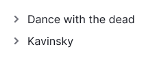

@## Description

**Accordion** is a component which allows you to hide/display areas with a large amount of information or data.

### When to use it

- **You have a large amount of data and don't want to show it all at once**. By hiding a part of the content, we help users focus on their task. _For example, you can use the Accordion in a table with large bulk of data or in large widgets with additional information._
- **When the screen area is limited (for example, on a mobile device)**. According to [NNG](https://www.nngroup.com/articles/accordions-complex-content/), users are very reluctant to scroll on mobile devices in contrast to the desktop. Therefore, using the accordion on small screens helps reduce the scroll area, simplify the structure of content and navigation through it.

> 💡 **Don't confuse hiding content in accordion with hiding content and functionality in dropdown**. These components have different tasks.
>
> We always use the accordion to collapse additional information (sometimes functions) in order to save space and time for the user.
>
> We use dropdown primarily to hide additional features and sometimes additional information.

@## Appearance

The accordion consists of:

- a trigger that usually includes the `ChevronRight` icon and a text label;
- collapsed areas with content.

The `ChevronRight` icon always has M size and has a `margin-right: 8px;` with all font sizes.

> 💡 Please note that you can use different styles for the trigger and collapsed content than the standard ones described below.

@## Sizes

You can set the width of the accordion that is appropriate for the context and solution of the problem.

@## Trigger

> 💡 The accordion trigger can be text, link or button of any size you need.

|                           | Appearance example                          | Description and styles                                                                                                      |
| ------------------------- | ------------------------------------------- | --------------------------------------------------------------------------------------------------------------------------- |
| Default accordion         |     | Default colors: icon — `--gray-300`; text — `--gray-800`.                                                                   |
| Accordion with background |  | The background and text color can be any color depending on the usage context. The default background color is `--gray-50`. |

@## Collapsed content

You can use this component to hide almost any content. This can be a text content, an additional information (for example, in a table), or even an entire table with a chart.

**Remember about visual hierarchy when designing the accordion**. If you use, the accordion, for example, in a table, then the title inside the accordion should not be equal to or greater than the size of the main titles on the page.

### Margins and paddings

@## Interaction

> 💡 **By default, when opening a section of the accordion, the sections that have already been opened should not be hidden**.
>
> The user expects this behavior when working with the desktop device interface.
>
> On mobile devices and in the menu, it is recommended to hide previously opened sections when opening a new data section, as this reduces the scroll area.

**The icon and text label have the same hover and click zone**.

| State    | Appearance examples                              | Description and                                                                                                                                                          |
| -------- | ------------------------------------------------ | ------------------------------------------------------------------------------------------------------------------------------------------------------------------------ |
| default  |    |                                                                                                                                                                          |
| hover    |        | The color of the icon changes to the next in the palette — `--gray-400`. If the accordion trigger has a background, it can also change color when hovering.              |
| active   |      | In this state, the `ChevronRight` icon rotates 90 degrees: `transform: rotate(90deg);`. All other trigger styles remain the same as in the `hover` state.                |
| disabled |  | Use [`--disabled-opacity` variable](/style/variables/).                                                                                                                  |
| loading  |    | If the system needs time to load the content hidden in the accordion, then display [Spin](/components/spin/) with a respective size. By default, the spinner size is XS. |

@## Animation

For smooth content display and icon rotation, the component has `transition: all 0.35s;`.

@## Use in UI/UX

### Accordion on mobile devices

If the accordion is used on a mobile device, then when scrolling the page it is recommended to fix the title of the open tab in the viewport upper part.

### Accordion labels

Keep your accordion labels short and clear. As a rule, choose nouns that reflect the backbone of the collapsed content tab.

### Accordion advantages

Mostly, they relate to the long pages loaded with content.

- Hiding data in the accordion helps reduce the scroll area. This is very practical for mobile devices.
- The accordion tabs makes a mini-structure of a page. Content becomes easier to navigate, and it is easier for users to build a mental model of the information available on the page.
- Hiding additional information makes the page look less intimidatingly loaded.
- Accordions can be a great alternative to links as they don't break the mental model in users' heads the way the links do.

@page accordion-a11y
@page accordion-api
@page accordion-code
@page accordion-changelog
