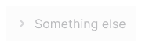
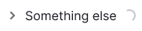
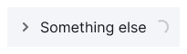

## Description

**Accordion** is a component which allows you to hide/display areas with a large amount of data.

### When to use it

- **You have a large amount of data and don't want to show it all at once**. By hiding a part of the content, you help users focus on their task. _For example, you can use an accordion in a table with a large amount of data or in large widgets with additional information._
- **When screen area is limited (for example, on a mobile device)**. Mobile users usually don't have much choice for navigating through site content other than scrolling. Therefore, using the accordion on small screens helps reduce the scroll area, simplify the structure of content and navigation through it.

::: tip
**Don't confuse hiding content in accordion with hiding content and functionality in dropdown**. These components have different tasks.

Use accordion to collapse additional information (sometimes functions) to save space and time for the user.

Use dropdown primarily to hide additional features and sometimes additional information.
:::

## Component composition

Component consists of the following:

- `Accordion.Item`
- `Accordion.Item.Toggle`
- Collapsed areas with content (`Accordion.Item.Collapse`)
- `Accordion.Item.Chevron`

## Accordion types

Intergalactic Design System has two accordion types (`use` property in API):

Table: Accordion types

| Type       | Appearance example  | Description |
| ------------------ | ------------------- | ----- |
| `primary`    |  | Main accent accordion. |
| `secondary` |     | Default non-accent accordion. |

## Appearance

The `ChevronRight` icon always has `margin-right: 8px` with all font sizes.

You can set the width of the accordion that is appropriate for the context.

### Trigger styles

You are free to set link or button of any size you need as the accordion trigger.

Table: Accordion trigger styles

| Type       | Appearance example  | Default styles      |
| ------------------ | ------------------- | ------------------- |
| `secondary` |     | Icon uses the `--icon-primary-neutral` token for color; text uses the `--text-primary` token for color.    |
| `primary`    |  | The default background color uses `--bg-secondary-neutral` token. |

### Collapsed content styles

You can use this component to hide almost any content. This can be a text content, an additional information (for example, in a table), or even an entire table with a chart.

**Remember about visual hierarchy when designing the accordion**. If you use, the accordion, for example, in a table, then the title inside the accordion shouldn't be equal to or greater than the size of the main titles on the page.

#### Margins and paddings

## Interaction

::: tip
**By default, when a section of the accordion is opened, other sections that have already been opened shouldn't be closed**.

The user expects this behavior when working with the desktop device interface.

On mobile devices and in the menu, it is recommended to close previously opened sections when a new data section is opened, as this reduces the scroll area.
:::

**The icon and text label have the same target zone**.

Table: Accordion states

| State    | Appearance examples    | Description and styles  |
| -------- | ---------------------- | ----------------------- |
| Default  |    |              |
| Hover    |         | Cursor changes to `pointer`. If the accordion trigger has a background, it should change color to the next one in the palette. |
| Active   |       | The `ChevronRight` icon rotates to 90 degrees: `transform: rotate(90deg)`. All other trigger styles remain the same as in the `hover` state.                                          |
| Disabled |   | Use [`--disabled-opacity`](/style/design-tokens/design-tokens) token.  |
| Loading  |    | If the system needs time to load the content hidden in the accordion, then show [Spin](/components/spin/spin) with a respective size. By default, the spinner size is XS.                  |

## Animation

For smooth content display and icon rotation, the component has `transition: all 0.35s`.

## Use in UI/UX

### Accordion on mobile devices

If the accordion is used on a mobile device, then when scrolling the page we recommended you to fix the title of the opened tab in the user's viewport upper part.

### Accordion labels

Keep your accordion labels short and clear. As a rule, choose nouns that capture the essence of the collapsed content tab.

### Accordion advantages

Mostly, the advantages of the accordion relate to long pages that are loaded with content.

- Hiding data in the accordion helps reduce the scroll area. This is very useful for mobile devices.
- The accordion tabs makes a mini-structure of a page. Content becomes easier to navigate, and it is easier for users to build a mental model of the information available on the page.
- Hiding additional information makes the page look less intimidatingly loaded.
- Accordions can be a great alternative to links as they don't break the mental model the way the links do.
