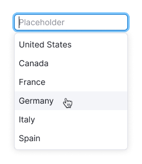
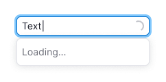
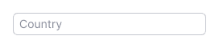
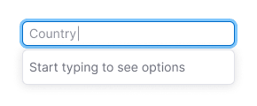
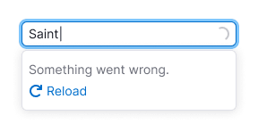
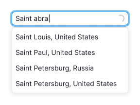
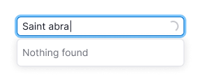
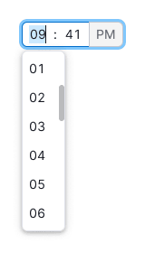
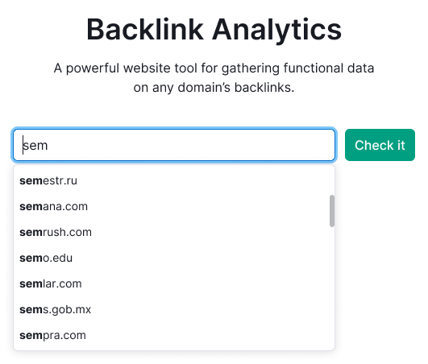

## Description

**AutoSuggest** and **AutoComplete** are patterns for providing as-you-type suggestions by filtering options within dropdowns and selects.

**Combobox** is a pattern that provides a user with a predefined list of options to help with filling out an input.

We've collected the table of differences between these search patterns.

Table: Differences between AutoSuggest, AutoComplete and Combobox search patterns

| Pattern      | List is shown while focusing | List filtering while entering the value | Upon searching, the options menu is scrolled | User can enter data different from the list |
| ------------ | ---------------------------- | --------------------------------------- | -------------------------------------------- | ------------------------------------------- |
| Combobox     | ✅                           | ❌                                      | ✅                                           | ❌                                          |
| AutoComplete | ❌                           | ✅                                      | ✅                                           | ✅                                          |
| AutoSuggest  | ❌                           | ✅                                      | ❌                                           | ✅                                          |

::: tip
If your search behavior differs from those described in the table, don’t hesitate to drop us a line so we can update the guide.
:::

## Pattern composition

These patterns use the following components:

- [Input](/components/input/input);
- [Select](/components/select/select).

## Combobox

**Combobox** is a combination of input and select. In other words it's a select with the possibility to enter the value from the list.

::: tip
User can't enter the data not corresponding to the items list.
:::

Use combobox when usual input, select or autocomplete aren't appropriate for your case. For example, we use it in the [TimePicker](/components/time-picker/time-picker).

### Interaction

The list with items opens as soon as input gets `focus`.

::: tip
Unlike the autocomplete, combobox has no items filtration. If user have entered `abc` into the input, all items will remain in the list, but the list will be scrolled up to the first item, which starts with `abc`.
:::

- If user entered the exact match for one of the items and pressed `Enter`, the item will be selected.
- If user entered the absent item and pressed `Enter`, we recommend you to show the tooltip with the message that it's necessary to select item from the list.

### Validation

Combobox validation works similarly to the other forms. You can find the detailed information in the [Validation](/patterns/validation-form/validation-form).

### Long loading

If your interface needs more time to load the items list, show [Spin](/components/spin/spin) in the input.

## AutoComplete, AutoSuggest

**AutoComplete and AutoSuggest** are combinations of input and select. As user enters information into the input, the corresponding results are displayed in the DropdownMenu.

::: tip
User may enter the data not corresponding to any results of the items list.
:::

The difference between these types of search is conceptual. In the AutoComplete search is performed as the final list of names and symbols. In the AutoSuggest search is performed as the open list of terms and phrases. To dive deep into the subject we recommend you to read [Designing Search: As-You-Type Suggestions](https://uxmag.com/articles/designing-search-as-you-type-suggestions).

### Interaction

As the user enters information into the input, the item list is filtered and only the results matching the entered data remain in the list.

Activating an item in the list selects it and the DropdownMenu closes.

Table: AutoComplete states

| State                | Appearance example                      |
| -------------------- | --------------------------------------- |
| Default              |                  |
| Start typing         |                    |
| Loading results      |                |
| Something went wrong |                    |
| Results              |                  |
| Loading results      |                |
| Nothing found        |  |

## Usage examples

Table: Usage examples

| Search type                                                       | Appearance example           |
| ----------------------------------------------------------------- | ---------------------------- |
| Combobox in the [TimePicker](/components/time-picker/time-picker) |      |
| AutoComplete                                                      |  |
