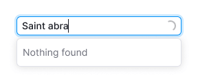

@## Description

**AutoSuggest**, **AutoComplete** and **Combobox** are different patterns for as-you-type suggestions for search with values filtering from the list.

We have collected the table of differences between these search patterns.

| Pattern      | List is shown while focusing | List filtering while entering the value | Upon search the options menu is scrolled | User can enter data different from the list |
| ------------ | ---------------------------- | --------------------------------------- | ---------------------------------------- | ------------------------------------------- |
| Combobox     | ✅                           | ❌                                      | ✅                                       | ❌                                          |
| AutoComplete | ❌                           | ✅                                      | ✅                                       | ✅                                          |
| AutoSuggest  | ❌                           | ✅                                      | ❌                                       | ✅                                          |

> If your search behavior differs from those described in the table, do not hesitate to drop us a line so we can update the guide.

@## Pattern composition

These patterns use:

- [Input](/components/input/);
- [DropdownMenu](/components/dropdown-menu/).

@## Combobox

**Combobox** is a combination of input and select. In other words it's a select with the possibility to enter the value only from the list.

> User cannot enter the data not corresponding to the options list.

You should use it when usual input, select or autocomplete are not appropriate. For example, we use it in [TimePicker](/components/time-picker/).

### Interaction

The list with options opens as soon as input gets `focus`.

> Unlike the autocomplete, combobox has no items filtration. If user have entered `abc` into the input, all items should remain in the list, but the list should be scrolled up to the first item, which starts with `abc`.

If user entered the exact match for one of the items and pressed `Enter`, the item will be selected. If user entered the item absent in the dropdown and pressed `Enter`, show the tooltip with the message that it is necessary to select something from the list.

### Validation

Combobox validation works similarly to other forms. See detailed infromation in [Validation](/patterns/validation-form/).

### Long loading

If you need more time to load the list items, show [Spin](/components/spin/) in the input.

@## AutoComplete, AutoSuggest

**AutoComplete and AutoSuggest** are combinations of input and select. As user enters information into the input, the corresponding results are displayed in a DropdownMenu.

> User may enter the data not corresponding to any results of the options list.

The difference between these types of search is conceptual. In AutoComplete search is performed as the final list of names and symbols. In AutoSuggest it is performed as the open list of terms and phrases. We recommend you [this good article on that subject](https://uxmag.com/articles/designing-search-as-you-type-suggestions).

### Interaction

While user enters information into the input, the items list is filtered, and only the results matching the entered data remain in the list.

Clicking an item in the list selects it and DropdownMenu closes.

|                      | Appearance example                                         |
| -------------------- | ---------------------------------------------------------- |
| Default              |                        |
| Start typing         |                           |
| Loading results      |                      |
| Something went wrong |                            |
| Results              |                        |
| Loading results      |                      |
| Nothing found        |  |

@## Usage examples

Example of Combobox in [TimePicker](/components/time-picker/).

Example of AutoComplete.

@page auto-tips-a11y
@page auto-tips-code
