@## Description

**AutoSuggest** as **Combobox** and **AutoComplete** are varieties of search with selection of values from the list.

To assemble any implementation of search with selection of values from the list you will need the [Input](/components/input/) and [Select](/components/select/) components. And a little magic ✨

For illustrative purposes we have collected the table of differences in such lists with prompts.

| Pattern      | The list is shown upon focusing (if the input box is empty) | List filtering when inputting | Option is highlighted, when the value is selected | Upon search the options menu is scrolled | It is possible to input data different from the list |
| ------------ | ----------------------------------------------------------- | ----------------------------- | ------------------------------------------------- | ---------------------------------------- | ---------------------------------------------------- |
| Combobox     | ✅                                                          | ❌                            | ✅                                                | ✅                                       | ❌                                                   |
| AutoComplete | ❌                                                          | ✅                            | ✅                                                | ✅                                       | ✅                                                   |
| AutoSuggest  | ❌                                                          | ✅                            | ❌                                                | ❌                                       | ✅                                                   |

> If your search behaviour is different from those presented in the table, it is possible that you discovered a new pattern 🕺🏻 (or we have left something out).

@## Appearance

All these patterns consist of:

- [Input](/components/input/);
- [Dropdown-menu](/components/dropdown-menu/).

> 💡 Input width should be such as scroll could be placed into the dropdown.

@## Combobox

**Combobox** is a combination of input and select. In some sense it is the select with the possibility to enter the value manually or from the list.

> 💡 The user cannot enter the data not corresponding to the list items into the combobox.

You should use it when usual input, select or autocomplete are not appropriate - for example, in [Time picker](/components/time-picker/).

### Interaction

Upon focusing the list with all the variants opens in combobox.

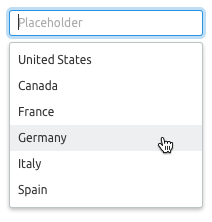

### Keyboard control

- `Tab` shifts between the report elements, including comboboxes;
- `Arrows` shift between the items.

> 💡 By contrast with autocomplete, there is no filtration in the dropdown of the combobox. If the user entered `abc` into the field, all the items will still remain in the dropdown, but the list will be scrolled up to the first item, which starts with `abc`.

If the user entered the exact match for one of the items and pressed `Enter`, the item will be selected. If the user entered the item absent in the dropdown and pressed `Enter`, it is recommended to show the tip in the form of a tooltip with the text that it is necessary to select something from the list.

### Validation

[validation](/patterns/validation-form/) works similarly to inputs.

### Long loading

If our system needs more time to load the proper results, we show a [спиннер](/components/spin/) in the input.

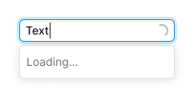

@## AutoComplete, AutoSuggest

**AutoComplete, AutoSuggest** – combination of input and select. In the course of the user’s entering the information into the input the corresponding results are shown in the dropdown menu.

> 💡 The user may enter the data not corresponding to any results of the prompted list into such input.

The difference between these types of search is conceptual. In AutoComplete the search is performed in the final list of names and symbols. In AutoSuggest - in the open list of terms and phrases. [Good material on that subject](https://uxmag.com/articles/designing-search-as-you-type-suggestions).

### Interaction

Upon entering the information into the input, the dropdown menu is filtered by the list, and only the results matching with the entered information remain in the dropdown menu.

Upon clicking the result in the dropdown menu it is put into the input and the dropdown menu with the result is hidden.

|                      | Appearance example                               |
| -------------------- | ------------------------------------------------ |
| default              |              |
| start typing         | 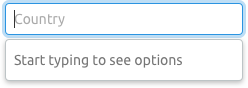                |
| loading results      |            |
| something went wrong | 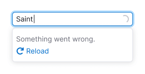                 |
| results              | 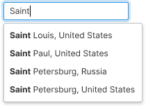             |
| loading results      | 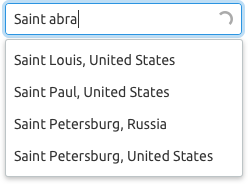           |
| nothing found        | 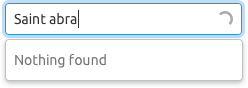 |

### Adding and deleting a line

Some cases may require the feature “Add content”. Using it you may add a line (for example, through the modal window).

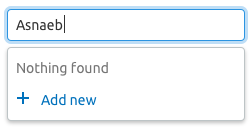

As well, you may add the feature for deleting a line.

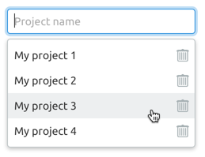

@## Use examples

Example of using `Combobox` in [Time picker](http://i.semrush.com/components/time-picker/).

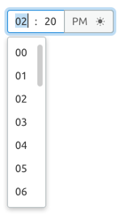

Example of using `AutoComplete` (domain input, country selection etc.).

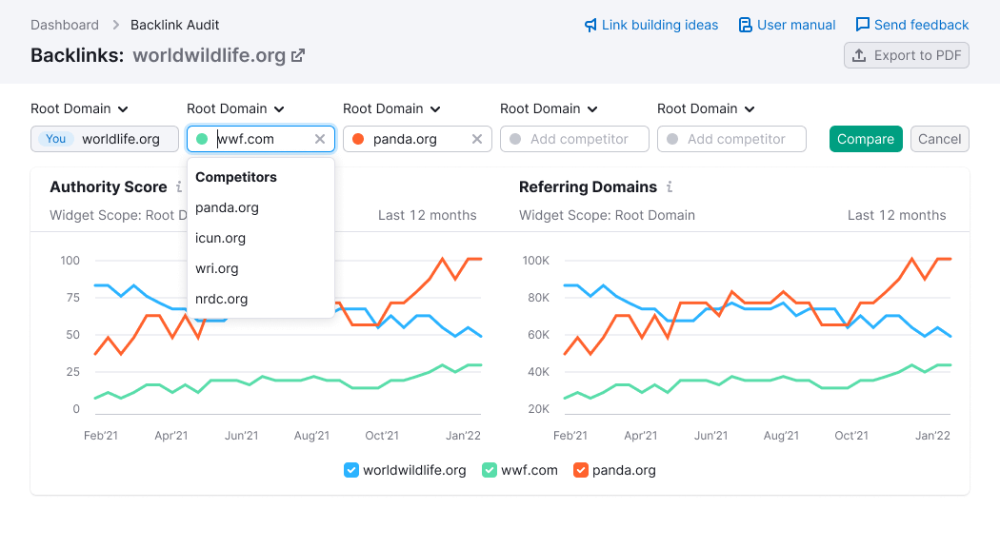

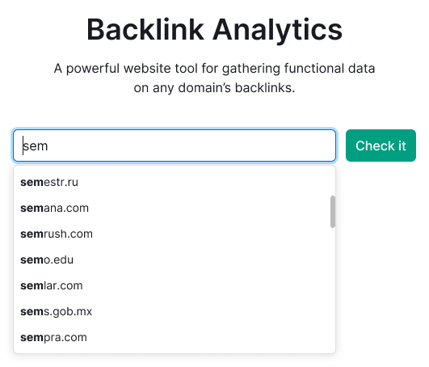

@page auto-tips-code
