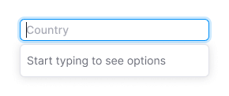

@## Description

**AutoSuggest** as **Combobox** and **AutoComplete** are varieties of search with selection of values from the list.

To assemble any implementation of search with selection of values from the list you need the [Input](/components/input/) and [Select](/components/select/) components. And a little bit of magic ✨

For illustrative purposes we have collected the table of differences between such suggestion lists.

| Pattern      | The list is shown while focusing (if the input box is empty) | List filtering while entering the value | Option is highlighted, when the value is selected | Upon search the options menu is scrolled | It's possible to input data different from the list |
| ------------ | ------------------------------------------------------------ | --------------------------------------- | ------------------------------------------------- | ---------------------------------------- | --------------------------------------------------- |
| Combobox     | ✅                                                           | ❌                                      | ✅                                                | ✅                                       | ❌                                                  |
| AutoComplete | ❌                                                           | ✅                                      | ✅                                                | ✅                                       | ✅                                                  |
| AutoSuggest  | ❌                                                           | ✅                                      | ❌                                                | ❌                                       | ✅                                                  |

> If your search behaviour is different from those presented in the table, it is possible that you discovered a new pattern 🕺🏻 (or we did not take something into account).

@## Appearance

All these patterns consist of:

- [Input](/components/input/);
- [Dropdown-menu](/components/dropdown-menu/).

@## Combobox

**Combobox** is a combination of input and select. In other words it's a select with the possibility to enter the value manually or from the list.

> 💡 The user cannot enter the data not corresponding to the options list.

You should use it when usual input, select or autocomplete are not appropriate — for example, in [Time picker](/components/time-picker/).

### Interaction

The options list opens in combobox when input become focused.

### Keyboard support

- `Tab` shifts between the page interactive elements, including comboboxes;
- `Arrows` shifts between the items.

> 💡 Unlike the autocomplete, there is no filtration in the combobox. If user entered `abc` into the field, all the items will remain in the dropdown, but the list will be scrolled up to the first item, which starts with `abc`.

If user entered the exact match for one of the items and pressed `Enter`, the item will be selected. If the user entered the item absent in the dropdown and pressed `Enter`, it is recommended to show the tooltip with the message that it is necessary to select something from the list.

### Validation

[Validation](/patterns/validation-form/) works similarly to inputs.

### Long loading

If we need more time to load the proper results, we show a [Spin](/components/spin/) in the input.

@## AutoComplete, AutoSuggest

**AutoComplete, AutoSuggest** – combination of input and select. In the course of the user’s entering the information into the input the corresponding results are shown in the dropdown-menu.

> 💡 The user may enter the data not corresponding to any results of the options list.

The difference between these types of search is conceptual. In AutoComplete the search is performed in the final list of names and symbols. In AutoSuggest — in the open list of terms and phrases. [Good material on that subject](https://uxmag.com/articles/designing-search-as-you-type-suggestions).

### Interaction

While entering the information into the input, the dropdown-menu is filtered by the list, and only the results matching with the entered information remain in the dropdown-menu.

After clicking on an option in the dropdown-menu, the selected option is inserted into the input. The dropdown-menu closes.

|                      | Appearance example                               |
| -------------------- | ------------------------------------------------ |
| default              |              |
| start typing         |                 |
| loading results      |            |
| something went wrong |                  |
| results              |              |
| loading results      |            |
| nothing found        |  |

### Adding and deleting a line

Some cases may require the feature “Add content”. Ther user can may add a line (for example, through the modal window) by using it.

As well, you may add the control for deleting a line.

@## Use examples

Example of using `Combobox` in [Time picker](http://i.semrush.com/components/time-picker/).

Example of using `AutoComplete` (domain input, country selection etc.).

@page auto-tips-code
