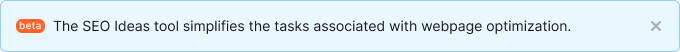
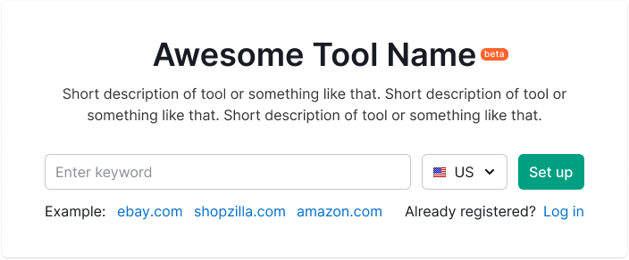

@import playground

@## Description

**Badge** is a component for visual indicating the product or showing feature status.

_For example, you added a new tab to the report. In this case, you need to highlight a new feature in your product with a `new` badge._

- Badge can not be deleted or added by a user. Badge is added to the elements by the system according to the rules described below in the table.
- Badge is not clickable.
- Do not use badge for filtering the data.

@## Appearance

This component has one size.

### Colors

Use the following badges in the products depending on the status of the product or feature:

| Badge                      | Color          | When used                                                                                                                                                                                                                                                                          |
| -------------------------- | -------------- | ---------------------------------------------------------------------------------------------------------------------------------------------------------------------------------------------------------------------------------------------------------------------------------- |
|  | `--blue-300`   | Use it with products or features that are only available for users with admin rights, i.e. for Semrush employees. We need our colleagues to understand that this functionality is not visible to users.                                                                         |
|  | `--red-300`    | It is used with products or features that are available only to admins and a limited number of users who have been granted access as beta users. This functionality may be used without any guarantees, it is unstable, and may be changed significantly over time or be disabled. |
|    | `--orange-300` | Use only for unstable functionality of a product or feature. A product/feature was released to test the product hypothesis, and it can have major changes in the future.                                                                                            |
|      | `--green-300`  | Use with products and features that are out of beta, and with new features that are available to all users. Use it to attract attention to a new product or feature.                                                                                                              |
|    | `--gray-300`   | It can be set on “placeholders” for collecting feedback, simulating the appearance of a new functionality.                                                                                                                                                                         |

### Usage on dark/colored background

Every badge can be inverted like this:

Use `--white` color for the background and `--gray-800` for the text color.

@## Feature status

The feature status can be shown inside most of the controls.

### Button

### Pill

### Mention of the feature status in the notification

> Keep in mind that you need to label data in tables using the [Tag](/components/tag/) component, and not using badge which indicates the status of product or feature.

@## Location

Badge is usually located to the right of the element. As an exception, in the [Notice](/components/notice/) component, badge is positioned to the left relative to the text. Badge's margins are always multiples of 4.

@## Usage in UX/UI

### Left menu

### Report header

### Landing page header

### Widget

@page badge-a11y
@page badge-api
@page badge-code
@page badge-changelog
