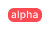
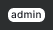

@import playground

@## Description

**Badge** is a visual component used to indicate the status of a feature or product.

_For example, you added a new tab to the report. In this case, you can highlight a new feature in your product with a `new` badge._

**Main features of the component:**

- Badge cannot be deleted or added by a user. Badge is added to the elements by the system according to the rules described below in the table.
- Badge is not clickable.
- Do not use badge for filtering the data.

@## Appearance

Component has one size.

### Badge types

Use the following badges in the products depending on the status of the feature or product:

| Badge                      | Background     | When used                                                                                                                                                                                                                                                                                 |
| -------------------------- | -------------- | ----------------------------------------------------------------------------------------------------------------------------------------------------------------------------------------------------------------------------------------------------------------------------------------- |
|  | `--blue-400`   | Use it with features that are only available for users with admin rights. The functionality with `admin` badge is not visible to the other users.                                                                                                                                         |
|  | `--red-400`    | Use it with features which are available only to admins and a limited number of users who have been granted access as `alpha` users. The functionality under this badge should be used without any guarantees, it is unstable, and may be changed significantly over time or be disabled. |
|    | `--orange-400` | Use only for unstable functionality of a feature or product. A product/feature with this badge was released to test the product hypothesis, and it can have major changes in the future.                                                                                                  |
|      | `--green-400`  | Use with products and features that are out of beta, and with new features that are available to all users. Use it to attract attention to a new product or feature.                                                                                                                      |
|    | `--gray-400`   | It can be set on “placeholders” for collecting feedback.                                                                                                                                                                                                                                  |

### Usage on dark/colored background

Every badge can be inverted like this:

Use `--gray-white` color for the background and `--gray-800` for the text color.

@## Feature status

The feature status can be shown inside most of the components and controls.

### Button

### Pill

### Feature status in the notification

### Badge vs. Tag

Do not confuse [Tag](/components/tag) and Badge components. Tag is used for thematic grouping and labeling data, while the Badge indicates the status of a feature or product.

@## Location

Badge is usually placed to the right of the element. As an exception, in the [Notice](/components/notice/) component, badge is positioned to the left relative to the text. Badge's margins are always multiples of 4.

@## Usage in UX/UI

| Component/block     | Appearance example                        |
| ------------------- | ----------------------------------------- |
| Product header      |  |
| Landing page header |  |
| Widget              |               |

@page badge-a11y
@page badge-api
@page badge-code
@page badge-changelog
