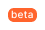
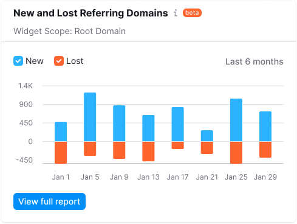

::: react-view

:::

## Description

**Badge** is a visual component used to indicate the status of a feature or a product.

_For example, you've added a new tab to the report. In this case, you can highlight the new feature in your product with the `new` badge._

**Main features of the component:**

- Badge can't be deleted or added by a user. Badge is added to elements by the system according to the rules described in [Types](#types).
- Badge isn’t clickable.
- Don’t use badge for filtering data.

## Appearance

Component has one size.

### Types

Use the following badges in the products depending on the status of the feature or product:

Table: Badge types

| Badge                          | Background                  | When used                                                                        |
| ------------------------------ | --------------------------- | -------------------------------------------------------------------------------- |
|      | <nobr>`--blue-400`</nobr>   | Use it with features that are only available for users with admin rights. The functionality with `admin` badge isn’t visible to the other users.            |
|      | <nobr>`--red-400`</nobr>    | Use it with features which are available only to admins and a limited number of users who have been granted access as `alpha` users. The functionality under this badge should be used without any guarantees, it's unstable, and may be changed significantly over time or be disabled. |
|        | <nobr>`--orange-400`</nobr> | Use only for unstable functionality of a feature or product. A product/feature with this badge was released to test the product hypothesis, and it can have major changes in the future.                    |
|          | <nobr>`--green-400`</nobr>  | Use with products and features that are out of beta, and with new features that are available to all users. Use it to attract attention to a new product or feature.            |
|  | <nobr>`--voilet-400`</nobr> | Use to promote products in the main navigation sidebar or other places. |
|        | <nobr>`--gray-400`</nobr>   | Can be placed on products and features that aren't yet available and are displayed for collecting feedback.         |

### Usage on dark/colored background

Any badge can be inverted like this:

Use `--gray-white` color for the background and `--text-primary` for the text color.

## Feature status

The feature status can be shown inside most of the components and controls.

### Button

### Pills

### Notification

### Badge vs. Tag

Don’t confuse [Tag](/components/tag/tag) and Badge components. Tag is used for thematic grouping and labeling data, while the Badge indicates the status of a feature or product.

## Placement

Badge is usually placed to the right of the element. As an exception, in the [Notice](/components/notice/notice) component, badge is positioned to the left relative to the text. Badge's margins are always multiples of 4.

## Usage in UX/UI

Table: Badge usage examples

| Component/block     | Appearance example                        |
| ------------------- | ----------------------------------------- |
| Product header      |  |
| Landing page header |  |
| Widget              |               |

