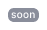
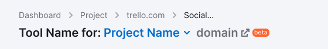

@import playground

@## Description

**Badge** is a visual marker indicating the product or feature status.

_For example, you added a new tab to the report. In this case, you need to highlight a new feature in your product with a `new` badge._ At the same time, if the tab has the badge teaser `soon`, when data appears it is also important to place a `new` badge on this tab.

@## Appearance

This component has the same size.

### Colors

We use the following badges in the interface of our products depending on the stage of development of the product or feature:

| Badge                      | Color     | When used                                                                                                                                                                                                                                                                                                                                                                                                                                                        |
| -------------------------- | --------- | ---------------------------------------------------------------------------------------------------------------------------------------------------------------------------------------------------------------------------------------------------------------------------------------------------------------------------------------------------------------------------------------------------------------------------------------------------------------- |
|  | `$cyan`   | We use it with products or individual features that are only available for users with admin rights, i.e. for Semrush employees. We need our colleagues to understand that this functionality is not visible to users, it should not be visible on screenshots and webinars.                                                                                                                                                                                      |
|  | `$red`    | It is used with products or individual features that are available only to admins and a limited number of users who have been granted access as beta users. Our colleagues and beta users shall understand that this functionality is not seen by the majority of users, it should not be visible in screenshots and webinars. This functionality may be used without any guarantees, it is unstable, and may be changed significantly over time or be disabled. |
|    | `$orange` | Used if the following is relevant. Unstable operation of a tool/feature. A tool/feature was released to test the product hypothesis, and it will be subject to major changes in the future. Limits are not defined (the decision that limits are not needed shall mean certain limits, and it shall not mean the reason to leave beta) or it is assumed that they will be cut.                                                                                   |
|      | `$green`  | Used with products and features that are out of beta, and with new features that are available to all users. We use it to attract attention to a new product or feature.                                                                                                                                                                                                                                                                                         |
|    | `$mist`   | It can be set on “placeholders” for collecting feedback, simulating the appearance of new functionality.                                                                                                                                                                                                                                                                                                                                                         |

@## Mechanics and states

- You can't delete or add a badge, because it is added by the service according to the rules described above.
- Badges are not clickable controls.
- Badges can not be used for filtering.

@## Examples in our interface

### Left menu

### Report header

### Landing page header

### Widget

@## Feature status

The feature status can be shown inside most of our controls. Please note the relevance and consult with colleagues if in doubt.

### Button

### Pill

### Mention of the feature status in the notification

> Keep in mind that you need to label data in tables using the [Tag](/components/tag/) component, and not using badges that indicate the status of products and features.

@## Location

The `Badge` is usually located to the right outside of the element and to the right inside the element. As an exception, in the [Notice](/components/notice/) component, it is positioned to the left relative to the text. `Margins` to budge are always multiples of 4.

@page badge-api
@page badge-code
@page badge-changelog
