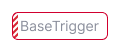
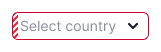
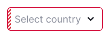

## Description

**BaseTrigger** is a foundational component for creating triggers with button-like behavior, resembling buttons, links, or filters.

`BaseTrigger` has the following types for using in different scenarios:

- `ButtonTrigger`
- `FilterTrigger`
- `LinkTrigger`

## Appearance

Table: BaseTrigger sizes, margins and paddings

| Size (height in px) | Appearance example                                       | Margins |
| ------------------- | -------------------------------------------------------- | ------- |
| M (28px)            |   | The button has `padding: 0 var(--intergalactic-spacing-2x)`, leading addon has `margin-right: var(--intergalactic-spacing-2x)`, trailing addon has `margin-left: var(--intergalactic-spacing-2x)`. |
| L (40px)            |   | The button has `padding: 0 var(--intergalactic-spacing-3x)`, leading addon has `margin-right: var(--intergalactic-spacing-2x)`, trailing addon has `margin-left: var(--intergalactic-spacing-2x)`. |

## Interaction

Table: BaseTrigger states

| State     | Appearance example                    | Styles |
| --------- | ------------------------------------- | ------ |
| Normal    |    | The background uses `--bg-primary-neutral` token. |
| Hover     |     | The background changes to `--bg-primary-neutral-hover`. |
| Active    |    | The background reverts to `--bg-primary-neutral`, and border changes color to `--border-info-active`. |
| Invalid   |   | The border changes color to `--border-critical-active`. |
| Valid     |     | The border changes color to `--border-success-active`. |
| Disabled  |  | The component changes opacity to `--disabled-opacity`. |

## ButtonTrigger

ButtonTrigger has the same sizes as BaseTrigger has.

Table: ButtonTrigger sizes

| Size (height in px) | Appearance example                      |
| ------------------- | --------------------------------------- |
| M (28px)            |  |
| L (40px)            |  |

### ButtonTrigger states

Table: ButtonTrigger states

| State  | Appearance example |
| ------ | ------------------ |
| Normal |   |
| Hover  |   |
| Active |   |
| Invalid |   |
| Disabled |   |

## FilterTrigger

This type has separate detailed [FilterTrigger guide](/components/filter-trigger/filter-trigger) since it operates as an active state of a filter.

 

## LinkTrigger

LinkTrigger has the styles of the [Link component](/components/link/link).

Table: LinkTrigger sizes

| Size (height in px) | Appearance example                    |
| ------------------- | ------------------------------------- |
| M (28px)            |  |
| L (40px)            |  |

### LinkTrigger states

Table: LinkTrigger states

| State  | Appearance example |
| ------ | ------------------ |
| Normal |   |
| Hover  |   |
| Active |   |
| Disabled |   |

