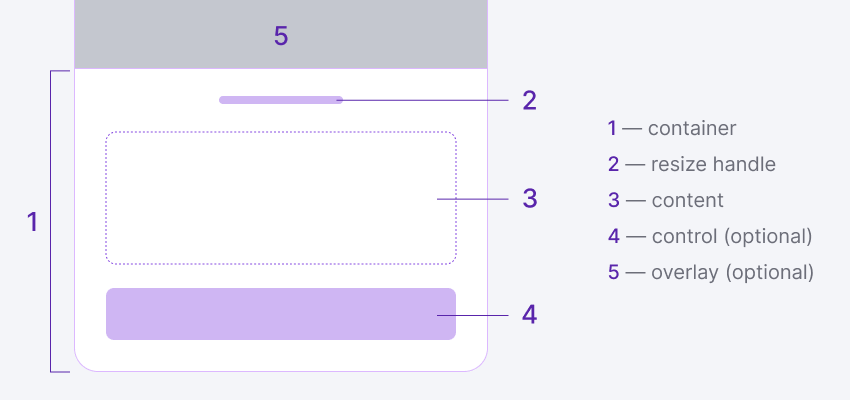
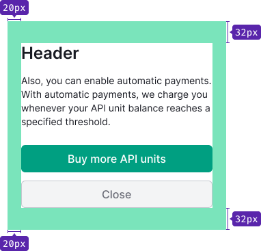
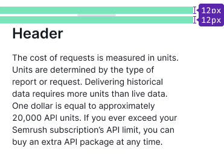
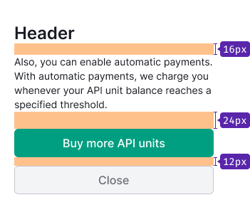
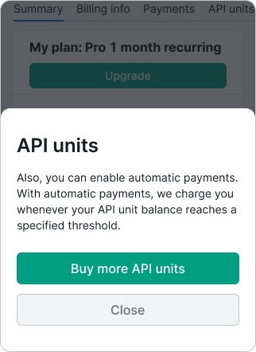
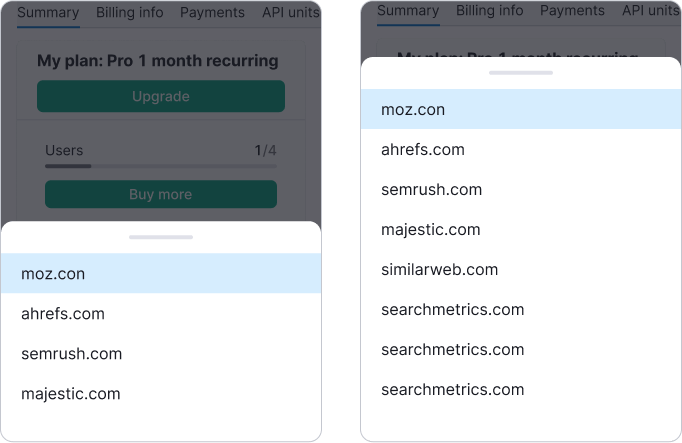
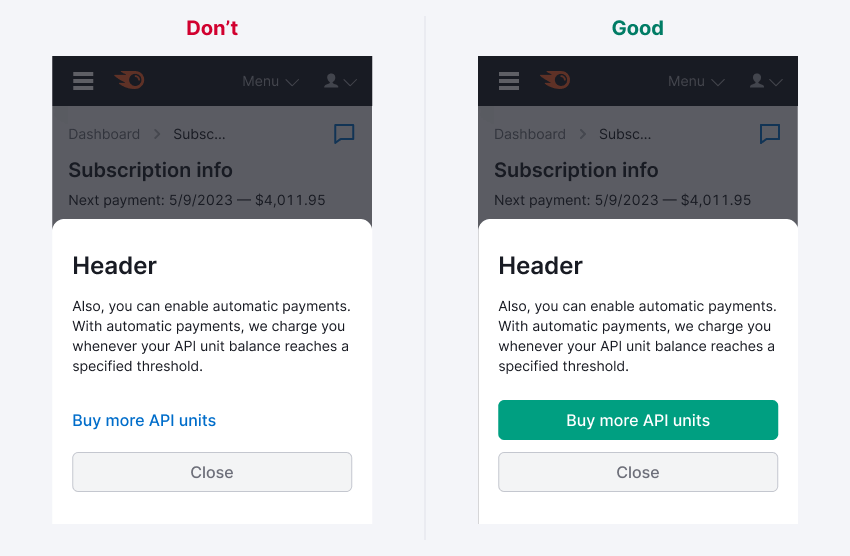
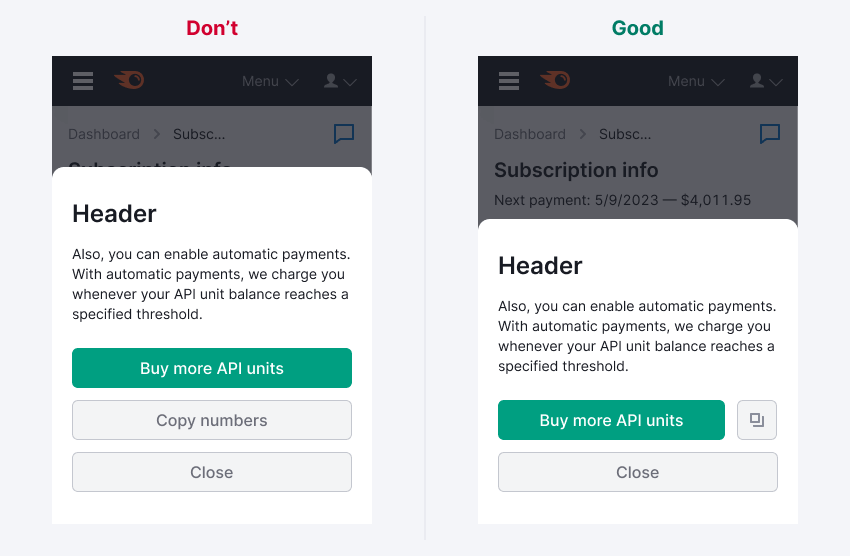
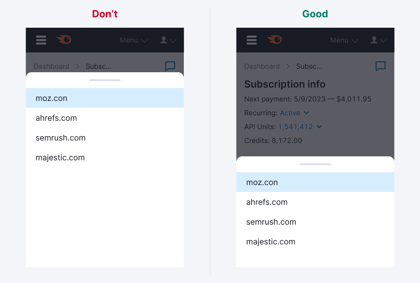

## Description

BottomSheet is a mobile component with additional content inside. It's always attached to the bottom of the screen. On desktop, use this component instead of a tooltip, dropdown, dropdown-menu, and similar components.

> Use it wisely—make sure that it improves the user experience and doesn't add unnecessary complexity.

Use the bottom sheet in the following scenarios:

- Show users a set of quick actions related to the current screen. For example, to allow sharing or saving a piece of content without leaving the current screen.
- Provide easy access to settings for modifying preferences.
- Display a list of filters or sorting options (a list or grid of items).
- Show hints and additional information to the user (text, formatted text with lists, links, buttons, and small images).

Don't use the bottom sheet:

- For complex information (data widgets, graphs, tables, etc.).
- To notify a user to take action.
- Instead of a side panel, notice bubble, confirming modal windows, or regular modal windows.

## Component composition

## Padding and margins

The content area has a default padding of 20px*32px:

The ResizeHandle has a defaul padding of 12px:

Recommendation for content margins for the variant with text:

## Scaling and adaptation

On mobile devices, bottom sheets extend across the width of a screen and are elevated above the primary content. Usually it works for all mobile devices and tablets from 824px—such as the iPad Pro—and smaller. The bottom sheet should scale to fit larger screens in one of two ways:

- Setting a maximum width.
- Switching to another component such as the side panel.

## Variations

There are two variants of bottom sheets: fixed and resizable. The user can expand the bottom sheet to take up most of the viewing area by swiping or dragging it up.

**Fixed**

The user can't resize the fixed bottom sheet. It resizes automatically to fit the content.

**Resizable**

The user can drag or swipe up on the resizable bottom sheet to reveal more content. The expanded bottom sheet leaves at least 48px uncovered at the top of the screen. Tapping this area closes the bottom sheet.

**Interaction**

Bottom sheets can be closed by swiping down on the bottom sheet or by using the Close button inside the component. The component can also be closed by tapping outside the bottom sheet.

## Usage

We recommend using a button instead of a link. The main action should always be the primary button. Other actions could be secondary or tertiary buttons depending on their priority.

>If you use a link for the main action, be sure to expand the touch target area.

Try to avoid placing buttons in more than two rows.

The height of the bottom sheet should match the height of the content.

