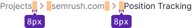

@import playground

@## Description

**Breadcrumbs** is a component used to display the "user's path" on the site. It's used as an auxiliary navigation tool.

**Why breadcrumbs are useful**:

- they unobtrusively tell the user which page they are on;
- they help you link to other pages on the site (useful for SEO);
- they allow you to move between higher / lower nesting levels without clicking the Forward / Backward buttons in the browser.

> 💡 Breadcrumbs are not used on the main pages.

@## Appearance & styles

Links inside this component are custom style links.

|                     | Styles                                                                         |
| ------------------- | ------------------------------------------------------------------------------ |
| Link                | `font-size: 12px; color: $gray60; cursor: pointer;`, there is no `line-height` |
| `ChevronRight` icon | Icon color `$gray60`, `cursor: default;`                                       |

> 💡 **Pay attention**. The last item in the breadcrumbs is always non-clickable.

### Margins

The margins between the components inside the breadcrumbs: 8px.

### Long links

If the links in the breadcrumbs don't fit (the screen is too small or the text is too long), the last item is collapsed into three dots (ellipsis).

@## Mechanics and states

|        | Styles                                                                         |
| ------ | ------------------------------------------------------------------------------ |
| normal | `font-size: 12px; color: $gray60; cursor: pointer;`, there is no `line-height` |
| hover  | `color: $gray20;` + underline                                                  |
| active | `color: $gray20; cursor: default;`                                             |

@## Use in UX/UI

The recommended order of the levels in the breadcrumbs:

- The first link is **Dashboard**, it leads to a shared screen with widgets for various tools.
- The second link is the **tool's Projects and/or the tool's home page**.
- The third link is the **Name of the project**.
- The fourth link is the **Name of the tool**.

@page breadcrumbs-api
@page breadcrumbs-code
@page breadcrumbs-changelog
