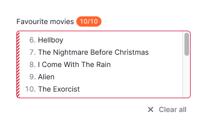
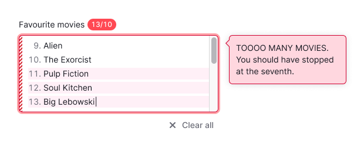

## Description

**BulkTextarea** is a multiline text field designed for entering lists of comma-separated values.

You can enter a list manually using **Enter** or a comma, or paste a comma-separated list. You can also define your own rules for splitting values into rows.

This component also provides the possibility to validate every row and the whole input.

## Component composition

Component consists of the following:

**_(THESE NAMES ARE TEMPORARY, WILL BE UPDATED ACCORDING TO THE ACTUAL COMPONENT)_**

- `BulkTextarea.Label`
- `BulkTextarea.Textarea`
- `BulkTextarea.TextareaRows`
- `BulkTextarea.TextareaRowsItem`
- `BulkTextarea.Navigation`
- `BulkTextarea.ClearButton`

## Appearance

### Sizes

Component has two sizes:

Table: BulkTextarea sizes

| Size (font size) | Appearance example     |
| ---------------- | ---------------------- |
| M (`--fs-200`)   |  |
| L (`--fs-300`)   |  |

### Rows

Each row is numbered. Rows that fail validation are marked with a `Warning` icon on the right. Rows that exceed the limit are highlighted.

### Width and height

Avoid making the textarea smaller than 160–200px in width and 3–4 rows in height. Working with large amounts of data in smaller sizes can be challenging, especially when it serves as a primary input in a form.

## Counter

BulkTextarea includes a counter displaying the number of rows entered. It's always positioned next to the text label.

Table: BulkTextarea with counter

| Size (font size) | Input with label       |
| ---------------- | ---------------------- |
| M (`--fs-200`)   |  |
| L (`--fs-300`)   |  |

### How counter works

1. The counter shows the value limit and updates once user enters at least one character on the line.
2. The counter updates if the user deletes a character and a line.
3. If the user presses **Enter** or types a comma on an empty line, they stay on the same line. This helps avoid adding unnecessary blank lines.
4. For now duplicate lines are counted.
5. You can set your own validation rules for how invalid values are counted in the counter.

### Values near and above limit

When the number of values reaches the limit, the counter changes its theme to `warning`.

Rows with values that exceed the limit are highlighted. Counter changes its theme to `danger`.

## Controls

In the component, the controls have a default placement, but if you need to position them elsewhere, you can expand the component and arrange them differently. [Refer to the example](/components/bulk-textarea/bulk-textarea-code#expanded-bulktextarea).

### Clear field button

As soon as at least one character is entered in the field, a button for clearing the field appears next to it. By default, the button is positioned to the bottom right of the field.

### Navigation buttons

Error navigation shows up after all the values or a single value (depending on the validation method) are validated. The number of errors is shown next to the buttons.

When a button is clicked, the cursor moves to the first or last invalid row, depending on the button. The entire row's value is selected for quick deletion. The text next to the navigation buttons updates to _"n out of n"_ when the cursor is moved using the buttons, keyboard, or mouse.

When navigating between invalid rows, the text next to the buttons is updated. If you move from an invalid row to a valid row, the counter in the text stays the same.

<!-- Hiding this section since for now component doesn't have it.
 ### Resize control

You can enable the resize control for the textarea, allowing users to adjust its size. They can stretch it horizontally, vertically, or both ways.

When the textarea cannot be stretched further, a scrollbar will appear after a certain number of rows. We recommend adding scrollbars when the textarea has at least 5 rows.

::: tip
Avoid making the textarea smaller than 160–200px in width and 3–4 rows in height. Working with large amounts of data in smaller sizes can be challenging, especially when it serves as a primary input in a form.
::: -->

## Interaction

### States

BulkTextarea has the same states and styles as [Textarea](/components/textarea/textarea#interaction).

### Validation

You can define your own validation rules for the input: on submit, on blur, or on row blur. By default, our component uses on blur validation.

### Tooltips

If there are invalid values in the textarea after validation, you can show a tooltip for the entire textarea or for individual rows when the cursor is on them.

