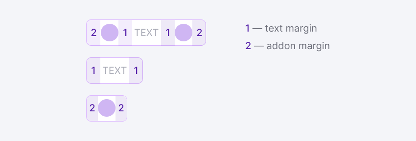
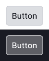
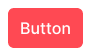

@import playground

@## Description

**Button** is a control element that calls you to perform an action on the page. Compared to [links](/components/link/), this is an accent control or CTA required for performing the main actions on the page.

> 💡 In some cases, you can use the button as a link that leads to another page. Use this feature only in extreme cases, when the [Link](/components/link/) component is not suitable for you at all.

@## Appearance

**There are 4 button sizes in our interface.** The button content is always centered relative to the vertical and horizontal position of the button.

You can add an [icon](/style/icon/), a [counter](/components/counter/), a [badge](/components/badge/), a ["mandarin"](/components/dot/) and a [flag](/components/flags/) to each of these buttons before and after the text.

The button text has margins on the right and left, and Addons that can be inserted inside the button also have margins on the right and left 😎

@## Sizes

| Button size   | Icon size | Appearance example               | Description                                                                                                                                                                                                                        |
| ------------- | --------- | -------------------------------- | ---------------------------------------------------------------------------------------------------------------------------------------------------------------------------------------------------------------------------------- |
| **XL (42px)** | M         |  | Used in: landing pages for main actions; limits (when the entire report or a significant part of the report is overlapped, and you need to focus on the main actions); modal windows with limits; modal windows with registration. |
| **L (32px)**  | S         |    | Used in: modal windows for main actions; empty pages and states that need to focus on the target action.                                                                                                                           |
| **M (26px)**  | XS        |    | This is the standard size of buttons for everyday routine actions in tools. Used in: filters, dropdowns, tables, modal windows for secondary actions and filters.                                                                  |
| **S (18px)**  | XXS       |    | 💡 **This is the deprecated size. Please do not use it in your interfaces, as it is already outdated**.                                                                                                                            |

@## Button width

The button width is determined by the width of the typed text/content. But it can also be stretched to a certain width (100%) - `w="100%"`.

This is necessary when the button text is short, but the button is a CTA on the page/in a modal window or it performs an important action. Also, in terms of visual hierarchy, it is not good to make it small-sized in such cases. Use this opportunity thoughtfully and carefully.

It is important that the CTA is always visually more significant than the secondary button due to its color and size.

@## Button types

We have 3 main button types. All button types can be used on a white and gray background, as well as on a transparent colored background of notifications.

### Primary

Main accent button for filters and basic actions on the page.

|               normal                |               hover               |               active                |                loading                | disabled                                |
| :---------------------------------: | :-------------------------------: | :---------------------------------: | :-----------------------------------: | --------------------------------------- |
|  |  |  |  |  |

### Secondary

Normal non-accent button for secondary/repetitive actions on the page.

|             normal              |                hover                 |                 active                 |                 loading                  | disabled                                   |
| :-----------------------------: | :----------------------------------: | :------------------------------------: | :--------------------------------------: | ------------------------------------------ |
|  |  |  |  |  |

### Tertiary

Control for third-party actions on the page. The tertiary button, unlike link, can be used when there is enough space and a large click area is needed.

|             normal             |                hover                |                active                 |                 loading                 | disabled                                  |
| :----------------------------: | :---------------------------------: | :-----------------------------------: | :-------------------------------------: | ----------------------------------------- |
|  |  |  |  |  |

@## Themes

For the primary button, use the themes that correspond to a particular situation. See the [visual loudness scale](/patterns/visual-loudness-scale) guide.

| Info                                 | Success                                    | Danger                                   |
| ------------------------------------ | ------------------------------------------ | ---------------------------------------- |
|  |  |  |

> 💡 You can also use the existing themes for the secondary and tertiary buttons, **but in very extreme cases**, when you can't do without a color for the secondary button.

@## Margins between buttons

**The margin shall be multiple of 4**. If there are several buttons next to each other, use the margins shown in table below for the appropriate button size.

|             XL (42px)              |             L (32px)              |             M (26px)              |             S (18px)              |
| :--------------------------------: | :-------------------------------: | :-------------------------------: | :-------------------------------: |
|  |  |  |  |

@## Use in UX/UI

- Leave one CTA on the page and in the modal window. For example, one green `success` button.
- We recommend that you do not disable CTA in the tools, even if something went wrong (especially in filters and modal windows with a single CTA). The user shall understand that the tool/service is still running. When you click on the button, tell the user in the simplest terms about the error or what they need to do in this case.
- If you can't do without a button in the disabled state, be sure to add a tooltip on it with an explanation of why it is `disabled`.
- If there are a lot of actions in your interface, first of all set your priorities in the correct way. Spread the controls in your interface according to the [visual loudness scale](/patterns/visual-loudness-scale) guide. First of all, use inactive "quiet" buttons in the interface. Don't "shout" at the user with your interface, let them work with our cool products in peace.

@## Button variations

The **text button** is the main one in the Semrush interface. It is used when:

- the button is a CTA;
- the interface has enough space for buttons.

We recommend using a **button with an icon and text** in cases where:

- the button is a CTA, and it needs an additional visual accent in the form of an icon;
- the interface has enough space for buttons;
- the user is not yet familiar with the functionality of the button, and one icon/text may not be enough for them to understand.

We recommend using the **icon button** if:

- space for controls is limited;
- the user can easily understand from the context its function (purpose)/the user is already trained and understands the functionality of the button without a lettering or explanation.

> 💡 **Attach a tooltip with information about its function to the icon button**. It can help the user understand functionality of the button if the icon provides ambiguous information.

@## Button name

The button name must start with a capital letter.

The button name shall not exceed 3 words. Such controls are difficult to read. Try to fit the desired meaning into the shortest possible name.

The name of the button should clearly indicate what happens after you click on it.

@## Branded buttons

Sometimes you need to show that the button connects or links to some other service. In this case, you should use a branded color for the background or the corresponding color icon of the service.

It is better to completely paint the button in a branded color when you need to focus on it, and it will not violate the visual hierarchy of the product.

> We recommend using the branded icon inside the secondary buttons. This is the safest option in relation to the visual hierarchy of the product.

@## Groups of buttons and other controls

To combine the components such as Button, Input, and Select, we have the [NeighborLocation](/utils/neighbor-location) component.

@page button-a11y
@page button-api
@page button-code
@page button-changelog
