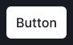
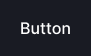

@import playground

@## Description

**Button** is a control component that performs an action on the page. Compared to [Link](/components/link/), it's an accent control or CTA required for performing the main actions on the page.

> In extreme cases, you can use the button as a [Link](/components/link/) that leads to another page.

@## Component composition


The button text has margins on the right and left. You can add addons before and after the text. As addons you can use:

- [Icon](/style/icon/),
- [Counter](/components/counter/),
- [Badge](/components/badge/),
- [Flag](/components/flags/).

Addons have margins on the right and left.

@## Sizes

| Button size  | Icon size | Appearance example             | Description                                                                                                              |
| ------------ | --------- | ------------------------------ | ------------------------------------------------------------------------------------------------------------------------ |
| **L (40px)** | M         |  | Use this size in modal windows for main actions, empty pages and page states that need to focus user on the main action. |
| **M (28px)** | M         |  | This is the default size of the button. Use it freely in filters, dropdowns, tables, etc.                                |

@## Button width

The button width is determined by its content. But it can also be stretched to a certain width:

```
w="100%"
```

This is necessary when the button text is short, but the button is a CTA on the page/in a modal window or it performs an important action. Also, in terms of visual hierarchy, it is not good to make it small-sized in such cases.


It is important that the CTA is always visually more significant than the secondary button due to its color and size. So don't hesitate to make button wider if necessary.


If you need to use a single button with a very long label we recommend you to set it's width to at least 120px.


@## Button types

We have three button types (they are called `use` in API). All button types can be used on a white and gray background, as well as on a transparent colored background.

### Primary

Main accent button for filters and basic actions on the page.

|               normal                |               hover               |               active                |                loading                | disabled                                |
| :---------------------------------: | :-------------------------------: | :---------------------------------: | :-----------------------------------: | --------------------------------------- |
|  |  |  |  |  |

### Secondary

Default non-accent button for secondary/repetitive actions on the page.

|             normal              |                hover                 |                 active                 |                 loading                  | disabled                                   |
| :-----------------------------: | :----------------------------------: | :------------------------------------: | :--------------------------------------: | ------------------------------------------ |
|  |  |  |  |  |

### Tertiary

Control for third-party actions on the page. The tertiary button, unlike link, can be used when there is enough space and a large click area is needed.

|             normal             |                hover                |                active                 |                 loading                 | disabled                                  |
| :----------------------------: | :---------------------------------: | :-----------------------------------: | :-------------------------------------: | ----------------------------------------- |
|  |  |  |  |  |

### Invert primary

We recommended you to use invert buttons on dark or colored background. For example in [Tooltip](/components/tooltip/), [NoticeBubble](/components/notice-bubble/), etc.

|               normal                |               hover               |               active                |                loading                | disabled                                |
| :---------------------------------: | :-------------------------------: | :---------------------------------: | :-----------------------------------: | --------------------------------------- |
|  |  |  |  |  |

### Invert secondary

|                   normal                   |                  hover                   |                   active                   |                   loading                    | disabled                                       |
| :----------------------------------------: | :--------------------------------------: | :----------------------------------------: | :------------------------------------------: | ---------------------------------------------- |
|  |  |  |  |  |

### Invert tertiary

|                    normal                    |                   hover                    |                    active                    |                    loading                     | disabled                                         |
| :------------------------------------------: | :----------------------------------------: | :------------------------------------------: | :--------------------------------------------: | ------------------------------------------------ |
|  |  |  |  |  |

@## Themes

For the primary button you can use themes according to the visual hierarchy on the page. See the [visual loudness scale](/patterns/visual-loudness-scale) guide.

| Info                                 | Success                                    | Danger                                   |
| ------------------------------------ | ------------------------------------------ | ---------------------------------------- |
|  |  |  |

@## Margins between buttons

**The margin between buttons shall be [multiple of 4](/style/variables/#main_denominator)**. If there are several buttons next to each other, use the recommended margins shown in table below.

| L (40px)                         | M (28px)                         |
| :------------------------------- | :------------------------------- |
|  |  |

@## Use in UX/UI

- Leave one CTA on the page and in the modal window. _For example, one green button._
- We recommend you do not disable CTA, even if something went wrong (especially in filters and modal windows with a single CTA). The user need to understand that the product/service is working. When user clicks on the button, add a message about the error or what user needs to do in this case.
- If you can't do without a button in the disabled state, be sure to add a tooltip for it with an explanation of why main action is disabled.
- If there are a lot of actions in your interface, first of all set your priorities. Place controls in your interface according to the [visual loudness scale](/patterns/visual-loudness-scale) guide. Use inactive "quiet" buttons in the interface. Don't "shout" at the user with your interface, let them work with your product in peace and comfort.

@## Button variations

The **text button** is the main one in the Semrush interface. It is used when:

- the button is a CTA;
- the interface has enough space for buttons.

We recommend using a **button with an icon and text** in cases where:

- the button is a CTA, and it needs an additional visual accent (icon);
- the interface has enough space for buttons;
- user is not yet familiar with the functionality of the button, and icon or only text may not be enough for them to understand.

We recommend using the **icon button** if:

- space for controls is limited;
- user can easily understand from the context its function (purpose) / user understands the functionality of the button without an explanation.

> **Add a tooltip with information about button's function to the icon-only button**. It helps user to understand functionality of the button if the icon is not the obvious one.

@## Button label

Button label always starts with a capital letter.


**Button label shall not exceed three words.** Too wordy controls are difficult to read. Try to fit the desired meaning into the short label.


The label of the button should clearly indicate what happens after user clicks on it.


@## Branded buttons

Sometimes you need to show that button connects or links to some other service. In this case, use a branded color for the background or the corresponding color icon of the service.

- You can completely color the button in a branded color when you need to focus user on it.
- You can use secondary button with the branded icon inside. This is the safest option in relation to saving the visual hierarchy of the product.


@## Groups of buttons

To combine the components such as Button, Input, and Select, use the [NeighborLocation](/utils/neighbor-location) component.

@page button-a11y
@page button-api
@page button-code
@page button-changelog
