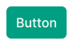
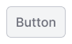
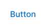

::: react-view

<script lang="tsx">
import React from 'react';

import PlaygroundGeneration from '@components/PlaygroundGeneration';

import Button from 'intergalactic/button';
import CheckM from 'intergalactic/icon/Check/m';

import ArrowRightM from 'intergalactic/icon/ArrowRight/m';

const SIZES = ['m', 'l'];
const USE = ['primary', 'secondary', 'tertiary'];
const THEME = {
  primary: ['info', 'success', 'warning', 'danger', 'invert'],
  secondary: ['info', 'muted', 'invert'],
  tertiary: ['info', 'muted', 'invert'],
};

const Preview = (preview) => {
  const { bool, select, radio, text } = preview('Button');

  const size = radio({
    key: 'size',
    defaultValue: 'm',
    label: 'Size',
    options: SIZES,
  });

  const use = select({
    key: 'use',
    defaultValue: 'secondary',
    label: 'Use',
    options: USE.map((value) => ({
      name: value,
      value,
    })),
  });

  const theme = select({
    key: 'theme',
    placeholder: 'Select theme',
    // defaultValue: THEME["secondary"][1],
    label: 'Theme',
    options: THEME[use].map((value) => ({
      name: value,
      value,
    })),
  });

  const active = bool({
    key: 'active',
    defaultValue: false,
    label: 'Active',
  });

  const disabled = bool({
    key: 'disabled',
    defaultValue: false,
    label: 'Disabled',
  });

  const loading = bool({
    key: 'loading',
    defaultValue: false,
    label: 'Loading',
  });

  const beforeIcon = bool({
    key: 'before',
    defaultValue: false,
    label: 'AddonLeft',
  });

  const afterIcon = bool({
    key: 'after',
    defaultValue: false,
    label: 'AddonRight',
  });

  const child = text({
    key: 'children',
    defaultValue: 'Default text',
    label: 'Text',
  });
  const beforeIconMap = {
    l: <CheckM />,
    m: <CheckM />,
  };
  const afterIconMap = {
    l: <ArrowRightM />,
    m: <ArrowRightM />,
  };

  const renderIcon = (position, size) => {
    switch (position) {
      case 'before':
        return beforeIconMap[size];
      case 'after':
        return afterIconMap[size];
      default:
        return false;
    }
  };

  return (
    <Button
      use={use}
      theme={theme}
      size={size}
      loading={loading}
      disabled={disabled || loading}
      active={active}
    >
      {beforeIcon && <Button.Addon>{renderIcon(beforeIcon && 'before', size)}</Button.Addon>}
      {(beforeIcon || afterIcon) && child ? <Button.Text>{child}</Button.Text> : child}
      {afterIcon && <Button.Addon>{renderIcon(afterIcon && 'after', size)}</Button.Addon>}
    </Button>
  );
};

const App = PlaygroundGeneration(Preview);
</script>

:::

## Description

**Button** is a control component that performs an action on the page. Compared to [Link component](/components/link/link), it's an accent control or call-to-action for performing actions on the page.

::: tip
In some cases, you can use the button as a [Link component](/components/link/link) that leads to another page.
:::

## Component composition


Component consists of the following:

1. `Button.Text`
2. `Button.Addon`

`Button.Text` has margins on the right and left sides. You can add addons before and after the text. As addons you can use:

- [Icon](/style/icon/icon),
- [Counter](/components/counter/counter),
- [Badge](/components/badge/badge),
- [Flag](/components/flags/flags).

Addon before the text has `margin-left`, while the trailing addon has `margin-right`.

## Sizes and margins

Table: Button sizes and margins

| Button size (height in px) | Icon size | Margins                | Description                                                                                                              |
| -------------------------- | --------- | ---------------------- | ------------------------------------------------------------------------------------------------------------------------ |
| **M (28px)**               | M         |  | This is the default size of the button. Use it freely in filters, dropdowns, tables, etc.                                |
| **L (40px)**               | M         |  | Use this size in modal windows for main actions, empty pages and page states that need to focus user on the main action. |

## Button types and themes

### Types

Intergalactic Design System has three button types (`use` property in API):

- `primary`: Main accent button for filters and basic actions on the page.
- `secondary`: Default non-accent button for secondary/repetitive actions on the page.
- `tertiary`: Button type for third-party actions on the page. The tertiary button can be used when there is enough space and a large click area is needed.

All button types can be used on a white and gray background, as well as on a transparent colored background.

Table: Button types

| Button type | Appearance example               |
| ----------- | -------------------------------- |
| `primary`   |    |
| `secondary` |  |
| `tertiary`  |   |

### Themes

You can use themes for the buttons according to the visual hierarchy on the page. See the [visual loudness scale](/core-principles/visual-loudness-scale/visual-loudness-scale) guide.

Invert theme button is used on dark or colored background. For example in [Tooltip](/components/tooltip/tooltip), [NoticeBubble](/components/notice-bubble/notice-bubble), etc.

Table: Button themes

| Button type | `muted`                         | `info`                        | `success`                    | `danger`                    | `invert`                               |
| ----------- | ------------------------------- | ----------------------------- | ---------------------------- | --------------------------- | -------------------------------------- |
| `primary`   | _no theme_                      |      |  |  |           |
| `secondary` |  | _deprecated_                  | _no theme_                   | _no theme_                  |    |
| `tertiary`  |   |  | _no theme_                   | _no theme_                  |  |

## Button states

Table: States for all buttons types and themes

| Button type | Normal                        | Hover                           | Active                           | Loading                           | Disabled                           |
| ----------- | ----------------------------- | ------------------------------- | -------------------------------- | --------------------------------- | ---------------------------------- |
| `primary`   |  |     |     |     |     |
| `secondary` |      |  |  |  |  |
| `tertiary`  |       |   |   |   |   |

## Button with Link styles

::: tip
This component was specifically created for cases where it is necessary to ensure proper accessibility for existing patterns in the interface. We recommend avoiding such cases as much as possible and using the Button and Link components instead.
:::

In cases where you need a button to look like a link, use a separate Button.Link` component instead of a link. For example, in the [Feedback](/components/feedback/feedback-form-code) and [ProductHead](/components/product-head/product-head-code) components, use a trigger for the feedback form.

Table: Button with Link styles

| Button type | Appearance example & states           |
| ----------- | ------------------------------------- |
| `primary`   |    |
| `secondary` |  |

## Button width

The button width is determined by its content. But it can also be stretched to a certain width. For example:

```
w="100%"
```

It is necessary when the button text is short, but the button is a CTA on the page or in a modal window, or it performs an important action. Also, in terms of visual hierarchy, it isn’t good to make the button small-sized in such cases.


It is important that the CTA is always visually more significant than the secondary button due to its color and size. So don't hesitate to make button wider if necessary.


If you need to use a single button we recommend you to set it's width to at least 120px.


## Margins between buttons

**The margin between buttons shall be [multiple of 4](/layout/box-system/box-system#spacing_system)**. If there are several buttons next to each other, use the recommended margins shown in table below.

Table: Margins between buttons

| L (40px)                 | M (28px)                 |
| ------------------------ | ------------------------ |
|  |  |

## Usage in UX/UI

- Try to have one call-to-action button on the page in the modal window. _For example, one green button._
- We recommend you don’t disable CTA, even if something went wrong (especially in filters and modal windows with a single CTA). User needs to understand that the product/service is working. When user clicks on the button, add a message about the error or what user needs to do in this case.
- If you can't do without a button in the disabled state, be sure to include a tooltip for it explaining why the primary action is disabled.
- If there are a lot of actions in your interface, first of all set your priorities. Place controls in your interface according to the [visual loudness scale](/core-principles/visual-loudness-scale/visual-loudness-scale) guide. Use inactive "quiet" buttons in the interface. Don't "shout" at the user with your interface, let them work with your product in visual "silence" and comfort.

## Button variations

### Text button

Use text button when:

- the button is a CTA;
- the interface has enough space for buttons.

We recommend using a button with an icon and text in cases when:

- the button is a CTA, and it needs an additional visual accent (icon);
- the interface has enough space for buttons;
- user isn’t yet familiar with the functionality of the button, and icon or only text may not be enough for them to understand.

### Icon-only button

We recommend using the icon-only button if:

- interface hasn’t enough space;
- user can easily understand from the context its function (purpose) / user understands the functionality of the button without an explanation.

::: tip
**Add a tooltip with information about button's function to the icon-only buttons**. It helps user to understand functionality of the button if the icon isn’t the obvious one.
:::

## Button label

Button label always starts with a capital letter.


**Button label shall not exceed three words.** Too wordy controls are difficult to read. Try to fit the desired meaning into the short label.


The label of the button should clearly indicate what happens after user clicks it.


## Branded buttons

In case when you need to show that button connects or links to some other service, use a branded color for the background or the corresponding color icon of the service.

- You can color the button in a branded color when you need to focus user's attention.
- You can use secondary button with the branded icon inside. This is the safest option in relation to saving the visual hierarchy of the product.


It may also be helpful checking the following branding guidelines:

- Google – [Sign-In Branding Guidelines](https://developers.google.com/identity/branding-guidelines?hl=ru)
- Facebook – [User Experience Design](https://developers.facebook.com/docs/facebook-login/userexperience) and [Brand Overview](https://about.meta.com/brand/resources/facebookapp/guidelines/)
- Instagram – [Brand Overview](https://about.meta.com/brand/resources/instagram/instagram-brand/)
- LinkedIn – [LinkedIn branding policies](https://brand.linkedin.com/policies)
- Twitter – [Brand Guidelines](https://about.twitter.com/en/who-we-are/brand-toolkit)
- Youtube – [Branding Guidelines](https://developers.google.com/youtube/terms/branding-guidelines) and [Brand resources](https://www.youtube.com/howyoutubeworks/resources/brand-resources/#overview)
- Pinterest – [How to use the Pinterest brand in your marketing](https://business.pinterest.com/en-us/brand-guidelines/)

## Grouped buttons

To combine the components such as Button, [Input](/components/input/input), and [Select](/components/select/select), use the [`neighborLocation`](/components/button/button-api) property.
