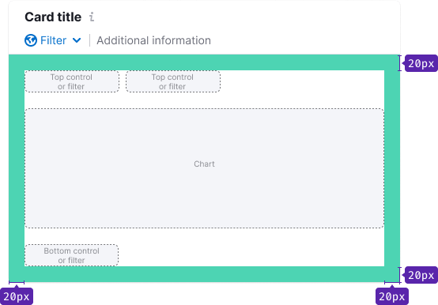
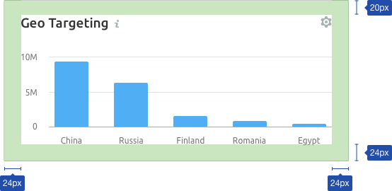
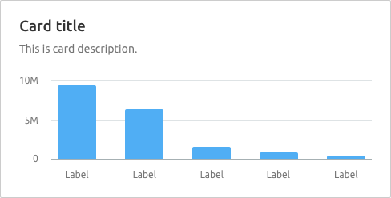
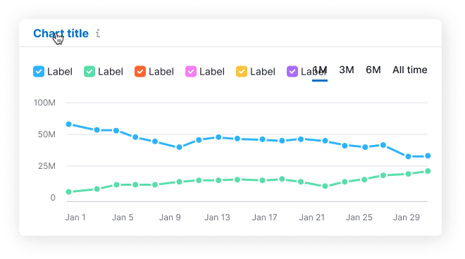
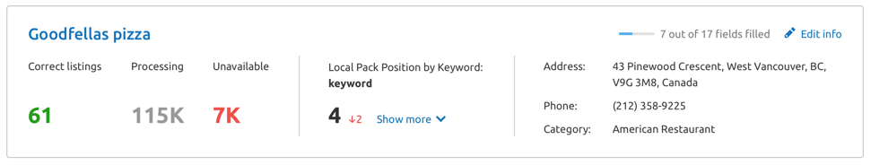

@## Description

**Card** is a component used for visually grouping other components into cards/blocks/widgets.

> It seems to be one of the simplest components in our library so far 🤓

@## Appearance

This component always has internal margins. **By default: 24px**.

> 💡 However, if the card has a title, the upper margin should always be slightly smaller.

This is necessary to visually compensate for the distance between the upper border and the line-height of the header.

@## Title and additional information

The card usually has a title.

The title may have a subhead-summary. It usually contains information about the extreme states of the data or an explanation of what the data is based on, etc. Or some interesting insight/advice on the visualized data.

@## Mechanics and states

By default, the card is non-clickable. However, the card may have a clickable title.

It is especially recommended to make a link title if the card does not have a button to open the detailed report.

@page card-a11y
@page card-api
@page card-code
@page card-changelog
