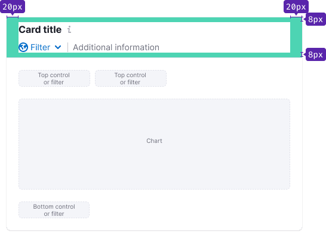

> In the last major update, component was divided into two parts: `Header` and `Body`. It was done to make it easier to use the component. Also, `Card` now has a white background.

@## Description

**Card** is a component for visually grouping data and other components into widgets.

@## Component composition

Component consists of:

- Header (can have Title and Description inside);
- [Divider](/components/divider/) (use only for big cards);
- Body.

@## Appearance

| Size  | Example                                      |
| ----- | -------------------------------------------- |
| Small |  |
| Big   |      |

@## Card.Header

### Title

For the card title use 16px text (`--fs-300; --lh-300;`) with `font-weight: 700`.

### Description

The card may have a description. It usually contains an explanation of what the data is based on, interesting insight/advice on the visualized data, etc.

### Margins and paddings

@## Card.Body

### Paddings

| Case  | Paddings                                         |
| ----- | ------------------------------------------------ |
| Chart |  |
| Table |  |

### Margins

### Layout

You can divide content into sections if needed.

@## Interaction

By default, the card is non-clickable. But you can add `--box-shadow-hover` variable for hover state and make title a clickable link if necessary.

@page card-a11y
@page card-api
@page card-code
@page card-changelog
