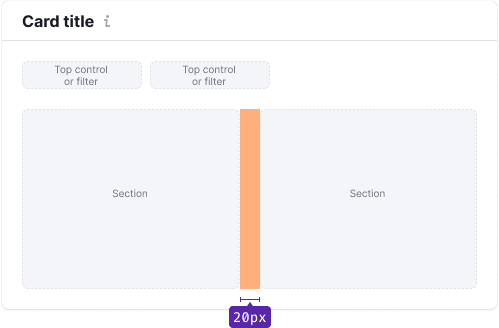

> In the last major update, component was divided into two parts: `Header` and `Body`. This was done to make it easier to use the restyling component. Also, `Card` now has a white background.

@## Description

**Card** is a component used for visually grouping data and other components into widgets.

@## Appearance

The component consists of:

- Header (can have Title and Description inside)
- [Divider](/components/divider/) (use only for big cards)
- Body

| Size  | Example                                       |
| ----- | --------------------------------------------- |
| Small |  |
| Big   |         |

@## Card header

### Title and description

For the card title use 16px text (`--fs-300`, `--lh-300`) with `font-weight: 700`.

The card may have a description. It usually contains an explanation of what the data is based on, interesting insight/advice on the visualized data, etc.

@## Card body

### Paddings and margins

| Case  | Paddings                                         |
| ----- | ------------------------------------------------ |
| Chart |  |
| Table |  |

### Layout

You can divide content into sections if needed.

@## Interaction

By default, the card is non-clickable. However, the card may have a clickable title.

@page card-a11y
@page card-api
@page card-code
@page card-changelog
