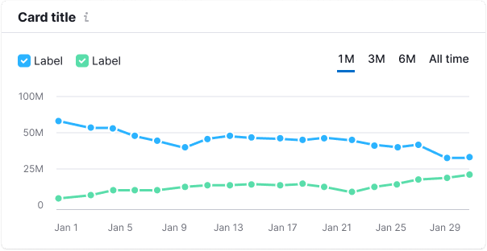
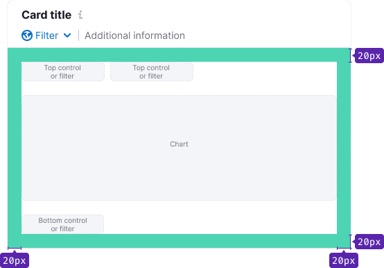
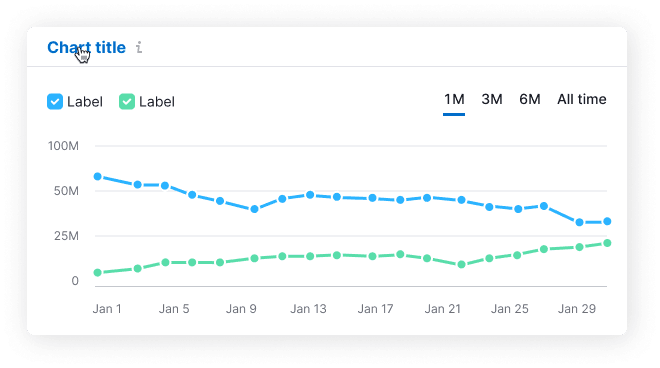

## Description

**Card** is a component for visually grouping data and other components into widgets.

## Component composition

Component consists of the following:

- `Card.Header`
- `Card.Body`
- `Card.Title`
- `Card.Description`

## Appearance

Table: Card sizes

| Size  | Example                                      |
| ----- | -------------------------------------------- |
| Small |  |
| Big   |      |

## Card.Header

`Card.Header` includes:

- Title
- Optional additional information below the title (`margin-top: 8px`)
- Optional general widget controls, such as **Export** or **Settings**

### Title

For the card title use 16px text (`--fs-300`, `--lh-300`) with `font-weight: var(--bold)`.

### Description

The card may have a description. It usually contains an explanation of what the data is based on, interesting insight/advice on the visualized data, etc.

### Margins and paddings

## Card.Body

`Card.Body` includes:

- Optional top controls (for example, filters, buttons)
- Content (`margin-top: 20px`)
- Optional bottom controls (`margin-top: 20px`)

::: tip
The presence of optional elements depends on the specific interface case.
:::

### Paddings

Table: Card paddings

| Case  | Paddings                       |
| ----- | ------------------------------ |
| Chart |  |
| Table |  |

### Margins

### Layout with sections

You can divide content into sections if needed.

## Interaction

By default, the card is non-clickable. But you can use `--intergalactic-box-shadow-card-hover` token for hover state and make title a clickable link if necessary.

