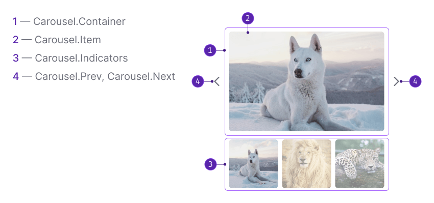

## Description

**Carousel** is a component for displaying a group of content in a limited area of the interface. Most often used for gallery of images or cards.

**Use carousel when:**

- There is a group of content on the same level (for example, images or cards).
- There is insufficient space in the interface, so carousel can save it.

::: tip
Carousels are useful when multiple content items need to share the same space on a page. However, note that carousels on homepages are often ignored by users, fail to engage them, and can cause frustration. Learn more about the necessity of using carousels on [this website with the humorous explanation](http://shouldiuseacarousel.com/).
:::

Use the carousel as an additional highlight of important website features and information, never as the only path to an important content.

## Component composition

Component consists of the following:

- Container for items: `Carousel.Container`
- Slide item: `Carousel.Item`. Slide may contain image, video, card or another type of information
- Slides' indicators or previews (optional): `Carousel.Indicators`
- Navigation buttons: `Carousel.Prev`, `Carousel.Next`

## Appearance

### Styles

Table: Carousel styles

| Element                     | Styles                                                                                                         |
| --------------------------- | -------------------------------------------------------------------------------------------------------------- |
| Navigation buttons          | [Buttons](/components/button/button) with L size and `ChevronLeft` / `ChevronRight` icons with L size as well. |
| Indicator                   | Indicator has 12px \* 12px size and uses `--icon-secondary-neutral` token for color.                           |
| Carousel item (image, etc.) | Uses `--surface-rounded` token for border-radius.                                                              |

Click-zone of the navigation buttons ( `Carousel.Prev` , `Carousel.Next` ) is stretched to the height of the content.

### Zoomed Carousel item

This example has the same styles as the example on the light background, except color for indicators—they change to `--icon-primary-invert` —and navigation buttons change theme to `invert` .

## Carousel controls

### Navigation buttons

Navigation buttons are always center aligned and have styles of the [Button](/components/button/button) with `use="tertiary"` and `theme="muted"` . Inside the modal buttons change their theme to `theme="invert"` .

Table: Navigation buttons states

| State    | Appearance example       |
| -------- | ------------------------ |
| Default  |   |
| Hover    |     |
| Disabled |  |

### Slides number indicators

Table: Slides number indicators states

| State              | Styles                                                                                                                   |
| ------------------ | ------------------------------------------------------------------------------------------------------------------------ |
| Default + Disabled | Uses `--icon-secondary-neutral` token for color, and `--disabled-opacity` token for opacity.                             |
| Hover              | Uses `--icon-secondary-neutral` token for color, and `calc(2 * var(--intergalactic-disabled-opacity, 0.3))` for opacity. |
| Active             | Uses `--icon-secondary-neutral` token for color.                                                                         |

<!-- ## Animation

Default animation properties:

- Animation duration – `300`.
- Animation easing function – `ease-in-out`. -->

## Usage in UX/UI

When using a carousel, keep in mind that some users may only see the first frame or nothing at all. Therefore, it's important to intentionally place essential content on each frame. Consider using a static carousel or a single image instead of a rotating one.

Table: Carousel usage advices

|       | Advice                                                                                                 | Description                                                                                                                                                                                                                                                                           |
| ----- | ------------------------------------------------------------------------------------------------------ | ------------------------------------------------------------------------------------------------------------------------------------------------------------------------------------------------------------------------------------------------------------------------------------- |
| **1** | Include 5 or fewer frames within the carousel, as it’s unlikely users will engage with more than that. | Scrolling through multiple slides on a mobile device can be tedious, and it's hard for users to recognize topics they've already viewed once the set is over five or so. Limiting the quantity also helps with content discovery and subsequent re-search of content in the carousel. |
| **2** | Indicate the number of slides.                                                                         | Specify how many slides are present and where the user is in sequence to help people feel in control.                                                                                                                                                                                 |
| **3** | Make links and buttons large enough to decipher and click.                                             | Tiny buttons placed close together or on top of a busy background are not easy to spot or click.                                                                                                                                                                                      |
