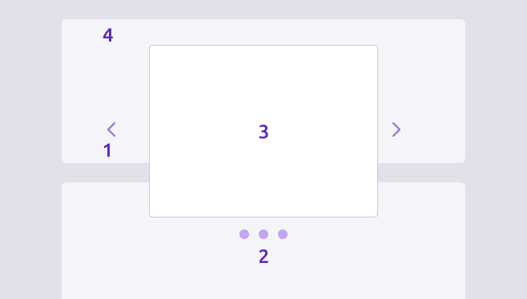
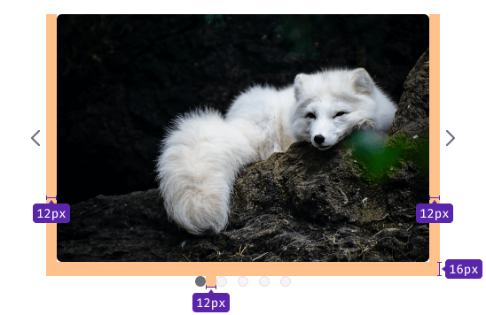
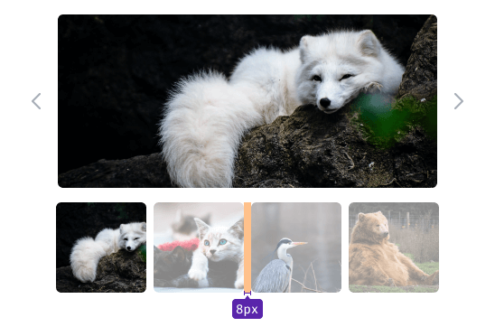
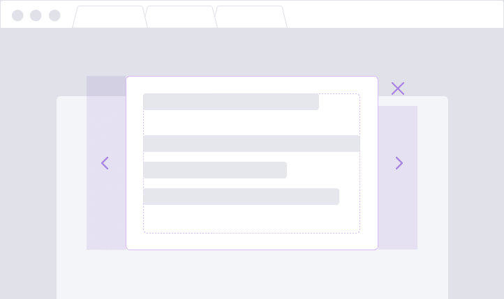
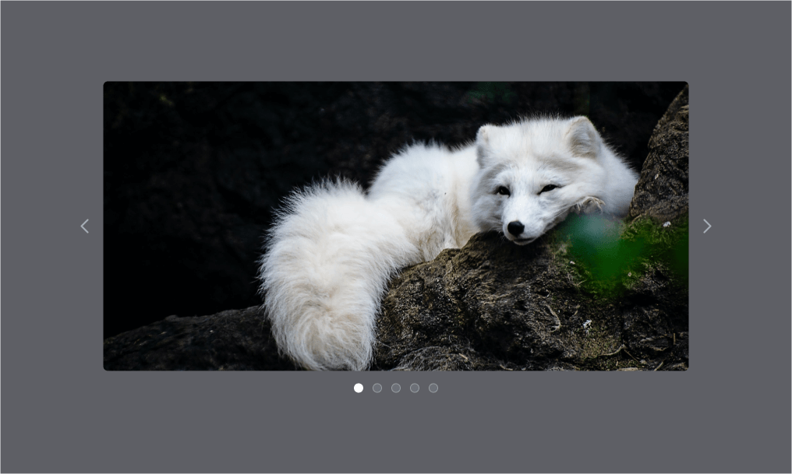
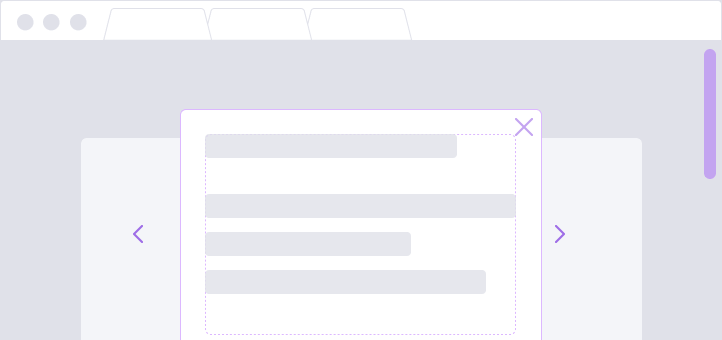
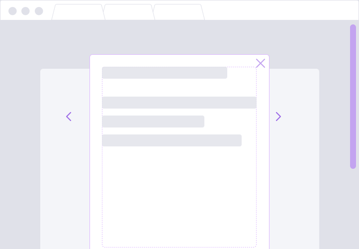
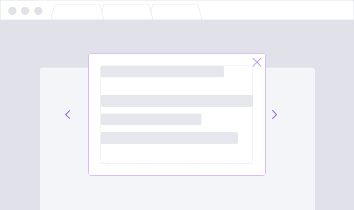
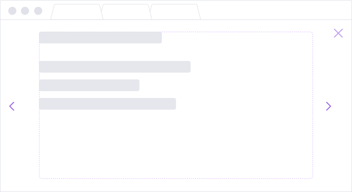

@## Description

**Carousel** is a component for displaying a group of content in a limited area of the interface. Most often used for image galleries and cards.

We use it for sequential viewing of single-level information within one component.

**When to use:**

- When there is a group of content on the same level (for example, images or modals with data opened from table rows). In this case, the carousel will save the user one click.
- When there is insufficient content space, it can be used to save space in the interface.

> 💡 Carousels are great to enable more than one piece of content to have the same page space. Note, that carousels on the homepages are typically ignored by users, don’t engage users, and frustrate users. Go to [funny explanation website about usage of a Carousel component](http://shouldiuseacarousel.com/).

Use the carousel as an additional highlight of important website features and information, never as the only path to important content.

### Component composition

- Navigation buttons
- Slides number indicator (optional)
- Slide with content

|                             | Description                                                                 |
| --------------------------- | --------------------------------------------------------------------------- |
| **Navigation buttons**      | Controls for navigation between slides.                                     |
| **Slides number indicator** | Controls for navigation between slides and indication of the slides number. |
| **Slide with content**      | Slide can have inside images, video or another type of information.         |

@## Appearance and styles

> 💡 Component has default styles, but you can change them depending on your task.

### Margins

### Default styles

|                         | Default styles                                      |
| ----------------------- | --------------------------------------------------- |
| Navigation buttons      | `icon size: L;` `color: --gray-300;`                |
| Slides number indicator | `indicator size: 12px * 12px;` `color: --gray-100;` |
| Content slide           | `border-radius: 6px;`                               |

> Click-zone of controls on the right/left is stretched to the height of the content.

### Example with dark background

This example has the same styles as the example on the light background.

@## States

### Navigation buttons

Navigation buttons have the following states.

| State    | Arrearance example                      | Styles                      |
| -------- | --------------------------------------- | --------------------------- |
| default  |    | `--gray-300`                |
| hover    |   | `--gray-400`                |
| disabled |  | `--gray-300` `opacity: 30%` |

> Navigation buttons are center aligned.

In the fullscreen mode, the navigation buttons don't cover the content.

### Slides number indicators

Number of slides indicator have the following states.

| State    | Styles       |
| -------- | ------------ |
| default  | `--gray-100` |
| hover    | `--gray-300` |
| disabled | `--gray-400` |

@## Animation

Default animation properties:

- animation duration — `300`
- animation easing function — `ease-in-out`

@## Keyboard navigation

- `Key →` goes to the next slide
- `Key ←` goes to the previous slide
- `Tab` moves focus on the controls

> On mobile devices, it should be possible to change slides using swipe.

@## Use in UX/UI

If you are using a carousel in the hope that people will see a variety of content, know that some people will only see the first frame or none at all. So ensure that important content is also placed mindfully in the IA and on another page of your site. Consider using a static carousel or hero image instead of a rotating one.

Slider controls must perform two functions: indicate the current slide among the set, and allow users to navigate back and forth.

|       | Advice                                                                                                 | Description                                                                                                                                                                                                                                                                                  |
| ----- | ------------------------------------------------------------------------------------------------------ | -------------------------------------------------------------------------------------------------------------------------------------------------------------------------------------------------------------------------------------------------------------------------------------------- |
| **1** | Include 5 or fewer frames within the carousel, as it’s unlikely users will engage with more than that. | It can be taxing to swipe through many slides on a mobile device, and it’s difficult for users to recognize topics they have already viewed when a set exceeds about five. Limiting the number also helps with discovering the content, and finding the content in the carousel again later. |
| **2** | Indicate the number of slides.                                                                         | Indicate how many slides are present and where the user is within the progression, to help people feel in control.                                                                                                                                                                           |
| **3** | Navigation controls differs from the content.                                                          | If offering a navigation button for each frame (rather than arrows to scroll through), ensure that each button looks different, and represents the frame if it's possible.                                                                                                                   |
| **4** | Make links and buttons large enough to decipher and click.                                             | Buttons that are tiny, close together, or on top of a busy background are not easy to notice or click.                                                                                                                                                                                       |

@## Auto-play

> Remember, it's a UX dream that auto-play leads people through the carousel frames 🦄

**Do not auto-play slides if:**

- You are not sure you can get the timing right, so that most people read and absorb the content within the time specified. Sometimes carousels move too quickly, and users can’t read the information, which is frustrating for them and not good for the organization trying to make a point. Sometimes carousels move too slowly, so when they do animate, it is surprising to the user.
- Your content resembles advertisements. Users are more likely to ignore an animated item that looks like an ad ([if they are not in a shopping mindset](https://www.nngroup.com/articles/designing-effective-carousels/))).

### Auto-play tips

- Do not add auto-play on mobile devices, because: (1) it slows down the page, and (2) because pages are short, users often scroll quickly, so by the time the carousel changes, the user is likely looking below the fold and won’t see the change anyway.
- Test for the right timing, or at least estimate how long it might take the average user to read the text and process the images. Nielsen Norman Group recommends 1 second per 3 words for auto-rotating slides.Don’t stop at the last frame. Continue cycling through the frames (and displaying which frame is selected).
- Auto-play should pause on hover.
- Auto-play should permanently stop after any active user interaction.

### Static (non-auto-play) carousel tips

Ensure that users interested in a carousel realize that there is more than just the currently displayed image/content. Offer clear visual elements that represent the notion of more content, such as:

- navigation links and icons (as noted above)
- **cutting off, or “bleeding” an image and displaying part of the next image.**

@page carousel-a11y
@page carousel-api
@page carousel-code
@page carousel-changelog
