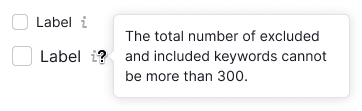
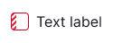

@import playground

@## Description

**Checkbox** is a component for selecting one or more values or options.

The checkbox component is used to select one or more options from a list. It displays whether the option is selected or not. It's commonly used for group settings and allows users to choose any number of options.

Multi-selection, which is commonly used in filters, is the exception to the image above.

@## Sizes and margins

### Sizes

Checkbox has two sizes: M and L. The text label is always positioned to the right of the checkbox.

| Size (px)        | Appearance example      |
| ---------------- | ----------------------- |
| M (16px * 16px) |  |
| L (20px * 20px) |  |

### Margins

The spacing between options may differ based on the context in which they are used. To maintain consistency, it's recommended to use margins that are multiples of 4. The default margins are displayed below.

| Size (px)        | Margins      |
| ---------------- | ----------------------- |
| M (16px * 16px) |   |
| L (20px * 20px) |   |

@## Checkbox with a paragraph

All checkbox sizes can be used with the corresponding text paragraphs.

| Checkbox size (px) | Paragraph size (px)                        | Appearance example                |
| ------------------ | -------------------------------------- | -------------------------------------- |
| M (16px * 16px)   | 14px (use `--fs-200`, `--lh-200` tokens) |  |
| L (20px * 20px)   | 16px (use `--fs-300`, `--lh-300` tokens) |  |

@## Checkbox with Info icon

Add an `Info` icon next to the checkbox label to provide more information about checkbox's purpose. User can hover over the icon to see a tooltip with additional details.

> Info icon should have `margin-left: 4px`.

@## Checkbox with a link inside

Text label may contain a [Link](/components/link).

> Note, that the checkbox text hover zone shouldn't include a link.

@## Interaction

- Hovering over the "Checkbox and text" area changes the cursor to a pointer.
- Clicking anywhere on the "Checkbox and text" area changes the state of the checkbox.
- If the text label contains a link or pseudo-link, clicking on the link area doesn't change the checkbox state.
- When the checkbox is disabled, the text and related words should also be "disabled." It's recommended to include a tooltip explaining why the checkbox is disabled.

### States

| State                 | Appearance example                                               |
| --------------------- | ---------------------------------------------------------------- |
| Normal                |                          |
| checked               |                              |
| indeterminate         |                  |
| indeterminate invalid |  |
| checked invalid       |              |
| Disabled              |                            |
| Invalid               |                              |

@## Checkbox group

To save the user's time, use the "Select all" and "Deselect all" options for checkbox groups with more than 6-7 options. These buttons will select or deselect all checkboxes in the group:

- "Select all" selects all checkboxes, and "Select all" changes to "Deselect all".
- "Deselect all" deselects all checkboxes at all levels.
- If at least one checkbox is checked at any level, "Deselect all" changes to "Select all".

  

If you have a checkbox tree, the top-level checkbox has three states:

- `normal`;
- `checked`;
- `indeterminate` - this state shows that some options of the tree are selected.

> If user clicks the checkbox in the `indeterminate` state, all the lower-level checkboxes get `checked` state.

If you use a combination of the checkbox tree and "Select all" and "Deselect all" buttons, the behavior is the following:

- "Select all" selects all checkboxes in the tree at all levels. "Select all" changes to "Deselect all".
- "Deselect all" deselects all checkboxes at all levels.
- If at least one checkbox is checked at any level, "Deselect all" changes to "Select all".
- If at least one checkbox is checked on the sub-level, the root checkbox changes its state to `indeterminate`, and "Deselect all" changes to "Select all".

When user clicks on a checkbox with the `indeterminate` state, all sub-level checkboxes get `checked` state.

 

@## Usage in UX/UI

- **Make lists of options vertically and left aligned**, one option per line. If using a horizontal layout, ensure that there is enough space between options to differentiate them.

- **Use positive language for checkbox labels** to clarify the action taken when the checkbox is enabled. Avoid negative wording, such as "Don't send me more email," which would mean that the user need to check the box to prevent something from happening.

Here are some other checkbox recommendations:

- Only use checkboxes for changing settings and not as action buttons.
- The [switch](/components/switch/) is better for binary settings since it performs an action while checkboxes have a status. [Radiobuttons](/components/radio/) are also good for binary settings.
- Use checkboxes for suspended actions and radiobuttons for immediate actions. [Switches](/components/switch/) and [radiobuttons](/components/radio/) work for actions that are applied instantly. Checkbox is useful when users need to check their settings before applying them or when additional steps are necessary to make changes.
- For checkbox groups with more than six options, include "Select all" and "Deselect all" controls to save time.
- When a checkbox is used in a table to select the entire row, make sure the clickable area covers the entire table cell where the checkbox is located.

@page checkbox-a11y
@page checkbox-api
@page checkbox-code
@page checkbox-changelog
