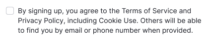
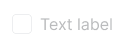
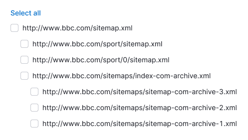
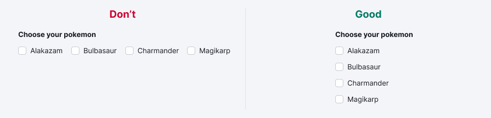
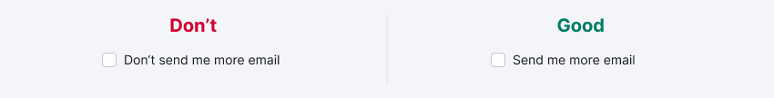

@import playground

@## Description

**Checkbox** is a control for selecting one or more values/options.

The checkbox clearly shows the status of the user's choice. It's mainly used for group settings, when there is a list of parameters/options and other things, and the user can choose any number of options, including zero, one or several.

The exception to the image above is multi-selection (for example, in filters).

@## Dimensions and margins

### Sizes

**Our interface uses 3 control sizes — XL, L, and M**. The text label is placed to the right of the checkbox.

|    XL (20px \* 20px)     |    L (16px \* 16px)     |    M (12px \* 12px)     |
| :----------------------: | :---------------------: | :---------------------: |
|  |  |  |

### Margins

Make the margins between the checkboxes so the options will be easy to read.

The margins may vary depending on the usage context. Make margins multiples of 4. Default recommended margins are shown below.

|    XL (20px \* 20px)     |    L (16px \* 16px)     |    M (12px \* 12px)     |
| :----------------------: | :---------------------: | :---------------------: |
|  |  |  |

@## Checkbox with a paragraph

All checkbox sizes can be used with the corresponding text paragraphs.

| Checkbox size     | Paragraph size        | Appearance example                       |
| ----------------- | --------------------- | ---------------------------------------- |
| XL (20px \* 20px) | XL, `font-size: 16px` |  |
| L (16px \* 16px)  | L, `font-size: 14px`  |    |
| M (12px \* 12px)  | M, `font-size: 12px`  |    |

@## Checkbox with Info icon

You can place the `Info` icon next to the checkbox label. By hovering over the icon, a tooltip with additional information shall be displayed. It shall help the user understand the purpose of this checkbox option 😏

> 💡 The `Info` icon should have a margin of 4px on the left.

@## Checkbox with a link inside

The checkbox label may contain a [link](/components/link).

> 💡 The checkbox label hover area shouldn't include a link.

@## Mechanics and states

### States

| State                 | Appearance                                               |
| --------------------- | -------------------------------------------------------- |
| unchecked             |                  |
| checked               |                      |
| indeterminate         |          |
| indeterminate invalid |  |
| checked disabled      |    |
| disabled              |                    |
| invalid               |                      |

### Behavior

- When you hover over the "Checkbox + label" area, the cursor changes to pointer.
- The checkbox switches by clicking on the entire area of the component, label, or related words.
- The text label of the checkbox may contain a link or pseudo-link. In this case, the checkbox switches by clicking on the entire text label area, except for the link area. A link in a text label opens the URL in a new window.
- If the checkbox is disabled, the text label and related words shall also be `disabled`. In such cases, it is recommended to place a tooltip with an explanation of why the checkbox is disabled.

@## Working with a checkbox group

If a group of checkboxes exceeds 6-7 positions, use the `Select all` and `Deselect all` options to save the user time. The mechanics of the `Select all`/`Deselect all` buttons:

- `Select all` selects all checkboxes, and `Select all` changes to `Deselect all`;
- `Deselect all` deselects all checkboxes at all levels;
- If at least one checkbox is checked at any level, `Deselect all` changes to `Select all`.

  

If you use a checkbox tree, the top-level checkbox has three statuses:

- `active`;
- `inactive`;
- `indeterminate` - intermediate state when not all elements of the tree are selected.

> 💡 If you click the checkbox in the `indeterminate` state, all the lower-level checkboxes will be highlighted.

If you use a combination of the checkbox tree and `Select all`/`Deselect all` buttons, the mechanics are as follows:

- `Select all` selects all checkboxes in the tree at all levels. `Select all` changes to `Deselect all`.
- `Deselect all` deselects all checkboxes at all levels.
- If at least one checkbox is checked at any level, `Deselect all` changes to `Select all`.
- If at least one checkbox is checked on the sublevel, the root checkbox changes to the `indeterminate` state, and `Deselect all` changes to `Select all`.

When you click on a checkbox with the `indeterminate` status, all sub-level checkboxes are selected.

 

@## Use in UX/UI

- **Build lists of options vertically with left alignment**, one option per line. If you have to use a horizontal layout, make sure that the margins between elements are correct.

- **Use positive wording for checkbox labels** to make it clear what happens if the user turns on the checkbox. Avoid negatives like _"Don't send me more email"_, which would mean that the user would need to check the box to prevent something from happening 🤯

- Use checkboxes only to change settings and then apply them, do not use them as action buttons. For binary selection, the main difference between the checkbox and the [Switch](/components/switch/) is that the Checkbox has a status, while the Switch performs an action. For binary settings, it is better to use the Switch or [Radiobutton](/components/radio/).
- Use checkboxes for suspended actions, and radiobuttons for immediate actions. If the action is applied instantly, it is better to use the [Switch](/components/switch/) or [Radiobutton](/components/radio/). Use checkboxes when the user needs to check their settings before applying them, or when the user needs to perform additional steps in order for the changes to become effective.
  If there are more than six options in the checkbox group, add the `Select all` and `Deselect all` controls to save the user time.
- If the checkbox is in the table to select the entire row, make clickable the entire cell (increase the click zone) where the checkbox is located.

> 💡 Specify in the prototype or technical documentation what happens to the checkbox after refreshing the page: reset or save.

@page checkbox-a11y
@page checkbox-api
@page checkbox-code
@page checkbox-changelog
