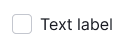
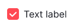

@import playground

@## Description

**Checkbox** is a component for selecting one or more values/options.

The checkbox shows the status of the user's choice. It's mainly used for group settings, when there is a list of parameters or options, and the user can choose any number of options: one, several, or none.

The exception to the image above is multi-selection (for example, in filters).

@## Sizes and margins

### Sizes

**Our checkbox has two sizes: M and L**. The text is always placed to the right of the checkbox.

| Size (px)        | Appearance example      |
| ---------------- | ----------------------- |
| M (16px \* 16px) |  |
| L (20px \* 20px) |  |

### Margins

Margins between the options may vary depending on the usage context. Make margins multiples of 4. Default recommended margins are shown below.

| Size (px)        | Appearance example      |
| ---------------- | ----------------------- |
| M (16px \* 16px) |  |
| L (20px \* 20px) |  |

@## Checkbox with a paragraph

All checkbox sizes can be used with the corresponding text paragraphs.

| Checkbox size (px) | Paragraph size                            | Appearance example (px)                |
| ------------------ | ----------------------------------------- | -------------------------------------- |
| M (16px \* 16px)   | 14px (use variables `--fs-200, --lh-200`) |  |
| L (20px \* 20px)   | 16px (use variables `--fs-300, --lh-300`) |  |

@## Checkbox with Info icon

To help the user understand the purpose of the checkbox option, place Info icon next to the checkbox text. By hovering over the icon, show a tooltip with additional information.

> 💡 Info icon should have a margin of 4px on the left.

@## Checkbox with a link inside

The checkbox text may contain a [Link](/components/link).

> 💡 The checkbox text hover zone shouldn't include a link.

@## Interaction

- When user hovers over the "Checkbox + text" area, the cursor changes to pointer.
- The checkbox changes its state by clicking on the entire area of the component that includes checkbox and text.
- The checkbox text may contain a link or pseudo-link. In this case, the checkbox changes its state by clicking on the entire text area, except for the link area.
- If the checkbox is disabled, the text and related words shall also be `disabled`. In such cases, we recommended you to place a tooltip with an explanation of why the checkbox is disabled.

### States

| State                 | Appearance                                                       |
| --------------------- | ---------------------------------------------------------------- |
| normal                |                          |
| checked               |                              |
| indeterminate         |                  |
| indeterminate invalid |  |
| checked invalid       |              |
| disabled              |                            |
| invalid               |                              |

@## Working with a checkbox group

If a group of checkboxes has more than 6-7 options, use the `Select all` and `Deselect all` options to save the user's time. `Select all`/`Deselect all` buttons have the following behavior:

- `Select all` selects all checkboxes, and `Select all` changes to `Deselect all`.
- `Deselect all` deselects all checkboxes at all levels.
- If at least one checkbox is checked at any level, `Deselect all` changes to `Select all`.

  

If you use a checkbox tree, the top-level checkbox has three states:

- `normal`;
- `checked`;
- `indeterminate` - this state shows that some options of the tree are selected.

> 💡 If user clicks the checkbox in the `indeterminate` state, all the lower-level checkboxes get `checked` state.

If you use a combination of the checkbox tree and `Select all`/`Deselect all` buttons, the behavior is the following:

- `Select all` selects all checkboxes in the tree at all levels. `Select all` changes to `Deselect all`.
- `Deselect all` deselects all checkboxes at all levels.
- If at least one checkbox is checked at any level, `Deselect all` changes to `Select all`.
- If at least one checkbox is checked on the sublevel, the root checkbox changes its state to `indeterminate`, and `Deselect all` changes to `Select all`.

When user clicks on a checkbox with the `indeterminate` state, all sub-level checkboxes get `checked` state.

 

@## Use in UX/UI

- **Make lists of options vertically and left aligned**, one option per line. If you have to use a horizontal layout, make sure that margins between the options are enough to distinguish them.

- **Use positive wording for checkbox texts** to make it clear what happens if the user enables the checkbox. Avoid negative phrases like: "Don't send me more email", — which would mean that the user would need to check the box to prevent something from happening.

- Use checkboxes only to change settings and then apply them, do not use them as action buttons.
- The main difference between the checkbox and the [switch](/components/switch/) is that the checkbox has a status, while the switch performs an action. For binary settings, it is better to use the switch or [radiobutton](/components/radio/).
- Use checkboxes for suspended actions, and radiobuttons for immediate actions. If the action is applied instantly, use [switch](/components/switch/) or [radiobutton](/components/radio/). Use checkboxes when the user needs to check their settings before applying them, or when the user needs to perform additional steps in order for the changes to happen.
- If there are more than six options in the checkbox group, add the `Select all` and `Deselect all` controls to save the user's time.
- If the checkbox is used in the table to select the entire row, make clickable the entire table cell (increase the click zone) where the checkbox is located.

@page checkbox-a11y
@page checkbox-api
@page checkbox-code
@page checkbox-changelog
