::: react-view

:::

## Description

**ColorPicker** is a component that allows the user selecting a color from a given list or input a custom color using its HEX code.

**ColorPicker contains:**

- Trigger
- List of ColorPicker.Items
- Input (optional)

## Appearance

### Trigger

The trigger for a ColorPicker is a Select with a circle as the leading addon, and has 16px * 16px size.

### Item

ColorPicker item has 28px * 28px size.

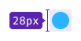

### List of colors

A list of colors can include either a single ColorPicker.Item or multiple ones, which are preview swatches that display all available color values.

Table: List of colors and its items

| ColorPicker.Item     | List of ColorPicker.Items                             |
| -------------------- | ----------------------------------------------------- |
|  | 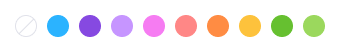 |

Margin between the items must be [multiples of 4](/layout/box-system/box-system#spacing-system). The default recommended margins are 4px:

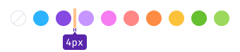

## Item types

An item can have two different types:

Table: Color items

| Type            | Appearance example                                                             | Usage                                                                                                                 |
| --------------- | ------------------------------------------------------------------------------ | --------------------------------------------------------------------------------------------------------------------------- |
| Item for background color |  | Use for changing the background color. For example, a user can pick colors to visually separate their competitors. |
| Item for text color      | 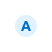    | Use for changing the Tag color, for example                                                                                             |

## Dropdown

### Width and height

**The recommended width of a dropdown is 188px.** The height of a dropdown list depends on its content.

Showing all available colors in the DropdownMenu is crucial, however, if a user has added more than 20 custom colors, a scrollbar should be displayed.

Table: DropdownMenu appearance

| DropdownMenu                  | DropdownMenu with more than 20 colors |
| ----------------------------- | ------------------------------------- |
| 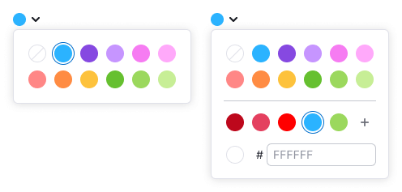 | 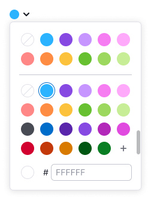                |

### Margins and paddings

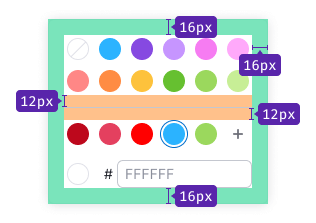

## Interaction

- In the hover state, trigger has a `border: 1px solid var(--border-secondary)`.
- In the active state, trigger changes its border color to `var(--border-info-active)`.

### Default item

Table: Color item states

| Item type | Normal | Hover | Active | Usage |
| ------------------- | ------------------------------- | -------------------------- | ----------------------- | -------------------- |
| Background color |  | 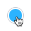 | | Use for changing the background color of other components.|
| Text color |  | 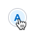 | | Use for changing text and background colors of other components.|
| No background color |  | 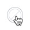 | | Use when no color is selected.|
| No text color | 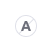 |  | | Use when no color is selected.|

### Item for custom colors

Table: Custom color item states

| Item type | Normal | Hover | Active                                              | Usage |
| ------------------- | ------------------------------- | -------------------------- |-----------------------------------------------------| -------------------- |
| Background color |  | 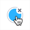 |       | Use for changing the background color of other components.|
| Text color | 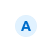 |  |  | Use for changing the text and background colors of other components.|

### Item for adding colors

Table: States of item for adding colors

| Item type | Normal | Hover | Active | Usage |
| ------------------- | ------------------------------- | -------------------------- | ----------------------- | -------------------- |
| Add color button | 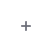 | 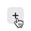 | 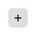| Use Button with icon and change border-radius to 50%.|

## Custom colors (optional)

Users have the ability to add or remove custom colors, but they cannot modify default or existing custom colors.

::: tip
We recommend that your product sync and save the user's custom palette in different parts of the interface.
:::

### Adding custom color

Users can add a color to the custom palette by entering the value into the input field and saving it by pressing `Enter` or clicking the `Check` button.

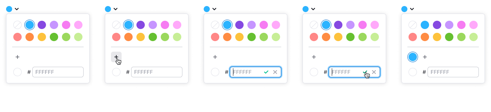

The input field only allows six characters, including numbers and letters from A to F. If the user enters fewer or more characters, or characters that cannot be converted to a 6-character HEX value, the input gets the `invalid` state.

To help users fix the invalid input, add the following message to the tooltip: "Please enter 6 latin letters and/or digits."

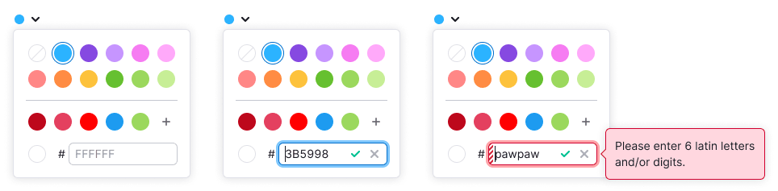

::: tip
User can enter both upper-case and lower-case characters, but the input will save them as upper-case.
:::

### Removing custom color

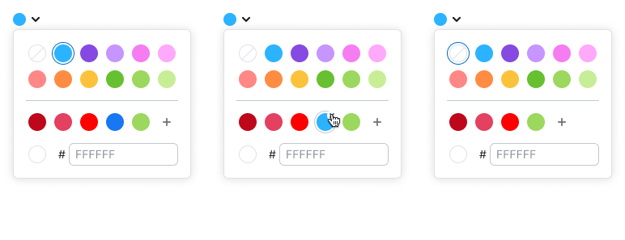

## Usage in UX/UI

Components that you can use as a trigger for the ColorPicker:

- [Input](/components/input/input)
- [Link component](/components/link/link)
- [Select](/components/select/select)

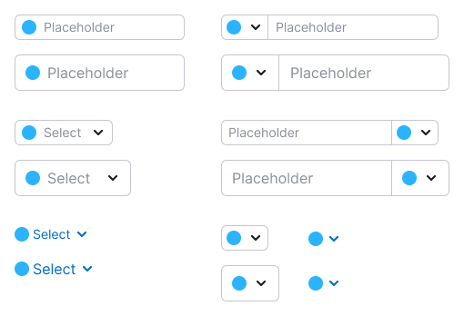

`ColorPicker.Item` can be placed inside other components, such as:

- [Button](/components/button/button)
- [FilterTrigger](/components/filter-trigger/filter-trigger)
- [Pills](/components/pills/pills)
- [Select/Multiselect](/components/select/select)
- [TabLine](/components/tab-line/tab-line)
- [TabPanel](/components/tab-panel/tab-panel)
- [Tag](/components/tag/tag)

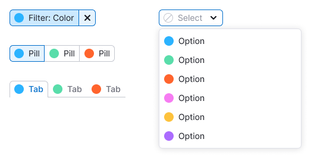

