@## Description

**Color picker** is a component that allows the user to select the color of another component from the pre-defined palette.

@## Appearance

### Composition

The color picker appearance varies depending on the context.

### Types of pickers and color palettes

There are two types of picker that can be used:

- Dropdown
- Plain

| Dropdown                                              | Plain                                           |
| ----------------------------------------------------- | ----------------------------------------------- |
| 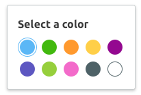 |  |

A picker can have two different content types:

- Color
- Color-text

| Color                                                 | Color-text                                            |
| ----------------------------------------------------- | ----------------------------------------------------- |
|  | 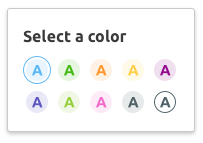 |
|     | 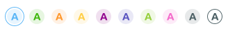    |

Each type can be expanded with an additional set of colors. There are two sets in total:

- standard comprising 10 colors;
- additional - also 10 colors.

| Color + More button                                                | Color + Less button                                                |
| ------------------------------------------------------------------ | ------------------------------------------------------------------ |
| 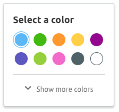 | 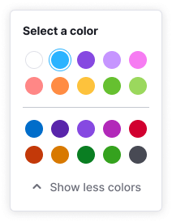 |

| Color-text + More button                                                   | Color-text + Less button                                                   |
| -------------------------------------------------------------------------- | -------------------------------------------------------------------------- |
| 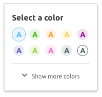 | 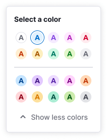 |

The Plain picker colors can be expanded in two ways:

- add an additional set to the main one as a separate row of colors;
- show via select dropdown with all the sets.

| Color 2 rows                                          | Color-text 2 rows                                           |
| ----------------------------------------------------- | ----------------------------------------------------------- |
|  |  |

| Color + Select + Dropdown                                | Color-text + Select + Dropdown                                 |
| -------------------------------------------------------- | -------------------------------------------------------------- |
| 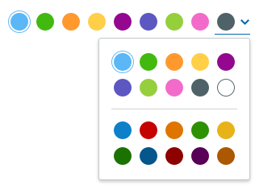 | 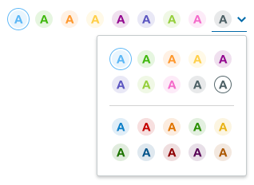 |

@## Content

### What can a Dropdown color picker consist of

|                                                                |                                                                      |
| -------------------------------------------------------------- | -------------------------------------------------------------------- |
| 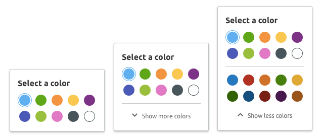 | 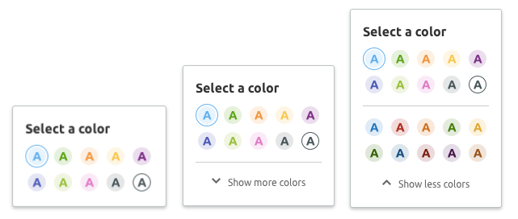 |

**Default**

- Trigger
- Dropdown that has:
  - Title
  - Set of 10 colors in two rows for the background (or for the background and text)

**Optional**

- Master expand/hide button
- Additional set of 10 colors in 2 rows

### What can Plain color picker consist of

|                                                          |                                                                |
| -------------------------------------------------------- | -------------------------------------------------------------- |
|  | 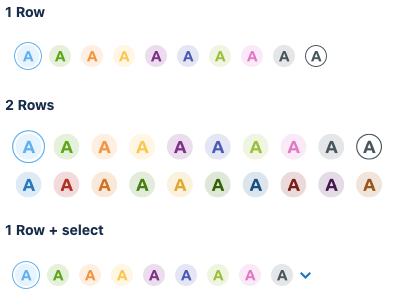 |

**Default** has 1 row of 10 colors.

**Optional**

- 2 rows of 10 colors
- Select that opens a dropdown with all colors

@## Triggers

Components that can call a picker:

- [Input](/components/input/)
- [Link](/components/link/)

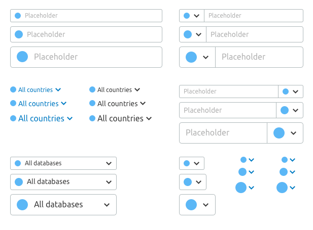

@## Where can we place the color marker?

- [Button](/components/button/)
- [FilterTrigger](/components/filter-trigger/)
- [Pills](/components/pills/)
- [Select/Multiselect](/components/select/)
- [Tabine](/components/tab-line/)
- [TabPanel](/components/tab-panel/)
- [Tag](/components/tag/)
- [Option](/components/dropdown-menu/#a66af9)

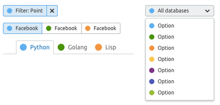

@## Mechanics and states

### Behavior

- When you hover over an unselected marker, an outline appears around it with color `--gray-200`, and the cursor changes to pointer. When hovering over unselected markers, the selected marker still has the outline.

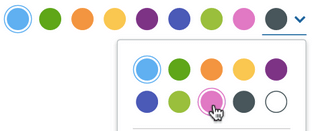

- Standard marker color in the trigger if a color is selected in the range from 1 to 8: `--gray-200`.

  - If you select a color in the dropdown from the range of colors from 9 to 20, the color of the marker in the trigger is equal to the selected color. In the trigger, the marker has a stroke with the same color.
    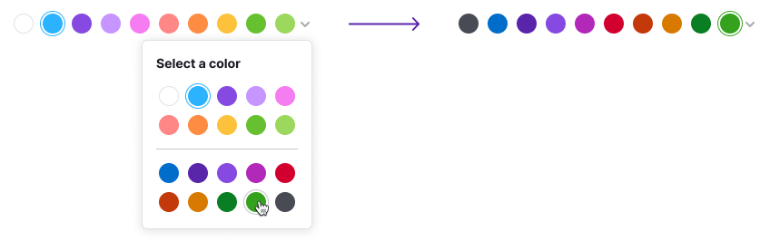
  - If a dropdown color is selected from the range of colors from 1 to 8, the marker of the selected color is duplicated in both the dropdown and plain component.

    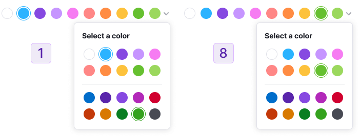

- If the `Plain` type is used with a select, the title is not used inside the dropdown with the palette. However, the `Plain` component itself may have an optional title. If a title is used, we recommend using the name: "Select a color".
- Dropdown closes when you click outside of its area, or when you click the trigger again.

@## Keyboard support

- When the component is focused via `Tab`, the color transition occurs sequentially — from top to bottom and from left to right. If 2 palettes are used, then when tabbed, the focus of the last element of the main palette skips to the first element of the additional palette.
- Inside the color palettes, you can navigate using the keyboard arrows.
- The color is selected by pressing `Enter`, `Space`.
- You can close the dropdown with colors using `Esc`.
- When the dropdown is closed, the focus returns to the trigger.

@## Use in UX/UI

### Dropdown color

Use it when **there is not enough space** and you need to change the color of the object/element, and:

- it doesn't have an alpha channel (non-transparent);
- it is not a background for the text;
- if you need to change the color of a text that has a white background color.

### Plain color

Use it when **there is enough space**. Or color selection is a priority for the user.

### Dropdown color-text

Use it when **there is not enough space** and you need to change the color of the object/element, and:

- it is the background for the text;
- it has an alpha channel (transparency);
- the text over it also changes color.

The text color and background color are based on the same color.

### Plain color-text

Use it when **there is enough space**. Or color selection is a priority for the user.
