<Playground for="ColorPicker" />

## Description

**ColorPicker** is a component that allows the user selecting a color from a predefined list or input a custom color using its HEX code.

## Component composition

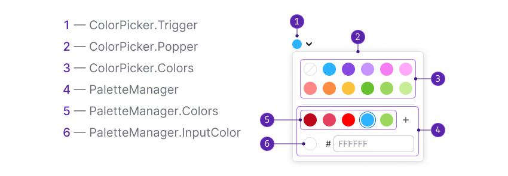

`ColorPicker` consists of the following:

- `ColorPicker.Trigger`
- `ColorPicker.Popper`
- `ColorPicker.Colors`: list of predefined colors
- `PaletteManager` (optional): container for user's custom colors, which includes:
  - `PaletteManager.Colors`: list of added colors
  - `PaletteManager.InputColor`: set of controls for adding new colors

## Appearance

### Trigger

ColorPicker's trigger is a Dropdown.Trigger with a circle showing the current selected color.

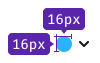

### List of colors

The list of colors consists of preview swatches that display all available color values.

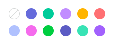

## Color swatch types

Color swatches can have one of the two types of appearance:

Table: Color types

| Type       | Appearance example                            | Usage                                                                                                              |
| ---------- | --------------------------------------------- | ------------------------------------------------------------------------------------------------------------------ |
| Fill       |    | Use for setting colors for markers, lines, and other non-text elements. For example, a user can pick colors to visually separate their competitors. |
| Text color |  | Use for changing the Tag color, for example                                                                        |

## Dropdown

### Height

The height of the dropdown depends on its content.

Showing all available colors in the dropdown is crucial. However, if there's more than 5 rows of colors, you should limit the height and display a scrollbar.

Table: DropdownMenu appearance

| Default dropdown              | Dropdown with more than 5 rows of colors |
| ----------------------------- | ---------------------------------------- |
| 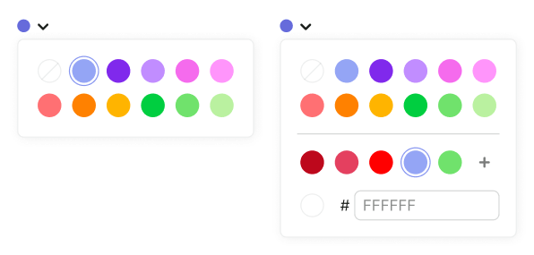 | 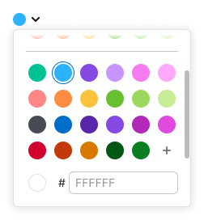                   |

## Interaction

### Background color

Table: Background color item states

| Item type       | Normal                                           | Hover                                          | Active                                          |
| --------------- | ------------------------------------------------ | ---------------------------------------------- | ----------------------------------------------- |
| Predefined fill |       | 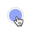      |       |
| Custom fill     |   | 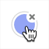  |   |
| No fill         |  | 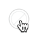 | 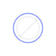 |

### Text color

Table: Text color item states

| Item type        | Normal                                                | Hover                                               | Active                                               |
| ---------------- | ----------------------------------------------------- | --------------------------------------------------- | ---------------------------------------------------- |
| Predefined text color |          | 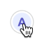         |          |
| Custom text color     |   | 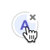  |   |
| No text color    |  |  |  |

### Adding colors

Table: States of item for adding colors

| Item type            | Normal                          | Hover                         | Active                         |
| -------------------- | ------------------------------- | ----------------------------- | ------------------------------ |
| **Add color** button |  | 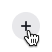 | 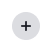 |

## Custom colors (optional)

Users have the ability to add or remove custom colors, but they can't modify predefined colors.

::: tip
We recommend that your product sync and save the user's custom palette in different parts of the interface.
:::

### Adding custom color

Users can add a color to the custom palette by entering the value into the input field and saving it by pressing `Enter` or clicking the `Check` button.

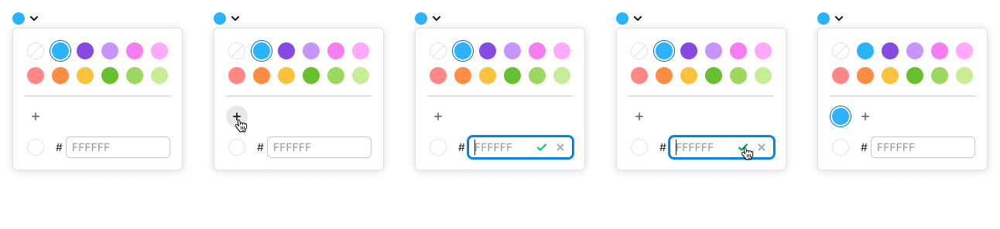

The input field only allows six characters, including numbers and letters from A to F. If the user enters fewer or more characters, or characters that can't be converted to a 6-character HEX value, the input gets the `invalid` state.

<!-- vale DevDocs.Please = NO -->
To help users fix the invalid input, add the following message to the tooltip: "Please enter 6 latin letters and/or digits."
<!-- vale DevDocs.Please = YES -->

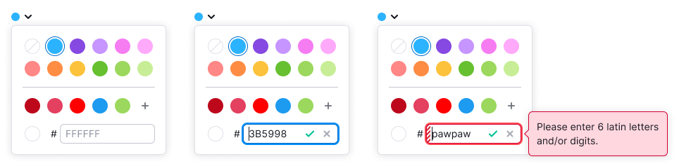

::: tip
User can enter both upper-case and lower-case characters, but the input will save them as upper-case.
:::

### Removing custom color

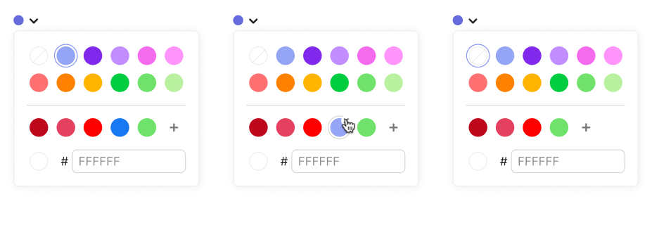

## Usage in UX/UI

Components that you can use as a trigger for the ColorPicker:

- [Input](/components/input/input)
- [Link component](/components/link/link)
- [Select](/components/select/select)

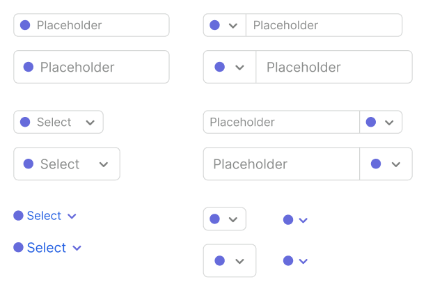

<!-- ColorPicker.Item is now deprecated -->

<!-- `ColorPicker.Item` can be placed inside other components, such as:

- [Button](/components/button/button)
- [FilterTrigger](/components/filter-trigger/filter-trigger)
- [Pills](/components/pills/pills)
- [Select/Multiselect](/components/select/select)
- [TabLine](/components/tab-line/tab-line)
- [TabPanel](/components/tab-panel/tab-panel)
- [Tag](/components/tag/tag)

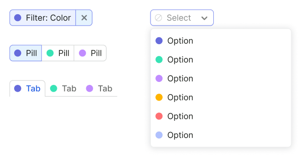 -->

