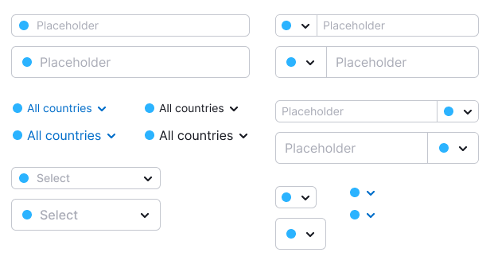

@## Description

**Color picker** is a component that allows the user to select the color of another component from the pre-defined palette.

@## Appearance

The color picker appearance varies depending on the usage context.

### Color picker types

We have two types of color picker that can be used:

- Color picker in a [dropdown](/components/dropdown/)
- Inline color picker

| Color picker in a dropdown                            | Inline color picker                              |
| ----------------------------------------------------- | ------------------------------------------------ |
|  |  |

A picker can have two different content types:

- Background color
- Text color

| Background color                                      | Text color                                             |
| ----------------------------------------------------- | ------------------------------------------------------ |
|  |  |
|     |     |

Each type can be expanded with an additional set of colors. There are two sets in total:

- standard comprising 10 colors;
- additional - also 10 colors.

| Set of background colors + "More" button                           | Set of background colors + "Less" button                           |
| ------------------------------------------------------------------ | ------------------------------------------------------------------ |
|  |  |

| Set of text colors + "More" button                                         | Set of text colors + "Less" button                                         |
| -------------------------------------------------------------------------- | -------------------------------------------------------------------------- |
|  |  |

The set of colors in inline color picker can be expanded in two ways:

- add an additional set to the main one as a separate row of colors;
- show via select dropdown with all the sets.

| Set of background colors in 2 rows                     | Set of text colors in 2 rows                                 |
| ------------------------------------------------------ | ------------------------------------------------------------ |
|  |  |

| Set of background colors + Select + Dropdown              | Set of text colors + Select + Dropdown                          |
| --------------------------------------------------------- | --------------------------------------------------------------- |
|  |  |

@## Content

### What a color picker in dropdown can consist of

|                                                                |                                                                      |
| -------------------------------------------------------------- | -------------------------------------------------------------------- |
|  |  |

**Default**

- Trigger
- Dropdown that has:
  - Title
  - Set of 10 colors in 2 rows for the background (or for the background and text)

**Optional**

- Master expand/hide button
- Additional set of 10 colors in 2 rows

### What inline color picker can consist of

|                                                          |                                                                |
| -------------------------------------------------------- | -------------------------------------------------------------- |
|  |  |

**Default** has 1 row of 10 colors.

**Optional**

- 2 rows of 10 colors
- Select that opens a dropdown with all colors

@## Triggers

Components that can be a trigger for the color picker:

- [Input](/components/input/)
- [Link](/components/link/)
- [Select](/components/select/)

You can place the color marker in the following components:

- [Button](/components/button/)
- [FilterTrigger](/components/filter-trigger/)
- [Pills](/components/pills/)
- [Select/Multiselect](/components/select/)
- [Tabine](/components/tab-line/)
- [TabPanel](/components/tab-panel/)
- [Tag](/components/tag/)
- [Option](/components/dropdown-menu/#a66af9)

@## Interaction

- When you hover over an unselected marker, an outline appears around it with color `--gray-200`, and the cursor changes to pointer. When hovering over unselected markers, the selected marker still has the outline.

- Standard marker color in the trigger if a color is selected in the range from 1 to 8: `--gray-200`.

  - If you select a color in the dropdown from the range of colors from 9 to 20, the color of the marker in the trigger is equal to the selected color. In the trigger, the marker has a stroke with the same color.
    
  - If a dropdown color is selected from the range of colors from 1 to 8, the marker of the selected color is duplicated in both the dropdown and plain component.

    

- If the `Inline` type is used with a select, the title is not used inside the dropdown with the palette. However, the `Inline` component itself may have an optional title. If a title is used, we recommend using the name: "Select a color".
- Dropdown closes when you click outside of its area, or when you click the trigger again.

@## Keyboard support

- When the component is focused via `Tab`, the color transition occurs sequentially — from top to bottom and from left to right. If 2 palettes are used, then when tabbed, the focus of the last element of the main palette skips to the first element of the additional palette.
- Inside the color palettes, you can navigate using the keyboard arrows.
- The color is selected by pressing `Enter`, `Space`.
- You can close the dropdown with colors using `Esc`.
- When the dropdown is closed, the focus returns to the trigger.

@## Use in UX/UI

### Color picker in a dropdown

Use it when **there is not enough space** and you need to change the color of the object/element, and:

- it doesn't have an alpha channel (non-transparent);
- it is not a background for the text;
- if you need to change the color of a text that has a white background color.

### Inline color picker

Use it when **there is enough space**. Or color selection is a priority for the user.

### Text color picker in a dropdown

Use it when **there is not enough space** and you need to change the color of the object/element, and:

- it is the background for the text;
- it has an alpha channel (transparency);
- the text over it also changes color.

The text color and background color are based on the same color.

### Inline text color picker

Use it when **there is enough space**. Or color selection is a priority for the user.
