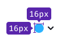

@import playground

@## Description

**ColorPicker** is a component that allows the user selecting a color from a given list or input a custom color using its HEX code.

**ColorPicker contains:**

- Trigger
- List of ColorPicker.Items
- Input (optional)

@## Trigger

The trigger for a ColorPicker is a Select with a circle as the leading addon.

### Sizes

@## List of colors

A list of colors can include either a single ColorPicker.Item or multiple ones, which are preview swatches that display all available color values.

| ColorPicker.Item                                             | List of ColorPicker.Items                             |
| ------------------------------------------------------------ | ----------------------------------------------------- |
|  |  |

@## Size

ColorPicker.Item has 28px * 28px size.

@## Margins

All margins must be [multiples of 4](/layout/box-system/#spacing_system). The default recommended margins are 4px:

@## Item types

An item can have two different types:

| Type            | Appearance example                                                             | Usage                                                                                                                 |
| --------------- | ------------------------------------------------------------------------------ | --------------------------------------------------------------------------------------------------------------------------- |
| Item for background color |  | Use for changing the background color. For example, a user can pick colors to visually separate their competitors. |
| Item for text color      |     | Use for changing the Tag color, e.g.                                                                                             |

@## Interaction

- In the hover state, trigger has a `border: 1px solid var(--border-secondary);`.
- In the active state, trigger changes its border color to `var(--border-info-active);`.

### Default item

| | Normal | Hover | Active | Usage |
| ------------------- | ------------------------------- | -------------------------- | ----------------------- | -------------------- |
| Background color |  |  | | Use for changing the background color of other components.|
| Text color |  |  | | Use for changing text and background colors of other components.|
| No background color |  |  | | Use when no color is selected.|
| No text color |  |  | | Use when no color is selected.|

### Item for custom colors

| | Normal | Hover | Active | Usage |
| ------------------- | ------------------------------- | -------------------------- | ----------------------- | -------------------- |
| Background color |  |  | | Use for changing the background color of other components.|
| Text color |  |  | | Use for changing the text and background colors of other components.|

### Item for adding colors

| | Normal | Hover | Active | Usage |
| ------------------- | ------------------------------- | -------------------------- | ----------------------- | -------------------- |
| Add color button |  |  | | Use Button with icon and change border-radius to 50%.|

@## Dropdown

### Width and height

**The recommended width of a dropdown is 188px.** The height of a dropdown list depends on its content.

Showing all available colors in the dropdown menu is crucial, however, if a user has added more than 20 custom colors, a scrollbar should be displayed.

| Dropdown menu | Dropdown menu with more than 20 colors |
| ------------------------------------------------------------ | ----------------------------------------------------- |
|  |  |

### Margins and paddings

@## Input (optional)

In case when a ColorPicker allows users to add custom colors, include an input that only accepts HEX values. For more information, refer to the [Validation section](/components/color-picker/#validation).

### Size, margins and paddings

Use input with M size.

### Value

The color value is always a 6-character string that specifies the color in the HEX format.

> User can enter both upper-case and lower-case characters, but the input will save them as upper-case.

@## Interaction

Users have the ability to add or remove custom colors, but they cannot modify default or existing custom colors.

### Adding custom color

> We recommend that your product sync and save the user's custom palette in different parts of the interface.

Users can add a color to the custom palette by clicking either the button with the `MathPlus` icon or the input field. They can add a color value by clicking the `Check` icon and remove a color by clicking the `Close` icon.

### Removing custom color

@## Validation

The input field only allows six characters, which can include numbers and letters. If the user enters fewer or more characters or characters that cannot be converted to a 6-character HEX value, the input gets the `invalid` state.

To help users fix the invalid input, add the following message to the tooltip: "Please enter 6 latin letters and/or digits."

@## Use in UX/UI

Components that you can use as a trigger for the ColorPicker:

- [Input](/components/input/)
- [Link](/components/link/)
- [Select](/components/select/)

ColorPicker.Item can be placed inside the following components:

- [Button](/components/button/)
- [FilterTrigger](/components/filter-trigger/)
- [Pills](/components/pills/)
- [Select/Multiselect](/components/select/)
- [TabLine](/components/tab-line/)
- [TabPanel](/components/tab-panel/)
- [Tag](/components/tag/)
- [Option](/components/dropdown-menu/#a66af9)

@page color-picker-a11y
@page color-picker-api
@page color-picker-code
@page color-picker-changelog
