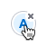
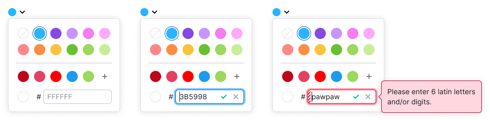

@import playground

@## Description

**ColorPicker** allows a user to select the color of another component from a predefined palette or specify a custom color using its hexadecimal (HEX) value.

**ColorPicker consists of the following elements:**

- **Trigger;**
- **List of ColorPicker.Items;**
- **Input (optional).**

@## Trigger

The trigger for a ColorPicker is a Select with a circle as the leading add-on.

### Sizes

@## ColorPicker.Item
**The item can be one ColorPicker.Item or a list of them.**

ColorPicker.Item is a swatch preview that allows a user to see what color is currently selected.

| ColorPicker.Item                                             | List of ColorPicker.Items                             |
| ------------------------------------------------------------ | ----------------------------------------------------- |
|  |  |

@## Size

We use only one size of ColorPicker.Item which is 28\*28px.

@## Margins

All margins must be multiples of 4. The default recommended margins are 4px:

@## Types

An item can have two different content types:  
| Type | Appearance example | Description |
| --------------- | ------------------------------------------------------------ | --------------------------- |
| Bakground color |  | Use for changing the background color. For example, a user can pick distinct colors to visually separate their competitors. |
| Text color |  | Use for changing the Tag color. |

@## Interaction

In the hover state, a trigger has a border: 1px solid `var (--gray-200);`  
In the active state, a trigger changes its border color to `var (--blue-300)`

**ColorPicker.Item**  
| | Normal | Hover | Active | Description |
| ------------------- | ------------------------------- | -------------------------- | ----------------------- | -------------------- |
| Background color |  |  | | Use for changing the background color of other components.|
| Text color |  |  | | Use for changing text and background colors of other components.|
| No background color |  |  | | Use when no color is selected.|
| No text color |  |  | | Use when no color is selected.|

**ColorPicker.Item for custom colors**  
| | Normal | Hover | Active | Description |
| ------------------- | ------------------------------- | -------------------------- | ----------------------- | -------------------- |
| Background color |  |  | | Use for changing the background color of other components.|
| Text color |  |  | | Use for changing the text and background colors of other components.|

**ColorPicker.Item for adding colors**  
| | Normal | Hover | Active | Description |
| ------------------- | ------------------------------- | -------------------------- | ----------------------- | -------------------- |
| Add color button |  |  | | Use Button with icon and increase border-radius to 14px.|

@## Dropdown

### Width and height

**The recommended width of a dropdown is 188px.**  
The height of a dropdown list depends on its content.

It is important for the user to see all available colors in the dropdown menu, but if a user added more than 20 custom colors, show a scrollbar.
| Dropdown menu | Dropdown menu with scroll |
| ------------------------------------------------------------ | ----------------------------------------------------- |
|  |  |

### Margins and paddings

@## Input (optional)

If a ColorPicker allows adding custom colors, add an input to it.
The input accepts only HEX values. For details, refer to the [Validation section](/components/color-picker/#validation).

### Size, margins and paddings

**Use a size M input.**  

@## Value

The color value is always a 6-character string that specifies the color in the HEX format.

> A user can enter both upper-case and lower-case characters, but the input will save them as upper-case.

@## Interaction

A user can add or remove custom colors, but they can't change default and custom colors.

**Adding a custom color**

> We recommend that you sync and save the user's custom palette in different parts of the product's interface.

Colors are added by either clicking on the button with `MathPlus`, or through the input field.  
A user can add a color value to the custom palette by clicking `Check`, and remove a color by clicking `Close`.

**Removing custom color**  

@## Validation

The input field accepts only six characters, including numbers and letters.  
If a user enters fewer or more characters, or characters which can't be converted to a 6-character HEX value, the input state changes to invalid.

**To help users fix the invalid input, add the following message to the tooltip: "Please enter 6 latin letters and/or digits."**

@## Keyboard support

- The component is focused using `Tab`.
- A user can navigate inside the color palettes with the keyboard arrows. The color transition occurs sequentially—from top to bottom and from left to right. If a component has two palettes, when tabbed, the focus of the last element of the main palette skips to the first element of the additional palette.
- The color is selected by pressing `Enter` or `Space`.
- A user can close the dropdown using `Esc`.
- When the dropdown is closed, the focus returns to the trigger.

@## Use in UX/UI

Components that can be a trigger for a ColorPicker:

- [Input](/components/input/)
- [Link](/components/link/)
- [Select](/components/select/)

You can place the color marker in the following components:

- [Button](/components/button/)
- [FilterTrigger](/components/filter-trigger/)
- [Pills](/components/pills/)
- [Select/Multiselect](/components/select/)
- [Tabine](/components/tab-line/)
- [TabPanel](/components/tab-panel/)
- [Tag](/components/tag/)
- [Option](/components/dropdown-menu/#a66af9)

@page color-picker-api
@page color-picker-code
@page color-picker-changelog
