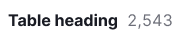

@import playground

@## Description

**Counter** is a component that displays the quantity.

It is used in various components such as:

- controls,
- limit progressbars,
- widget titles,
- table headers,
- etc.

> Counter is a static component and shouldn't be clickable.

@## Themes

The appropriate theme for a counter varies based on its context and the component it is located in or near.

| Theme          | Appearance examples                      | Styles                                                                                                                      | Usage                                                               |
| -------------- | ---------------------------------------- | --------------------------------------------------------------------------------------------------------------------------- | ------------------------------------------------------------------- |
| Default        |  | `background-color: var(--bg-primary-neutral);`, `border: 1px solid var(--border-primary);`, `color: var(--text-secondary);` | Use inside secondary controls and next to various types of inputs. |
|                |  |                                                                                                                             |                                                                     |
| Light-blue     |  | `background-color: var(--bg-primary-info);`, `color: var(--text-invert);`                                                   | Use in filters to focus on the selected values.                    |
| Orange         |      | `background-color: var(--bg-primary-warning);`, `color: var(--text-invert);`                                                | Use to display the reached limit.                                  |
| Red            |            | `background-color: var(--bg-primary-critical);`, `color: var(--text-invert);`                                               | Use to display the over-limit.                                     |
| White (invert) |      | `background-color: var(--bg-primary-neutral);`, `color: var(--text-primary);`                                               | Use inside primary controls with a bright/dark background color.   |

@## Text counters

The size of text counters is determined by the typography used in the element where the numeric value is being displayed. Typically, these counters are positioned near widget or table titles, within text, and other relevant locations. Additional examples can be found in the [Example tab](/components/counter/counter-code/).

_For example, the counter in the table title has the same text size as the title itself._

@## Counter location

The counter should always be positioned to the right of other interface elements, because it's an additional data.

@## Use in UX/UI

Use a counter to display an element that changes numerically.

|                      | Examples                                     | Usage                                                                                                                                                                                                                                    |
| -------------------- | -------------------------------------------- | ---------------------------------------------------------------------------------------------------------------------------------------------------------------------------------------------------------------------------------------- |
| Output data counter  |          | Usually it shows the total results. Use it next to the title of a table or widget.                                                                                                                                         |
| Entered data counter |       | The counter typically displays the limit of characters allowed, commonly used in [Input](/components/input/) and [Textarea](/components/textarea/). When the limit is reached or surpassed, the color of the counter changes. |
| Limits               |  | The counter changes color to indicate when the limit has been exceeded.                                                                                |

In primary controls, use a counter with the `white` (invert) theme. Otherwise, it will not be readable on a bright/dark background.

For notifications, use the [Dot](/components/dot/) component with a counter inside.

In a table, a text counter can be used inside a tag to mark or group the data.

@page counter-a11y
@page counter-api
@page counter-code
@page counter-changelog
