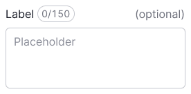
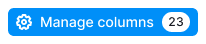
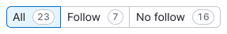

@import playground

@## Description

**Counter** is a component that shows the quantity.

It is used inside a large number of components:

- controls,
- limits,
- titles of widgets,
- table headers,
- etc.

> 💡 Counters can't be clickable.

@## Themes

The use of a particular theme for a counter depends on the context and the component in or near it.

| Theme          | Appearance examples                      | Styles                                                           | Usage                                                               |
| -------------- | ---------------------------------------- | ---------------------------------------------------------------- | ------------------------------------------------------------------- |
| Default        |  | `background-color: #fff; border-color: $gray80; color: $gray60;` | Used inside secondary controls and next to various types of inputs. |
|                |  |
| Light-blue     |  | `background-color: $light-blue; color: #fff;`                    | Used in filters to focus on the selected values.                    |
| Orange         |      | `background-color: $orange; color: #fff;`                        | Used to display the reached limit.                                  |
| Red            |            | `background-color: $red; color: #fff;`                           | Used to display the over-limit.                                     |
| White (invert) |      | `background-color: #fff; color: $gray20;`                        | Used inside primary controls with a bright/dark background-color.   |

@## Text counters

The text counters size depends on the size of the typography used in the element in which you want to display the numeric value. These counters are usually placed next to the titles of widgets, tables, inside the text, and so on. And in the ["mandarin"](/components/dot/). See detailed examples in the Code tab.

_For example, the counter in the table title has the same text size as the title itself._

@## Use in UX/UI

Use a counter to display an element that changes numerically.

|                      | Examples                                     | Usage                                                                                                                                                                                                                                    |
| -------------------- | -------------------------------------------- | ---------------------------------------------------------------------------------------------------------------------------------------------------------------------------------------------------------------------------------------- |
| Output data counter  |          | Usually it shows the total results. Usually used next to the title of a table or widget/widgets.                                                                                                                                         |
| Entered data counter |       | Normally it displays the limitation of the elements to enter. Most often, this is necessary in [Input](/components/input/) or in [Textarea](/components/textarea/). The counter changes its color when the limit is reached or exceeded. |
| Limits               |  | When you need to highlight exceeding of the limit (the counter changes its color). For more information about the limits, see the LimitIndicator guides.                                                                                 |

In primary controls, you must use a counter with the `white` (invert) theme. Otherwise, it will not be readable on a bright/dark background.

For notifications (update messages), use the [Dot](/components/dot/) component with an a counter inside it.

In a table, a text counter can be used inside a tag to mark information.

### Location

The counter shall be always located right relative to other interface elements.

@page counter-api
@page counter-code
@page counter-changelog
