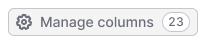
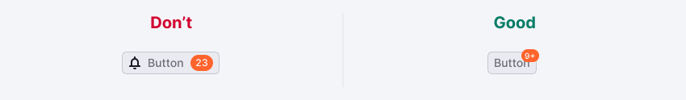

::: react-view

:::

## Description

**Counter** is a component that displays the quantity.

It is used in various components such as:

- controls,
- limit progress bars,
- widget titles,
- table headers,
- etc.

::: tip
Counter is a static component and shouldn't be clickable.
:::

## Themes

The appropriate theme for a counter varies based on its context and the component it is located in or near.

Table: Counter themes

| Theme     | Appearance examples      | Styles    | Usage           |
| --------- | ------------------------ | --------- | --------------- |
| default        |   | `background-color: var(--bg-primary-neutral)`, `border: 1px solid var(--border-primary)`, `color: var(--text-secondary)` | Use inside secondary controls and next to various types of inputs. |                                                                    |
| `light-blue`     |  | `background-color: var(--bg-primary-info)`, `color: var(--text-invert)`                                                   | Use in filters to indicate the number of selected values.                    |
| `orange`         |      | `background-color: var(--bg-primary-warning)`, `color: var(--text-invert)`                                                | Use to display a reached or almost reached limit.                                  |
| `red`            |            | `background-color: var(--bg-primary-critical)`, `color: var(--text-invert)`                                               | Use to display an exceeded limit.                                     |
| `white` (invert) |      | `background-color: var(--bg-primary-neutral)`, `color: var(--text-primary)`                                               | Use inside primary controls with a bright/dark background color.   |

## Text counters

The size of text counters is determined by the typography used in the element where the numeric value is being displayed. Typically, these counters are positioned near widget or table titles, within text, and other relevant locations. Additional examples can be found on the [Example page](/components/counter/counter-code).

_For example, the counter in the table title has the same text size as the title itself._

## Counter location

The counter should always be positioned to the right of other interface elements, because it's an additional data.

## Usage in UX/UI

Use a counter to display an element that changes numerically.

Table: Counter usage examples

|                      | Examples      | Usage    |
| -------------------- | ------------- | -------- |
| Output data counter  |          | Usually it shows the total results. Use it next to the title of a table or widget.                                                                                                                                         |
| Entered data counter |       | The counter typically displays the limit of characters allowed, commonly used in [Input](/components/input/input) and [Textarea](/components/textarea/textarea). When the limit is reached or surpassed, the color of the counter changes. |
| Limits               |  | The counter changes color to indicate when the limit has been exceeded.                                                                                |

In primary controls, use a counter with the `white` (invert) theme. Otherwise, it will not be readable on a bright/dark background.

For notifications, use the [Dot](/components/dot/dot) component with a counter inside.

In a table, a text counter can be used inside a tag to mark or group the data.

