@import playground

@## Description

**Date picker** is a component for selection/input of the date and, in some cases, the time.

The component exists in 4 types:

- Date picker — selection of one day;
- Date range picker — selection of a range of days/weeks;
- Month picker — selection of one month;
- Month range picker — selection of a range of months.

@## Trigger

Trigger, as a rule, is in the form of select trigger, only without the chevron icon.

| Description                        | Appearance example                    |
| ---------------------------------- | ------------------------------------- |
| Placeholder                        |     |
| Day                                | 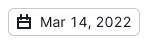 |
| Range of days in one month         | 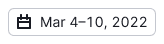 |
| Range of days in one year          |  |
| Range of days in different years   | 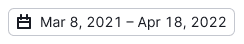 |
| Month                              | 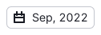 |
| Range of months in one year        |  |
| Range of months in different years | 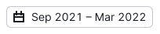 |

@## Date picker

You may select only one day. Select the day by clicking the box with the date. Upon clicking the available day of another month this day is selected, the current month is not scrolled. Upon clicking the day the dropdown is closed, the date in the trigger is updated to become the selected one. If the dropdown has the **Apply** button, the date is selected, and the dropdown is closed by clicking this button.

> 💡 If the calendar has `disabled` dates, nothing happens by clicking them.

**The dropdown width is formed according to 7 days width (32\*7=224px + paddings)**. Paginator at the top of the component has two buttons and designation of the month stretched to the remaining width between them.

@## Date picker + Today

Optionally there may be the button for selecting the present date in the date picker component. After clicking the **Today** button the present date is selected and the calendar is scrolled up to the current month, it another one was selected.

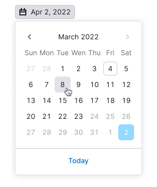

@## Date picker + metric

Calendar days may have some metrics. It is optional and is displayed as a small [horizontal bar chart](/data-display/bar-chart/) under the date.

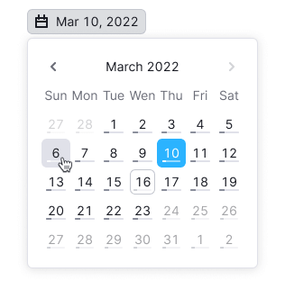

@## Date picker + time picker

[Timepicker](/components/time-picker/) may be inside the dropdown with dates.

Depending on the selected region (account settings) **12-hour or 24-hour format** of time is displayed.

@## Month picker

Yo may select only one month in such calendar. Standard form - one year. Variant with displaying two calendar blocks at once is possible, but more often such variant is required for range selection (see further).

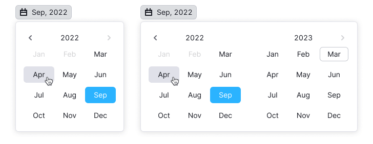

@## Range picker

### Date range picker

By default such date selection has two calendar blocks. The selected date is applied after clicking **Apply**. Click outside the dropdown deselects and closes it. Dates outside this month are not shown in the calendar block.

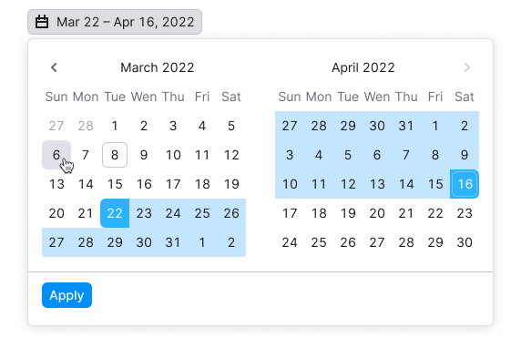

Upon selecting the first date of the range only one day is highlighted. Upon selecting the last one all the dates inside the range are highlighted.

Optionally you may add period presets. The presets and their names may be customized. The selected preset has the status `active`.

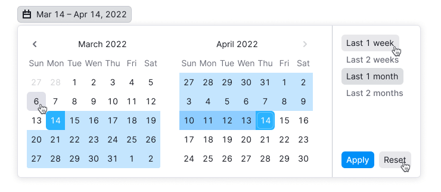

Upon hovering over the preset, the dates corresponding to the preset are highlighted. Upon that the selected (current) range of days / day does not lose its highlighting.

Optionallyly there may be the **Reset** button for deselecting. The trigger text in this case is changed into a placeholder.

### Week picker

The calendar variant, where you may select the dates only in the form of weeks, is possible. It is a usual date range picker, but with one calendar block and possibility to select only by weeks. Selection is made by clicking any day of the week.

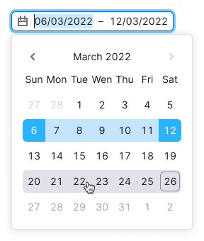

@## Month range picker

By default such date selection has two calendar blocks. The selected range is applied either at once or by clicking **Apply**, if there is such a button.

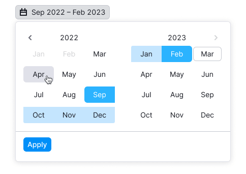

You may also use the variant with period presets for such calendar.

@page date-a11y
@page date-api
@page date-code
@page date-changelog
