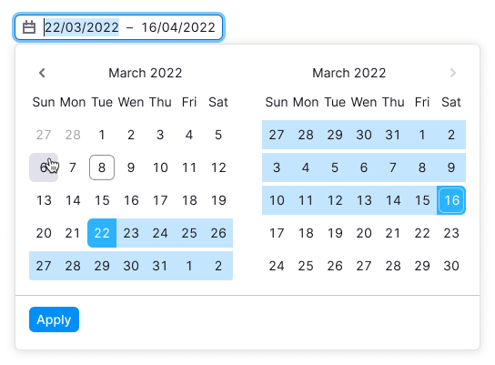
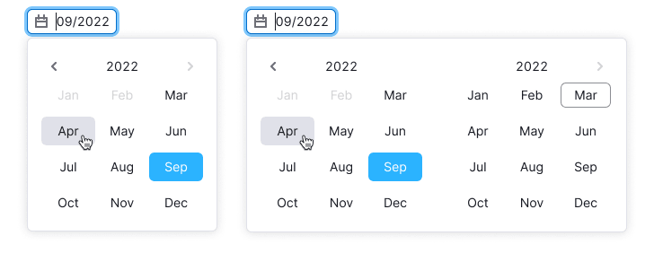
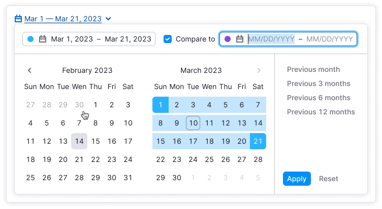
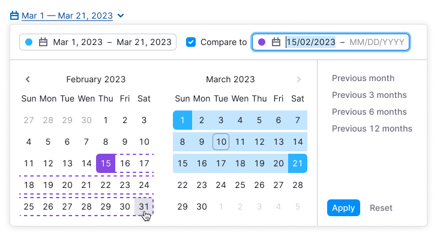
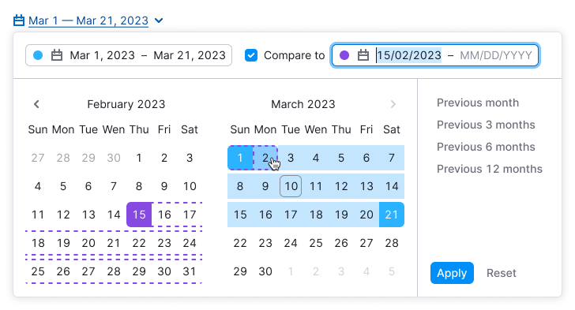
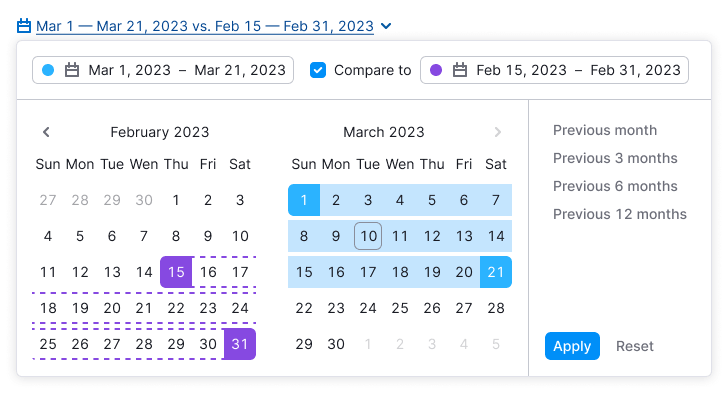

::: react-view

:::

## Description

**DatePicker** is a component used to input or select a specific date or date range. It's available in four types:

- Date picker (for selecting a single day)
- Date range picker (for selecting a range of days/weeks)
- Month picker (for selecting a single month)
- Month range picker (for selecting a range of months)

## Trigger

Trigger is built on the [Input](/components/input/input) component.

::: tip
Use the **en dash** to indicate range of dates. Don’t add a space on either side of the **en dash**.
:::
<!-- > _For example: "Mar 4–10, 2022"._ -->

Table: Date picker trigger's states and cases

| State or case                      | Appearance example                    |
| ---------------------------------- | ------------------------------------- |
| Placeholder                        |     |
| Day                                |  |
| Range of days in one month         |  |
| Range of days in one year          |  |
| Range of days in different years   |  |
| Month                              |  |
| Range of months in one year        |  |
| Range of months in different years |  |

## "Apply" button

"Apply" button allows users to submit their selected date(s). The selected date can be submitted by clicking on the date itself or by clicking the "Apply" button (if available).

"Apply" button is typically added to dropdowns when users need to select a range of dates or when selecting a date affects interface limitations. If necessary, the "Apply" button can be added to any type of date picker.

## DatePicker

Date picker selects a single day. Once the day is selected, the dropdown closes and the date in the trigger updates.

::: tip
If date has `disabled` state, then nothing should happen after user clicks it.
:::

### Grid margins

## DatePicker and "Today" button

You can include a "Today" button that selects the current date. Upon clicking the button, the present date is selected, and the calendar automatically scrolls up to the current month (if it wasn't already displayed).

## DatePicker with TimePicker

You can place [TimePicker](/components/time-picker/time-picker) inside the dropdown.

And you can show 12-hour or 24-hour format of time for TimePicker, depending on the selected region (for example, user account settings).

## DatePicker with custom cell elements

You can add custom elements inside cells: for example, a small progressbar under the date to show the progress of the metrics you need to show.

## MonthPicker

selects only one month. Once the month is selected, the dropdown closes, and the value in the trigger updates.

While a calendar with two month blocks can be displayed, it's more commonly used for range selection.

### Grid margins

## DateRangePicker

Date range picker typically displays two month blocks in the calendar by default. To update the value in the trigger, user must click the "Apply" button after selecting the desired date range.

You can add presets for date ranges. Presets and their names may be customized. The selected preset gets `active` status.

You also can add the "Reset" button for deselecting the selected values. In this case the trigger changes its value to the placeholder.

### Week picker

Week picker selects a single week and is similar to a regular date range picker, but with only one month block displayed in the dropdown.

## MonthRangePicker

Month range picker selects a range of several weeks and typically displays two month blocks in the dropdown by default. To update the value in the trigger, user must click the "Apply" button after selecting the desired month range.

You can also add the presets of date ranges for such picker.

## DateRangeComparator

You can compare two date ranges with DateRangeComparator. The ranges can either intersect or not intersect.

Each range in the `DateRangeComparator.Trigger` has an addon with a color: the first range uses the `--date-picker-cell-active` token, and the second range uses the `--date-picker-cell-comparison-active` token.

### Interaction

Table: Interaction states for Date range comparator

| Description | Appearance example    |
| ----------- | --------------------- |
| In the default state, the second period, which is activated by toggling the "Compare to" checkbox, is in a `disabled` state. |  |
| When enabling the comparison period, the focus shifts to the input field for selecting the second period. The preset set with periods changes to the one defined for the second period. |  |
| The selected date is immediately displayed in the input field. |   |
| The selected periods are applied after clicking the "Apply" button. |   |
