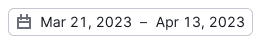
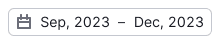
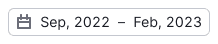
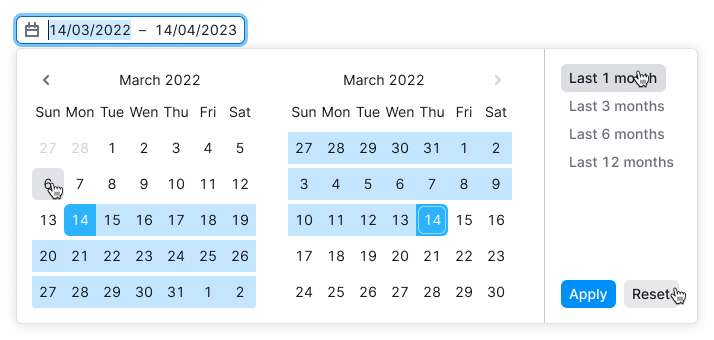
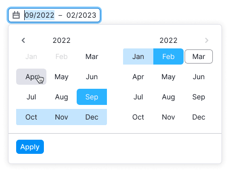
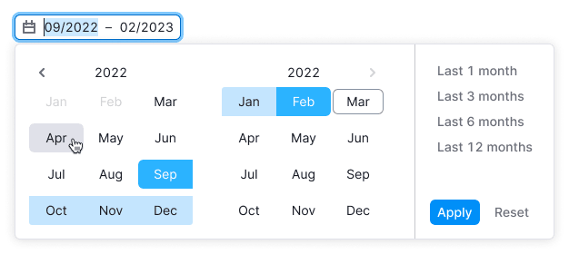

@import playground

@## Description

**Date picker** is a component for selecting or inputting the date or date range.

The component has 4 types:

- Date picker — selection of one day;
- Date range picker — selection of a range of days/weeks;
- Month picker — selection of one month;
- Month range picker — selection of a range of months.

@## Trigger

Trigger has styles of [Select](/components/select/).

> Use the **en dash** to indicate range of dates. Don’t add a space on either side of the **en dash**.
> _For example: "Mar 4–10, 2022"._

| State or case                      | Appearance example                    |
| ---------------------------------- | ------------------------------------- |
| Placeholder                        |     |
| Day                                |  |
| Range of days in one month         |  |
| Range of days in one year          |  |
| Range of days in different years   |  |
| Month                              |  |
| Range of months in one year        |  |
| Range of months in different years |  |

@## "Apply" button

Selected date can be submitted:

- after clicking the date
- or after clicking the "Apply" button (if there is one).

"Apply" button is usually added to the dropdown when user needs to select date range or if the choice of the date affects some limitations in the interface.

@## Date picker

Date picker selects only one day. After selecting the day the dropdown closes and the date in the trigger updates.

> If date has `disabled` state, then nothing should happen after user clicks it.

@## Date picker + "Today" button

You can add "Today" button that selects the present date. After clicking the button the present date is selected and the calendar is scrolled up to the current month, if another one was selected.

@## Date picker + progressbar

You can add a small progressbar under the date to show the progress of some metrics.

@## Date picker + time picker

[Timepicker](/components/time-picker/) can be placed inside the dropdown.

You can show 12-hour or 24-hour format of time for TimePicker, depending on the selected region (e.g., user account settings).

@## Month picker

Month picker selects only one month. After selecting the month the dropdown closes and the value in the trigger updates.

You can show calendar with two month blocks, but more often such variant is used for range selection (see further).

@## Date range picker

By default date range picker has two month blocks in calendar. The dropdown closes and the value in the trigger updates only after clicking on the "Apply" button.

You can add presets for date ranges. Presets and their names may be customized. The selected preset gets `active` status.

You also can add the "Reset" button for deselecting the selected values. In this case the trigger changes its value to a placeholder.

### Week picker

Week picker selects only one week. It is a usual date range picker, but with one month block inside the dropdown.

@## Month range picker

Month range picker selects several weeks. By default such picker has two month blocks inside the dropdown.

The dropdown closes and the value in the trigger updates only after clicking on the "Apply" button.

You can also add the presets of date ranges for such picker.

@page date-a11y
@page date-api
@page date-code
@page date-changelog
