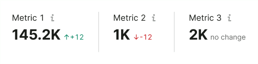
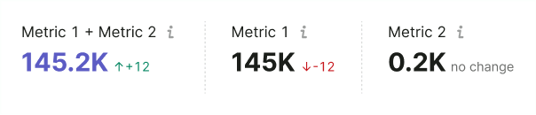
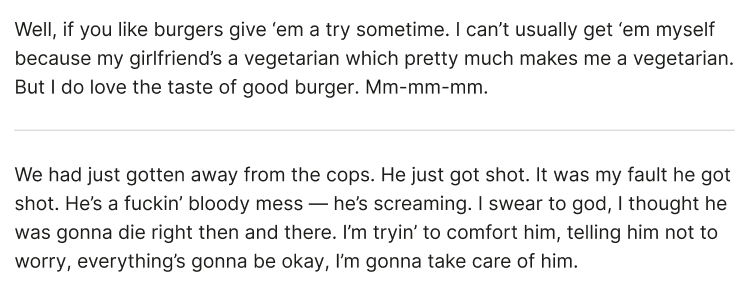
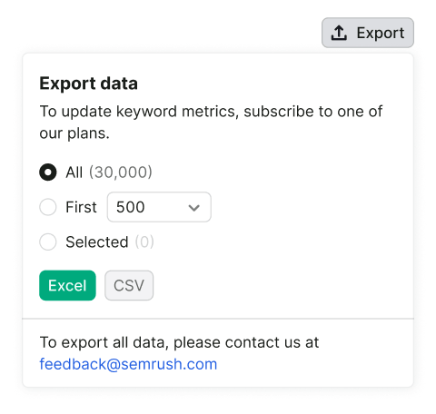
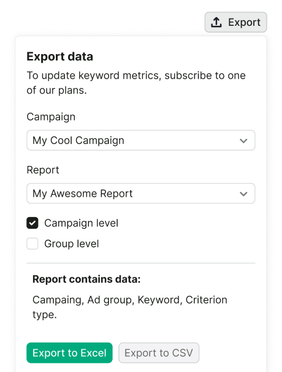

<Playground for="Divider" />

## Description

**Divider** is a component that visually and semantically separates content or components.

## Appearance

### Types

Divider has two types: `primary` and `secondary`. Secondary type helps to separate and show the connection between two parts of the content.

Table: Divider types

| `use`       | Appearance             |
| ----------- | ---------------------- |
| `primary`   |   |
| `secondary` |  |

### Themes

The divider can be used either on a light or dark/colored background.

Table: Divider themes

| `theme` | Appearance                    |
| ------- | ----------------------------- |
| Default |  |
| Invert  |   |

## Orientation

Table: Divider orientation

| Orientation | Example                       |
| ----------- | ----------------------------- |
| Horizontal  |  |
| Vertical    |          |

## Usage in UX/UI

The divider separates content visually and semantically, whether it's different or similar in meaning.

Table: Divider usage

| Case                                                                                                        | Example               |
| ----------------------------------------------------------------------------------------------------------- | --------------------- |
| Contact information needs to be visually separated from the form.                                           |  |
| Separate information about a report's data visually from the form, but maintain its connection to the form. |  |
