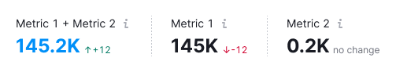

@import playground

@## Description

**Divider** is a component that visually and semantically separates content or components.

@## Types

Divider has two types: `primary` and `secondary`. Secondary type helps to separate and show the connection between two parts of the content.

| Type       | Appearance                           | Styles                                      |
| ------ | ------------------------------------ | ------------------------------------------- |
| `primary`  |    | `border: 1px solid var(--border-primary);`  |
| `secondary` |  | `border: 1px dashed var(--border-primary);` |

@## Orientation

| Orientation           | Example                                         |
| ---------- | ----------------------------------------------- |
| horizontal |  |
| vertical   |            |

@## Themes

The divider can be used either on a light or dark/colored background.

| Theme        | Appearance                                   | Styles                                            |
| ------- | -------------------------------------------- | ------------------------------------------------- |
| default |  | `border: 1px solid var(--border-primary);`        |
| invert  |    | `border: 1px solid var(--border-primary-invert);` |

@## Use in UX/UI

The divider separates content visually and semantically, whether it is different or similar in meaning.

| Case                                                                                                                    | Example                          |
| ----------------------------------------------------------------------------------------------------------------------- | -------------------------------- |
| Contact information needs to be visually separated from the form.                                                        |  |
| Separate information about a report's data visually from the form, but maintain its connection to the form. |  |

@page divider-a11y
@page divider-api
@page divider-changelog
