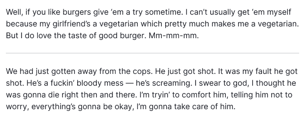
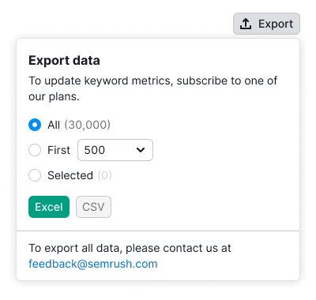

::: react-view

:::

## Description

**Divider** is a component that visually and semantically separates content or components.

## Types

Divider has two types: `primary` and `secondary`. Secondary type helps to separate and show the connection between two parts of the content.

Table: Divider types

| Type       | Appearance              | Styles                                      |
| ---------- | ----------------------- | ------------------------------------------- |
| `primary`  |    | `border: 1px solid var(--border-primary)`   |
| `secondary`|   | `border: 1px dashed var(--border-primary)`  |

## Orientation

Table: Divider orientation

| Orientation  | Example                         |
| ------------ | ------------------------------- |
| Horizontal   |    |
| Vertical     |            |

## Themes

The divider can be used either on a light or dark/colored background.

Table: Divider themes

| Theme   | Appearance                   | Styles                                            |
| ------- | ---------------------------- | ------------------------------------------------- |
| Default |  | `border: 1px solid var(--border-primary)`        |
| Invert  |    | `border: 1px solid var(--border-primary-invert)`|

## Usage in UX/UI

The divider separates content visually and semantically, whether it is different or similar in meaning.

Table: Divider usage

| Case    | Example                          |
| ------- | -------------------------------- |
| Contact information needs to be visually separated from the form.                                                        |  |
| Separate information about a report's data visually from the form, but maintain its connection to the form. |  |

