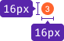
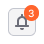

::: react-view

:::

## Description

**Dot** is a component that marks updates in the interface. For example, it shows that a new item has appeared in the button, selection, tab, filter, or dropdown menu.

::: tip
Keep in mind that a dot isn’t used to display the status of a feature, new data types, or tabs in the report. It cannot be green, red, blue, or any other color. It can only be orange.
:::

**You can use it to:**

- draw the user's attention to updated controls and menu items. Clicking an item with a dot will reveal other items marked with a dot.
- show new notifications, like in a blog.

::: tip
Dot must disappear after user clicks/hovers over an item with a dot. See the details of these cases below.
:::

## Appearance

### Sizes and margins

The component has two sizes: M and L.

Table: Dot sizes

| Size                    | Margins                              | Usage                                                                    |
| ----------------------- | ------------------------------------ | ------------------------------------------------------------------------ |
| M                       |                 | Use it to mark text items inside the list.                               |
|                         |             |                                                                          |
|                         |  | Use it to mark images/controls inside the list.                          |
| L                       |                 | Use it to mark controls from the outside.                                |
|                         |             |                                                                          |
| L with a counter inside |                | Use it to mark controls from the outside and show the number of updates. |
|                         |            |                                                                          |

## Location

Dot component can be set to the up right corner of the control or inside the list. In cases where a dot is above the component, it is always has `transform: translate (30%, -30%)`.

If dot shows an update in the control, locate it in the upper right corner above the component. Use `size="l"` and `up` props.

If dot points to a new element in the list inside the [DropdownMenu](/components/dropdown-menu/dropdown-menu), it is located to the right of the item text and has a smaller size (use `size="m"` prop).

## Counter

The dot may contain a notification counter, and for more information about this, you can refer to the [Counter](/components/counter/counter) for more information about this case.

::: tip
When the dot has a counter, it increases in size accordingly.
:::

Table: Dot with and without a counter

|                   | Appearance example      |
| ----------------- | ----------------------- |
| without a counter |   |
| with a counter    |  |

If there is one update, show a dot without a counter inside.

If there are more than nine updates, shorten the value displayed in the counter to 9+. When the counter with a large value is used inside the dot, it “grows” only inside the control.

::: tip
Note that this behavior isn’t implemented in the component.
:::

## Usage with different controls

The dot has a standard size, making it compatible with controls of various types and sizes.

## Interaction

We have two scenarios of how the dot disappears from a component or an item in the list:

Table: Interaction with Dot

|                                             | Conditions under which the dot disappears                     |
| ------------------------------------------- | ------------------------------------------------------------- |
| The dot disappears from the control         | after the user **has hovered** all the new items of the list. |
|                                             | after the user **has clicked** on all new items of the list.  |
| The dot disappears from an item in the list | after the user **has hovered** a new item of the list.        |
|                                             | after the user **has clicked** on a new item of the list.     |
