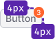
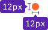
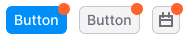
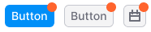
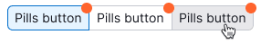
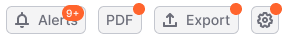

@import playground

@## Description

**Dot 🍊** is a component that marks updates in the interface. _For example, it shows that a new item has appeared in the button, select, tab, filter or dropdown-menu._

> 💡 Keep in mind that dot is not used to display the status of the feature, new data types or tabs in the report. It cannot be green, red, blue or other colors. **It can only be orange**.

**You can use it in order to:**

- draw the user’s attention to the controls and menu items, within which any update has been implemented. _In other words, by clicking an item with Dot, the user will find an item also marked with Dot (it's graphical rhyme for user experience 🕺🏻)._
- show new notifications to the user. _For example, this pattern works in a blog._

> 💡 Dot must disappear after the user clicks/hovers over an item with a dot. The details of these cases are below.

@## Appearance

The Dot component can appear above the control and inside the list. **If it shows an update in the control, it is located in the upper right corner above the component.**

If Dot points to a new element in the list inside the [Dropdown-menu](/components/dropdown-menu/), it is located to the right of the item text and has a smaller size.

@## Sizes and margins

The component has two sizes. In cases where a dot is above the component, it is always shifted in this way: `transform: translate (30%, -30%);`.

| Size                    | Appearance                                      | Styles                                            | Usage                                                                           |
| ----------------------- | ----------------------------------------------- | ------------------------------------------------- | ------------------------------------------------------------------------------- |
| L with a counter inside |                     | `background-color: $orange`                       | It helps to mark the controls from the outside and shows the number of updates. |
|                         |         |                                                   |                                                                                 |
| L                       |                       | `background-color: $orange`                       | It is used to mark the controls from the outside.                               |
|                         |           |                                                   |                                                                                 |
| M                       |                       | `margin-left: 4px; border: 1px solid #fff;`       | It's used to mark text items inside the list.                                   |
|                         |           |                                                   |                                                                                 |
|                         |  | `top: -1px; right: -1px; border: 1px solid #fff;` | It's used to mark images/controls inside the list.                              |

@## Counter
There may be a counter with the number of notifications inside the dot. See [Counter](/components/counter/) for more information about this case.

> 💡 If the dot contains a counter, it grows in size, respectively.

|                   | Appearance                                |
| ----------------- | ----------------------------------------- |
| without a counter |  |
| with a counter    |    |

If there is one update, we show a dot without a counter inside.

If there are more than nine updates, shorten the value displayed in the counter to 9+.

> 💡 Note that this feature is not yet implemented in the component.

@## Examples of usage with different controls

The dot has a universal basic size so that it can be used with controls of different types and sizes.

When the counter with a large value is used inside the dot, it “grows” only inside the control.

@## Interaction

We have two scenarios of how the dot disappears from a component or an item in the list:

|                                             | Conditions under which the dot disappears                     |
| ------------------------------------------- | ------------------------------------------------------------- |
| The dot disappears from the control         | after the user **has hovered** all the new items of the list. |
|                                             | after the user **has clicked** on all new items of the list.  |
| The dot disappears from an item in the list | after the user **has hovered** a new item of the list.        |
|                                             | after the user **has clicked** on a new item of the list.     |

@page dot-api
@page dot-code
@page dot-changelog
