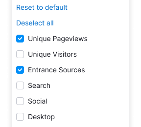
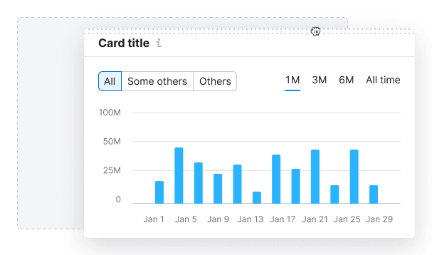

@## Description

**Drag & drop** is a component for the elements dragging in the interface (change their order and sometimes their properties).

> Frequent case of using the drag & drop in our interface is dropdowns with the order of columns in the table (the so-called **Table settings** controls).

The component is meant for imitating physical dragging of objects, so the following is the most important for it:

- It should be obvious, which elements or parts of the interface you may drag and where.
- It should be visually shown during dragging, that the element is dragged and where it can be dragged.

### Component composition

`DroppableContex` is a container wrapping the required area for drag & drop operation.
`Droppable` is the interface area, where the element can be dropped.
`Draggable` is the element you may drag.

@## Common styles

> 💡 Styles for dark background are constructed on the basis of white colour with transparency. It is required for using this theme both on the background and on the coloured background.

### Icon for identification of the possibility to drag the object

`MoveAlt` icon is recommended to be shown upon hover over the element which can be dragged.

|                      | Appearance example                    | Styles                         |
| -------------------- | ------------------------------------- | ------------------------------ |
| For light background |  | `fill: var(--stone);`          |
| For dark background  |                                       | `fill: rgba(255,255,255,0.5);` |

### Shadow of the object which can be dragged

|                      | Appearance example                              | Styles                                      |
| -------------------- | ----------------------------------------------- | ------------------------------------------- |
| For light background |         | `box-shadow: 0 2px 5px 0 rgba(0,0,0,0.15);` |
| For dark background  |  | `box-shadow: 0 2px 5px 0 rgba(0,0,0,0.5);`  |

@## Area for dragging

- It is the area you may grab with a long click of the mouse or using the keyboard, and drag a large object (card, table line etc.) or something.
- For such area we use the pattern which appears upon hovering over the area or moving to the element using `Tab`.
- The pattern may be placed both horizontally (as in the card) and vertically (as in the table line).

|                      | Appearance example                                                               | Styles                               |
| -------------------- | -------------------------------------------------------------------------------- | ------------------------------------ |
| For light background |   | `background: var(–gray80);`          |
| For dark background  |                               | `background: rgba(255,255,255,0.5);` |

@## Area for dropping

In the `default` state the large area where the element can be placed has dashed border. Upon hovering over such area its styles are not changed, in order not to create the impression that the area is clickable.

|                      | Appearance example                                                                                      | Styles                                      |
| -------------------- | ------------------------------------------------------------------------------------------------------- | ------------------------------------------- |
| For light background |   | `border: 2px dashed var(--gray80);`         |
| For dark background  |                                                      | `border: 2px dashed rgba(255,255,255,0.4);` |

@## Highlighting the area

Upon dragging the object to the area where the element can be dragged, it should be obligatorily highlighted.

|                      | Appearance example                                                                           | Styles                                      |
| -------------------- | -------------------------------------------------------------------------------------------- | ------------------------------------------- |
| For light background |                 | `border: 2px dashed var(--gray80);`         |
| For dark background  |   | `border: 2px dashed rgba(255,255,255,0.4);` |

@## Components which may have drag and drop

| Components                                | Appearance example                                                                                  |
| ----------------------------------------- | --------------------------------------------------------------------------------------------------- |
| [Accordion](/components/accordion/)       |                                             |
| [Card](/components/card/)                 |    |
| [Table](/table-group/table/)              |    |
| [TabPanel](/components/tab-panel/)        |                                               |
| [Select/Multiselect](/components/select/) |   |

@## Interaction

### Cursor

> Upon dragging both the clickable and non-clickable element, long click on any part of the element changes the cursor for `move` — dragging is started 🕺🏻

### States of draggable element

Upon dragging the axis is not blocked, the element may be dragged to any part of the page, but added only to certain areas ☝🏻

| State    | Appearance example                                              | Styles                                                                                                                                                                                                                                                                                                         |
| -------- | --------------------------------------------------------------- | -------------------------------------------------------------------------------------------------------------------------------------------------------------------------------------------------------------------------------------------------------------------------------------------------------------- |
| default  |                              | In default status the `MoveAlt` icon / pattern with dotes is not shown.                                                                                                                                                                                                                                        |
| hover    |   | Upon hover over the element the `MoveAlt` icon / pattern with dotes of the corresponding size (depending on the size of the component where the icon should be placed) is shown. If the element has hover, the element is highlighted. Upon `hover` over the `MoveAlt` icon the cursor is changed into `move`. |
| dragging |                                 | The dragged object loses the hover status and obtains the `box-shadow: 0 2px 5px 0 rgba(0,0,0,0.15);`                                                                                                                                                                                                          |
| no-drop  |                                   | If the drop zone under the dragged object is unavailable, the cursor is changed into `not-allowed`.                                                                                                                                                                                                            |

### States of droppable area

| State    | Appearance example                                                                        | Styles                                                                                                                                                                                                                                                                                      |
| -------- | ----------------------------------------------------------------------------------------- | ------------------------------------------------------------------------------------------------------------------------------------------------------------------------------------------------------------------------------------------------------------------------------------------- |
| default  |                                               | In the default condition the large area where the element can be placed has dashed border. Inside such zone you may place the text describing what can be dropped into this area and appropriate according to the context. For the text we use the secondary text colour — `var(--gray60)`. |
| hover    |                                            | The colour of the border upon hover over the zone, where the object may be dragged, is not changed.                                                                                                                                                                                         |
| dragging |   | Upon hover over the area where the element can be dropped it changes the colour. If the object is dragged in the list of analogous objects, upon dragging they are drawn apart, showing the drop zone of colour `var(--mercury)`.                                                           |
| no-drop  |                                                             | If the drop zone under the dragged object is unavailable, the cursor is just changed into `not-allowed`.                                                                                                                                                                                    |

### Mouse

- Simple click on the object does not start dragging.
- Click with small shift (as some people call it, “sloppy click”) and long click start dragging and the dragged object obtains the styles for this condition.
- `Esc` — cancels dragging using the mouse.
- `Tab` and `Enter` — do nothing.

@## Use in UX/UI

This component is meant for imitating physical dragging of objects, so it is important to remember the following upon its implementation:

- Show visually (using the icons, text etc.) that the element is draggable.
- Show the area where the draggable element can be placed.
- It is not recommended to place the draggable element and the area where it can be placed far away from each other.

> Upon interaction with the draggable elements it is important to use the corresponding cursors: `move`, `grab`, `grabbing`.

- It is important to remember that the short and long clicks are not the same. The long click is used when the draggable object is clickable.
- To show visually during dragging (the so called `DragEvent`), that the element is dragged - to add the required styles to the element.

@page drag-and-drop-a11y
@page drag-and-drop-api
@page drag-and-drop-code
@page drag-and-drop-changelog
