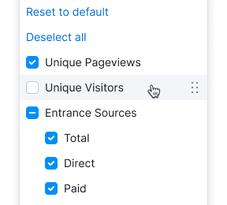
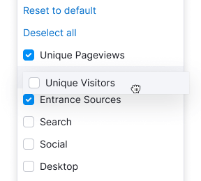
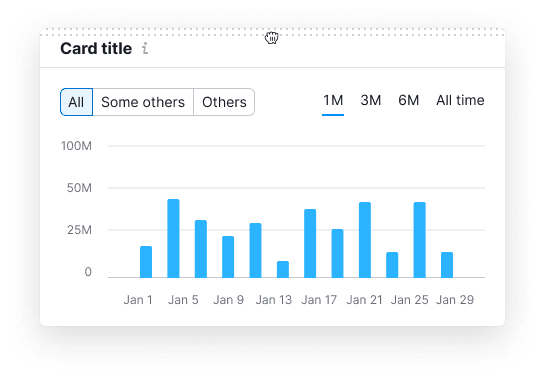

## Description

**Drag and drop** is a component that allows user to move elements within the interface, changing their order and sometimes their properties.

::: tip
One common use for drag and drop is a dropdown with a list of table columns that can be reordered, usually titled **Table settings** or **Manage columns**.
:::

The component imitates physically dragging objects, and two essential considerations for this are:

- Clearly indicate which interface elements can be dragged and where.
- Provide visual cues during dragging to show that the element is being moved and where it can be placed.

### Component composition

The component consists of the following parts:

1. `DragAndDrop` is a container for `Draggable` elements and related `DropZone` elements.
2. `DragAndDrop.DropZone` is where the element can be dropped.
3. `DragAndDrop.Draggable` is the element you can move.

## Grabbing

| State description | Illustration |
|-------------------|--------------|
| Drag indicators are hidden in the default state.  |   |
| Drag indicator appears when the draggable object is hovered or focused.  |   |
| When the grab area is hovered, mouse cursor turns into `grab`.  |   |
| When the object is grabbed, mouse cursor turns into `grabbed`, the object box-shadow changes to `--box-shadow-dnd`.  |   |

Drag indicator can be placed vertically, as in lists, or horizontally, as in cards.

## Dragging

Dragging trajectory isn’t restricted, allowing the element to be moved freely between its original position and the drop zone.

## Dropping

| State description | Illustration |
|-------------------|--------------|
| In the default state, the drop zone is marked with `border: 1px dashed var(--border-primary)`. Display text with `--text-secondary` color inside the zone to describe what can be dropped there.   When nothing is dragged, the drop zone isn't interactive and its styles don't change on hover. |   |
| When an object is dragged over the drop zone, if the object was dragged from another area, the drop zone background changes to `--bg-primary-neutral-hover`.  |   |
| When rearranging objects in a list or grid, the drop zone is created dynamically by pushing apart neighbouring objects. In this case, the drop zone background is `--bg-secondary-neutral-hover`.  |   |
| If the drop zone under the dragged object is unavailable, mouse cursor changes to `not-allowed`.  |   |

<!--
COMMENT. This looks like we intended entire objects to be grabbable, not only the grab area:
When dragging either a clickable or non-clickable element, a long click on any part of the element will change the cursor to a "move" cursor, indicating that dragging has begun.

COMMENT. Almost the same thing from another part of the page:
Note that short and long clicks have different meanings, with long clicks used for clickable draggable objects.

COMMENT. Didn't understand what it means exactly... Can we remove it?
Apply the required styles to show that an element is being dragged during the `DragEvent`.
-->
