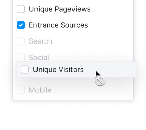

<!-- All styles for dark background are hidden to comments, because they need to be a separate theme -->

@## Description

**Drag and drop** is a component that allows user to move elements within the interface, changing their order and sometimes their properties.

> One common use case is reordering columns in a table, using dropdowns known as "Table settings controls".

The component imitates the physical dragging of objects, and two essential considerations for this are:

- Clearly indicating which interface elements can be dragged and where.
- Providing visual cues during dragging to show that the element is being moved and where it can be placed.

### Component composition

`DnD` is a container that wraps the necessary area for drag and drop functionality. The `DropZone` is where the element can be dropped, and the `Draggable` is the element you can move.

@## Appearance

<!-- > Styles for dark background are constructed on the basis of white color with transparency. It is required for using this theme both on the background and on the colored background. -->

### Icon for identification of the possibility to drag the object

When hovering over a draggable element, it's recommended to display the `MoveAlt` icon, which should use the `--icon-secondary-neutral` token for its color.

<!-- |                      | Appearance example                         | Token              |
| -------------------- | ------------------------------------------ | ------------------- |
| For light background |         | `fill: var(--icon-secondary-neutral);` |
| For dark background  |  | `fill: var(--icon-secondary-neutral);` | -->

### Shadow of the object which can be dragged

`--box-shadow-dnd` token is used for the shadow.

<!-- |                      | Appearance example                              | Styles                                            |
| -------------------- | ----------------------------------------------- | ------------------------------------------------- |
| For light background |     | `box-shadow: 0 2px 5px 0 rgba(gray-80, .16);`     |
| For dark background  |  | `box-shadow: 0 2px 5px 0 rgba(138,142,155, .25);` | -->

@## Area for dragging

The area for dragging is where you can click and hold the mouse or use the keyboard to move a large object, like a card or table row. We recommend using the dotted pattern that appears when user hovers over the area or use the `Tab` key to navigate to the element. This pattern can be placed both horizontally, as in the case of cards, and vertically, as in table rows.

<!-- |                      | Appearance example                                                               | Styles                    |
| -------------------- | -------------------------------------------------------------------------------- | ------------------------- |
| For light background |   | `background: --gray-200;` |
| For dark background  |                               | `background: --gray-200;` | -->

@## Area for dropping

By default, the element's placement area is marked with a dashed border. If user hovers over this area, its styles should remain unchanged to avoid giving the impression that it is clickable.

Use `border: 1px dashed var(--border-primary)` for border styles.

<!-- |                      | Appearance example                                                                                      | Styles                                |
| -------------------- | ------------------------------------------------------------------------------------------------------- | ------------------------------------- |
| For light background |   | `border: 1px dashed rgba(gray-200);`  |
| For dark background  |                                                      | `border: 1px dashed rgba(white, .3);` | -->

@## Area highlighting

When the object is dragged to the area where the element can be placed, area must be highlighted.

Use `--bg-primary-neutral-hover` token for background-color and `border: 1px dashed var(--border-primary)` for border styles.

<!-- |                      | Appearance example                                                                           | Styles                                 |
| -------------------- | -------------------------------------------------------------------------------------------- | -------------------------------------- |
| For light background |             | `border: 1px dashed rgba(--gray-200);` |
| For dark background  |   | `border: 1px dashed rgba(white, .3);`  | -->

@## Where to use

| Component                                | Appearance example                                                                                      |
| ----------------------------------------- | ------------------------------------------------------------------------------------------------------- |
| [Accordion](/components/accordion/)       |                                                 |
| [Card](/components/card/)                 |        |
| [Table](/table-group/table/)              |        |
| [TabPanel](/components/tab-panel/)        |                                                   |
| [Select/Multiselect](/components/select/) |   |

@## Interaction

### Cursor

When dragging either a clickable or non-clickable element, a long click on any part of the element will change the cursor to a "move" cursor, indicating that dragging has begun.

### States of draggable element

When dragging, the axis is not restricted, allowing the element to be moved anywhere on the page but only added to certain areas.

| State    | Appearance example                                              | Description                                                                                                                                                                                                                                                                                                        |
| -------- | --------------------------------------------------------------- | ------------------------------------------------------------------------------------------------------------------------------------------------------------------------------------------------------------------------------------------------------------------------------------------------------------- |
| default  |                              | Do not show the `MoveAlt` icon and pattern with dots in default state.                                                                                                                                                                                                                                        |
| hover    |   | If the element is hovered over, a `MoveAlt` icon or pattern with dots is displayed, indicating that the component can be moved. If the `MoveAlt` icon is hovered over, the cursor changes to `move`. |
| dragging |                             | The dragged object changes its box-shadow to the `--box-shadow-dnd` token.                                                                                                                                                                                                                                    |
| no-drop  |                                   | If the drop zone under the dragged object is unavailable, the cursor changes to `not-allowed`.                                                                                                                                                                                                           |

### States of droppable area

| State    | Appearance example                                                                        | Description                                                                                                                                                                                                                                                                               |
| -------- | ----------------------------------------------------------------------------------------- | ------------------------------------------------------------------------------------------------------------------------------------------------------------------------------------------------------------------------------------------------------------------------------------ |
| default  |                                               | By default, the area where the element can be placed is marked with a dashed border. You can place text inside this area to describe what can be dropped there, using the secondary text color (`--text-secondary`) that is appropriate for the context. |
| hover    |                                            | The border color of the area where an object can be dragged is not changed when hovered over.                                                                                                                                                                                   |
| dragging |   | Hovering over the area where an element can be dropped changes its color. When dragging an object in a list of similar objects, they are separated, and the drop zone changes the background color to `--bg-secondary-neutral-hover`.       |
| no-drop  |                                                             | If the drop zone under the dragged object is unavailable, the cursor changes to `not-allowed`.                                                                                                                                                                             |

<!-- ### Mouse

- Simple click on the object does not start dragging.
- Click with small shift (as some people call it, “sloppy click”) and long click start dragging and the dragged object obtains the styles for this condition.
- `Esc` — cancels dragging using the mouse.
- `Tab` and `Enter` — do nothing. -->

@## Use in UX/UI

This component imitates physically dragging objects, so keep the following in mind when implementing it:

- Visually indicate that the element is draggable using icons or text.
- Display the area where the element can be placed.
- Avoid placing the draggable element and its drop area too far apart.

> Use appropriate cursors such as `move`, `grab`, or `grabbing` when interacting with draggable elements.

Note that short and long clicks have different meanings, with long clicks used for clickable draggable objects.

Apply the required styles to show that an element is being dragged during the `DragEvent`.

@page drag-and-drop-a11y
@page drag-and-drop-api
@page drag-and-drop-code
@page drag-and-drop-changelog
