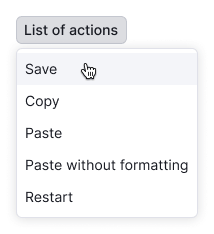
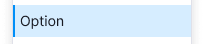
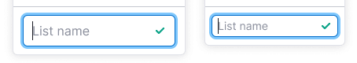
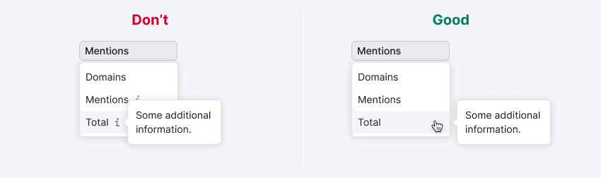

@## Description

> 💡 See description of trigger and examples in [Select/Multiselect](/components/select/).

**Dropdown-menu** is a component for displaying the dropdown list and its nested items.

@## Sizes of the list

The list has three sizes.

| XL                                                   | L                                                  | M                                                  |
| ---------------------------------------------------- | -------------------------------------------------- | -------------------------------------------------- |
|  |  |  |

@## Container width and height

- The width of the dropdown list may be defined by the maximum width of the trigger or it can be extended to match the longest item in the list.
- The recommended maximum height of the dropdown list with search is seven items. **If there are more items in the list, the dropdown must have a scroll.**
- You should not limit the list height in dropdown with a list of different links and controls. In this case, it is important to show all possible options to the user.

|                           | Example                                                           |
| ------------------------- | ----------------------------------------------------------------- |
| Trigger width             |             |
| Width of the longest item |  |

@## Container positioning

The list of selects always drops down, regardless of whether there is space or not. This behavior is necessary, for example, for a clear control of the select from the keyboard.

@## States of the list

One of the items in the dropdown list may be input with search. **When you open the list, the focus is immediately placed to the input.**

When typing in the input, only those items that match the entered request remain in the list. **In this case, the items are not highlighted in any way.**

- If for some reason the list is being loaded for a long time at opening or the results are being filtered out for a long time (for example, because of a very slow connection), the dropdown must display the following text: **Loading...**.
- If you type something that is not in the list, we show the following text: **Nothing found**.
- To display backend errors, use a warning message with the corresponding text: **Something went wrong. Please try again later.**

@## Data Loading

If after clicking on the trigger of the select we cannot show the list at once (we cannot load it at once, or we are searching for data somewhere else, etc.), then the chevron of the trigger must be changed to a spinner of `XXS` size. In this case, the trigger remains in the `default` state and it is not clickable.

See all states of the trigger in [Select/Multiselect](/components/select/#a24650).

@## Items of the List

### States

|          | Appearance                                 | Styles                             |
| -------- | ------------------------------------------ | ---------------------------------- |
| Default  |    |                                    |
| Hover    |        | `background: rgba($stone,.2)`      |
| Active   |      | `background: rgba($light-blue,.2)` |
| Disabled |  | `opacity: .3`                      |

### Dividers

The dropdown list may have sections, each of which is separated by a divider.

### Titles

An item in a list can be a title so that it cannot be selected. It does not have `hover` or `active` state and it is not clickable. Cursor `default`. The text is typed in the `bold` style of the same size as the list items.

### Button inside the list

You can add a button in any list. The color of the icon should coincide with the color of the text.

**An action button** that opens another dropdown takes the user to a new page or settings page or performs any other action on the page.

The item has the same hover as a regular item in the list.

**The button that adds a new item has two states:**

- Trigger that looks like a regular item. It coincides with a regular item in height, styles and hovers.

- An item with an input that appears when you click on the trigger. It is higher (the height of the Input is bigger than the height of the item line), the paddings coincide with the regular item. There is no `hover`. Cursor is `default`. When clicking, the input gets the `focus` state.

Clicking on the `Enter/Return` icon adds an item to the list upwards. After adding, the item becomes a trigger again. Clicking on `Esc` or the item’s space outside the input cancels the state.

Clicking on an existing list item selects that item and minimizes the list. At the next opening of the list, the item has a trigger state. The text previously typed by the user will be displayed when clicking on the trigger. If adding is not instantaneous, we show the spinner instead of the `Return` icon. **The input is not visually disabled, but the actions with it are unavailable.**

If there was an error when adding, we highlight the input and write the text of the error in the tooltip.

### Button inside the item

An icon performing a separate action may appear on the right of the item.

**Item deleting.** If an item can be deleted, the basket icon is shown on the right.

**Drag and drop of the list items.** Lines can be swapped by dragging them up or down. A special icon is used for this purpose. When you click on it, the cursor turns to `move`.

You can drag while holding the cursor over a button and moving the item down/up. A shadow appears below an item when you hold the cursor over it.

The color below the item is `rgba(&stone, .2)`.

@## Selected item resetting

The list may contain a link-button to reset the selected value. It is always placed at the top of the list.

The Reset button appears only if an item from the list is selected. After you click on the item, the button disappears and the trigger is replaced by the `default` state with the placeholder.

@##Content of the item

You can insert addons such as an icon, flag, label, user picture or some kind of control to the left and right of the item text.

### Addon placed to the left

An icon, flag or user picture may be placed on the left side of the item. The icon always has the color of the text.

> 💡 Please add an icon and text to the list item in exceptional cases. For example, when it is necessary to show a colored icon of a social network, but the text should not be painted in its color.

### Addon placed to the right

An addon (an icon, a link or a button) may also be placed on the right side of the item. Usually we put clickable elements to the right.

When an icon indicates some additional information to the item, it is recommended to place it next to the text.

### The “Info” icon

Informer is the `Info` icon, which follows the text of the list item. It calls a tooltip when hovering it and the cursor always changes to `help` in such cases (see examples in [Informer](/patterns/informer/)). The click zone shall be larger than the icon itself. The indent between the icon and the text is always 4px.

### Value

A numeric value may be placed to the right of the list item text. It is attached to the right edge, and its size coincides with the size of the text in the item.

### Badge

A badge (micro label) such as `new`, `beta`, `alpha` and others can be placed to the right of the text. The distance from the text to it is 4px. If the item with badge is selected, the badge in the trigger is not shown.

### The secondary text

Tiny additional text of color `--gray60` may be under the item.

| Size of the list | Appearance                                    | Styles             |
| ---------------- | --------------------------------------------- | ------------------ |
| XL               |  | `font-size: 14px;` |
| L                |    | `font-size: 12px;` |
| M                |    | `font-size: 12px;` |

@## Scroll in the dropdown

Within the list of uniform options scroll appears after seven items. It is the same for all list sizes. It is also recommended to add search to such list.

> 💡 It is important for the user to see all available options in the dropdowns with menu (usually there are links and different controls), and **it is not recommended to show scroll after 7 items there.**

### Fixed item

An item with a title, input, notice or a button can be fixed at the top or at the bottom. The pinned item is separated by a divider and should be fixed at scrolling.

**Title**. Fixed title refers to the entire Select. In this case, it is placed on top, and it necessarily has a [divider](/components/divider/).

**Input with search**. If the list contains more than 10 items, it is necessary to add the input with search to it. When you open the list, the input with search immediately gets the `focus` state. The text of a placeholder for this type of input is **“Start typing {parameter}”**. In this case, the search should not be performed by titles and it should work fast without submission.

When the user types the text, we show him the items that fall under the search criteria. The `active` (selected) item (if any) is not displayed in the search. The search icon may be either at the beginning of the parameter or anywhere else (we search for all matches). The matching part should be marked with underline.

**Notice**. The notice item has the divider, the color of which coincides with the style of an ordinary notice.

The title should be typed with the same point size as in the usual item, but in boldface. The paragraph shall be typed with the style for the secondary text.

**Button**. The action button or the button of the list item adding can also be pinned.

@## Nested item

The item of the list can be a folder for an embedded list. In this case, it has a chevron icon on the right (always visible).

Inside the second-level list, there may be the same elements (title, dividers and buttons) as in the parent item. It is impossible to select a folder item. However, if an item is selected inside a folder, this folder is highlighted as a selected item. Nothing happens when clicking on it. Cursor `pointer`.

**The maximum level of lists nesting is three (but try to avoid nesting at all, as it is not very convenient to work with such lists)**. If you have enough space, the nested list opens to the right. If available space is not enough, it opens to the left.

The nested list is shown when the user hovers over a line, then it disappears when the user hovers over another line, or when the user moves the cursor out of the zone of the entire nested list.

Nested groups are hidden with a delay of 0.3 seconds:

- when you hover over another item of the top level;
- when the mouse cursor is moved beyond the dropdown list;
- when the entire select is hidden (e.g. by pressing the `Esc` button).

If you select a nested item, the trigger contains only its name, not the name of the parent item.

@page dropdown-menu-a11y
@page dropdown-menu-api
@page dropdown-menu-code
@page dropdown-menu-changelog
