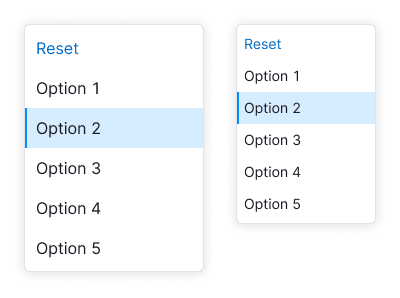

## Description

**DropdownMenu** is a component for displaying the menu of options and their nested items.

::: tip
Note that the DropdownMenu component doesn't handle the value change in the trigger. This mechanism is implemented in the [Select](/components/select/select#a24650).
:::

## Sizes and indents

The DropdownMenu has two sizes.

Table: DropdownMenu sizes

| Size | Appearance example and indents |
| ---- | ------------------------------ |
| M    |      |
| L    |      |

### Width

The width of the dropdown can be defined several ways:

Table: DropdownMenu width

|                                                        | Example                                |
| ------------------------------------------------------ | -------------------------------------- |
| It can be defined by the maximum width of the trigger. |        |
| It can be defined by the longest item in the list.     |  |

### Height

We recommended to avoid limiting the dropdown's height for the menus. It's important for the user to observe all available options, especially if there are links or different controls. We don’t recommend using a scroll for such menus.

## Placement

The menu always drops down, regardless of space availability under the trigger. This behavior is necessary to enable accessible keyboard control of the menu.

## Menu item states

### States

Table: DropdownMenu item states

| State               | Appearance                        | Tokens                                |
| ------------------- | --------------------------------- | ------------------------------------- |
| Default             |       | `--dropdown-menu-item`                |
| Hover               |         | `--dropdown-menu-item-hover`          |
| Selected            |        | `--dropdown-menu-item-selected`       |
| Selected with hover |  | `--dropdown-menu-item-selected-hover` |
| Disabled            |      | `--disabled-opacity`                  |

## Menu item types

### Divider

The dropdown menu items can be separated by [Divider](/components/divider/divider).

### Title

You can group list items by adding a title. Use the `DropdownMenu.Group` component for this.

Title doesn't have `hover` or `active` state and it isn’t clickable. The title always has `font-weight: var(--bold)` and the same size as the list items have.

### Hint

You can add some additional information to the menu items using `DropdownMenu.Item.Hint` component.

Table: Hint text sizes

| List size | Appearance example          | Tokens                 |
| --------- | --------------------------- | ---------------------- |
| M         |  | `--fs-200`, `--lh-200` |
| L         |  | `--fs-300`, `--lh-300` |

### Button

You can add a button to the list.

<!-- #### Action button

Action button opens another dropdown, takes user to a new page or performs any other action on the page.

The item with button should have the same hover as a regular item in the list.

 -->

#### Addition button

This item with such a button adds a new item and has the following states:

Table: DropdownMenu addition button states

| State                  | Appearance example       | Description                                                                                                                                                                                                   |
| ---------------------- | ------------------------ | ------------------------------------------------------------------------------------------------------------------------------------------------------------------------------------------------------------- |
| Default trigger button |  | Trigger has the same styles as a regular item.                                                                                                                                                                |
| Active input           |  | Clicking on the button opens an input in the `focus` state. The list item has no `hover` state in this case.                                                                                                  |
| Entering value         |  | To add an item, click the submit icon. To close the input, click outside the input or press the `Esc` key. If user entered data but closed the input without submitting, their entered value should be saved. |
| Loading                |  | For loading state change submit icon to [Spin](/components/spin/spin) with XS size. Input receives the `disabled` state.                                                                                      |
| Error                  |  | If an error occurred during adding, show the error message in a tooltip and highlight the input.                                                                                                              |

#### Button inside item

You can add a button to the right of an item for an additional action.

Table: Button inside the item cases of use

| Case          | Appearance example                | Description                                                                                                                                                                                                                                                                                                       |
| ------------- | --------------------------------- | ----------------------------------------------------------------------------------------------------------------------------------------------------------------------------------------------------------------------------------------------------------------------------------------------------------------- |
| Delete item   |        | If a list item can be deleted, use Button with `use="secondary"` and `tertiary` theme.                                                                                                                                                                                                                            |
| Drag and drop |  | To drag and drop list items, use the `MoveAlt` icon with the `--icon-secondary-neutral` color. The icon should appear when hovering over the item, and the cursor should change to `move`. For more information on dragging and dropping items, refer to the [Drag and drop](/components/drag-and-drop/drag-and-drop). |

<!-- ### Reset item

You can add reset item to the list to reset the selected value or values. Place it at the top of the list.

The reset item appears only if any item from the list is selected. After user clicks on the item, the item should hide and the trigger gets the the default value with placeholder.

 -->

## List item content

You can put the following addons before and after the text inside the list item:

- [Icon](/style/icon/icon),
- [Flag](/components/flags/flags),
- [Badge](/components/badge/badge),
- user picture or avatar,
- control such as [Link component](/components/link/link), [Button](/components/button/button) or [Switch](/components/switch/switch).

### Addon before text

Before the text you can place an icon, flag or image. In this case icon always has the color of the text.

Table: Addon before the text examples

| Addon        | Appearance example         |
| ------------ | -------------------------- |
| Icon         |  |
| Flag         |  |
| Image/avatar |   |

### Addon after text

After the text you can place either non-interactive and interactive addons: an icon, badge, switch, link or button.

If an icon displays additional information about an item, we recommend placing it right next to the text.

### Info icon

Avoid adding `Info` icon for displayng a tooltip. Check the [Tooltip section](#tooltip).

### Counter

You can place a text counter after the text. It should have the same size that item's text has.

### Badge

Badge can be placed after the text. The margin between the text and the badge is always 4px. If item with badge is selected, then don’t show badge in the trigger.

## Tooltip

If you want to add a tooltip to an item, apply it to the entire item. We don't recommend adding an additional `Info` icon, as it doesn't display a tooltip on hover.

## Nested menu

The item can have a nested menu. In this case, it should have the `ChevronRight` icon to indicate the nesting.

**The maximum recommended nesting level is two, but it's better to avoid nesting altogether because large menu of options can be inconvenient to work with.** If there's sufficient space, nested menus will drop to the right; otherwise, they will drop to the left.

Nested menus hide after the 0.3 seconds delay in the following cases:

- When user hovers over another item in the parent menu.
- When mouse cursor moves away from the dropdown.
- When the entire dropdown closes (for example, by pressing the `Esc` button).

To prevent inconvenience for users with small screens, avoid expanding the entire chain of submenus when opening a dropdown with a selected item in such a menu.
