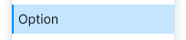
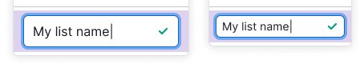
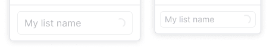
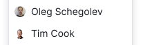
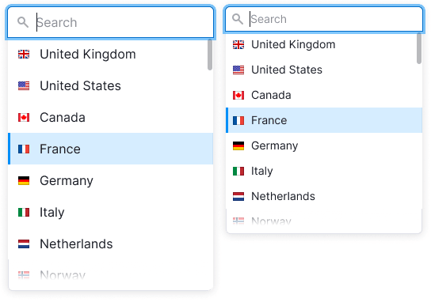
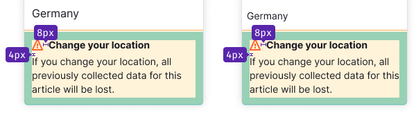

@## Description

> 💡 See description of trigger and examples in [Select/Multiselect](/components/select/).

**DropdownMenu** is a component for displaying the list of options and their nested items.

@## Sizes

DropdownMenu has two sizes.

| Size | Appearance example                                 |
| ---- | -------------------------------------------------- |
| M    |  |
| L    |  |

### Width and height

| Case                       | Example                                                                                               | Description                                                                                                                                                                      |
| -------------------------- | ----------------------------------------------------------------------------------------------------- | -------------------------------------------------------------------------------------------------------------------------------------------------------------------------------- |
| Trigger width              |                                  | The width of the dropdown can be defined by the maximum width of the trigger.                                                                                                    |
| Width of the longest item  |  | The width of the dropdown can be defined by the longest item in the list.                                                                                                        |
| Maximum height of the list |         | The recommended maximum height of the dropdown list with search is seven items. **If there are more items in the list, the dropdown gets scroll and a fader for the last item.** |

If you use DropdownMenu for a list of links and controls (like menu), do not limit the dropdown's height. It is important for such cases to show all possible options to the user.

@## DropdownMenu placement

The list always drops down, regardless of whether there is enough space under its trigger. This behavior is necessary, for example, for a understandable accessible control of the list from the keyboard.

@## States

- If for some reason the list is being loaded for a long time or the results are being filtered out for a long time (for example, because of a very slow connection), the dropdown must show the text: **"Loading..."**.
- If user entered value that list does not have, show the text: **"Nothing found"**.
- To show backend errors, use a warning message with the text: **"Something went wrong. Please try again later."**

@## Data loading

If the list needs time to show all items (system cannot load it at once, or is searching for data somewhere else, etc.), then change the Chevron icon in the trigger to a spinner with XS size. In this case, the trigger is not clickable and remains in the `default` state.

To know more about all trigger states, see [Select / Multiselect](/components/select/#a24650).

@## DropdownMenu with search input

If the list has a search input, then the input should get the focus when user opens dropdown.

When user enters value in the input, only those items that match the entered value should remain in the list. **Do not highlight these items in this case.**

@## List item

### States

|                     | Appearance                                                                           | Styles                             |
| ------------------- | ------------------------------------------------------------------------------------ | ---------------------------------- |
| Default             |                            |                                    |
| Hover               |                     | `background: var(--gray-50)`       |
| Selected            |                 | `background: var(--blue-100, .7)`  |
| Selected with hover |  | `background: var(--blue-100)`      |
| Disabled            |               | Use `--disabled-opacity` variable. |

### Divider

The dropdown list can be separated by [Divider](/components/divider/).

### Title

List item can be a title. It does not have `hover` or `active` state and it is not clickable. The title always has `font-weight: 700;` and the same size as the list items have.

### Button

You can add a button in any list.

#### Action button

Such button opens another dropdown, takes user to a new page or performs any other action on the page.

The item with button should have the same hover as a regular item in the list.

#### Addition button

Thie item with such a button adds a new item and has the following states:

| State                  | Appearance example                      | Description                                                                                                                                                                                                                                                   |
| ---------------------- | --------------------------------------- | ------------------------------------------------------------------------------------------------------------------------------------------------------------------------------------------------------------------------------------------------------------- |
| Default trigger button |   | Trigger has the same styles as a regular item.                                                                                                                                                                                                                |
| Active input           |     | Clicking on button opens an input the `focus` state. The item has no `hover`.                                                                                                                                                                                 |
| Entering value         |  | Clicking on the submit icon adds an item to the list. Clicking on `Esc` or the item’s space outside the input closes the input. If user entered something inside the input and then closed the input without submitting the data then save the entered value. |
| Loading                |   | For loading state change submit icon to [Spin](/components/spin/) with XS size. Input gets the `disabled` state.                                                                                                                                              |
| Error                  |   | If there was an error when adding, we highlight the input and write the text of the error in the tooltip.                                                                                                                                                     |

#### Button inside the item

You can add an icon for an additional action on the right of the item.

| Case          | Appearance example                        | Description                                                                                                                                                                                                                        |
| ------------- | ----------------------------------------- | ---------------------------------------------------------------------------------------------------------------------------------------------------------------------------------------------------------------------------------- |
| Delete item   |     | If a list item can be deleted, use the Trash icon.                                                                                                                                                                                 |
| Drag and drop |  | For list items drag and drop use MoveAlt icon with `--gray-300` color. Show it while hovering the item and change the cursor to `move`. Read more about drag and drop of the items in [Drag and drop](/componrnts/drag-and-drop/). |

### Reset button

You can add reset button to the list to reset the selected value or values. Place it at the top of the list.

The reset button appears only if any item from the list is selected. After user clicks on the item, the button should hide and the trigger gets the the default value with placeholder.

@## List item content

You can put addon before and after the text inside the list item:

- [Icon](/components/icon/),
- [Flag](/components/flag/),
- [Badge](/components/badge/),
- user picture or avatar,
- or even control such as [Link](/components/link/) or [Button](/components/button/).

### Addon before the text

Before the text you can place an icon, flag or image. In this case icon always has the color of the text.

| Addon        | Appearance example                   |
| ------------ | ------------------------------------ |
| icon         |  |
| flag         |  |
| image/avatar |    |

### Addon after the text

After the text you can place either non-interactive and interactive addons: an icon, badge, switch, link or button.

If an icon shows additional information to the item, we recommend you placing it next to the text.

### Info icon

Info icon shows a tooltip when hovering it (see examples in [Informer](/patterns/informer/)). We recommend you to make the icon's hover zone bigger than the icon's size. The margin between the icon and the text is always 4px.

### Counter

You can place a text counter after the text. It should have the same size that item's text has.

### Badge

Badge can be placed after the text. The margin between the text and the badge is always 4px. If item with badge is selected, then do not show badge in the trigger.

### Secondary text

You can add additional text with `--gray-500` color under the main text of the item.

| Size of the list | Appearance example                          | Styles             |
| ---------------- | ------------------------------------------- | ------------------ |
| M                |  | `font-size: 14px;` |
| L                |  | `font-size: 16px;` |

@## Scroll in the dropdown

If DropdownMenu has more than seven items show scroll. We also recommend adding search input to such lists.

> 💡 If you use DropdownMenu for menu then show all the items even if there more than seven items. It is important for the user in such cases to see all available options (especially if there are links and different controls). And we do not recommend to show scroll in such menus.

### Fixed item

You can fix an item with a title, input, notice or a button on the top or at the bottom of the list. Such item should be separated by a [Divider](/components/divider/) and fixed while scrolling.

| Item content      | Appearance example                                                                            | Description                                                                                                                                                                           |
| ----------------- | --------------------------------------------------------------------------------------------- | ------------------------------------------------------------------------------------------------------------------------------------------------------------------------------------- |
| Title             |                                                     | Fixed title refers to the entire list and it should have a [Divider](/components/divider/).                                                                                           |
| Input with search |                                                         | If the list has more than 10 items, add the search input. When user opens the list, the input gets the `focus` state. For a placeholder use the text: **“Start typing {parameter}”**. |
| Notice            |   | The notice title should have the same size as the text has and `font-weight: 700;`.                                                                                                   |
| Button            |                                                       |                                                                                                                                                                                       |

@## Nested item

The item of the list can have a list of items inside. In this case, it has a ChevronRight icon after the text.

**Maximum number of nesting levels is three (but try to avoid nesting at all, as it is not very comfortable to work with such lists)**. If you have enough space, the nested list drops to the right. If there is not enough space, it drops to the left.

Nested groups are hidden with a delay of 0.3 seconds:

- when user hovers over another item of the parent list with items;
- when the mouse cursor is moved away from the dropdown;
- when the entire dropdown closes (e.g. by pressing the `Esc` button).

If you select a nested item, the trigger will get only its name without the name of the parent item.

@page dropdown-menu-a11y
@page dropdown-menu-api
@page dropdown-menu-code
@page dropdown-menu-changelog
