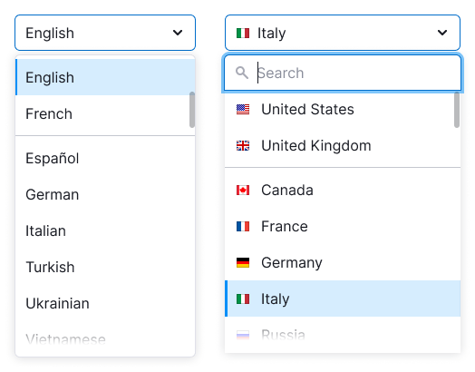
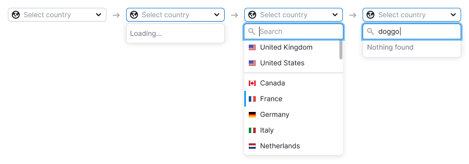
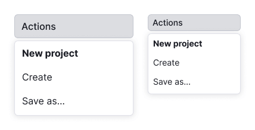
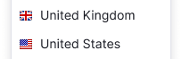
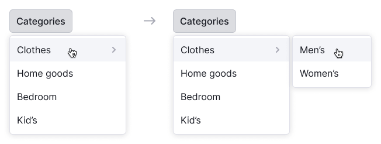

@## Description

**DropdownMenu** is a component for displaying the list of options and their nested items.

@## Sizes and indents

DropdownMenu has two sizes.

| Size | Appearance example and indents |
| ---- | ------------------------------ |
| M    |      |
| L    |      |

### Width

The width of the dropdown can be defined several ways:

|        | Example    |
| ------ | ---------- |
| The width of the dropdown can be defined by the maximum width of the trigger. |    |
| The width of the dropdown can be defined by the longest item in the list.  |  |

### Height

It is recommended that the dropdown list with search should have a maximum height of seven items. If there are more items, the dropdown will have a scroll and a fader for the next item.

However, if you're using DropdownMenu for a list of links and controls, such as a menu, it is essential not to limit the dropdown's height. This is necessary to display all possible options to the user.

@## Placement

The list always drops down, regardless of space availability under the trigger. This behavior is necessary to enable accessible keyboard control of the list.

@## States

- If the list is taking a long time to load or filter results (e.g., due to a slow connection), the dropdown should display "Loading...".
- If a user enters a value that is not in the list, the dropdown should display "Nothing found".
- If there are backend errors, a warning message should be displayed with the text "Something went wrong. Please try again later."

@## Data loading

If the list takes time to load, such as when the system cannot load it all at once or when searching for data elsewhere, change the `Chevron` icon to a spinner with XS size. In this case, the trigger is not clickable and remains in the default state.

For more information about trigger states, refer to [Select / Multiselect](/components/select/#a24650).

@## List with search input

If the list includes a search input, it should automatically receive focus when the user opens the dropdown.

As the user enters a value into the input, only the items that match the input should remain in the list. Do not highlight these items in this case.

@## List item states

### States

|                     | Appearance                                                                           | Tokens                                |
| ------------------- | ------------------------------------------------------------------------------------ | ------------------------------------- |
| Default             |                            | `--dropdown-menu-item`               |
| Hover               |                     | `--dropdown-menu-item-hover`          |
| Selected            |                 | `--dropdown-menu-item-selected`       |
| Selected with hover |  | `--dropdown-menu-item-selected-hover` |
| Disabled            |               | `--disabled-opacity`                  |

@## List item types

### Divider

The dropdown list can be separated by [Divider](/components/divider/).

### Title

List item can be a title. It does not have `hover` or `active` state and it is not clickable. The title always has `font-weight: var(--bold)` and the same size as the list items have.

### Button

You can add a button to any list.

#### Action button

Action button opens another dropdown, takes user to a new page or performs any other action on the page.

The item with button should have the same hover as a regular item in the list.

#### Addition button

This item with such a button adds a new item and has the following states:

| State                  | Appearance example                      | Description                                                                                                                                                                                                                                                   |
| ---------------------- | --------------------------------------- | ------------------------------------------------------------------------------------------------------------------------------------------------------------------------------------------------------------------------------------------------------------- |
| Default trigger button |   | Trigger has the same styles as a regular item.                                                                                                                                                                                                                |
| Active input           |     | Clicking on the button opens an input in the `focus` state. The list item has no `hover` state in this case.                                                                                                                                                                                 |
| Entering value         |  | To add an item, click the submit icon. To close the input, click outside the input or press the `Esc` key. If user entered data but closed the input without submitting, his entered value should be saved. |
| Loading                |   | For loading state change submit icon to [Spin](/components/spin/) with XS size. Input receives the `disabled` state.                                                                                                                                              |
| Error                  |   | If an error occurred during adding, show the error message in a tooltip and highlight the input.                                                                                                                                                     |

#### Button inside the item

You can add an icon to the right of an item for an additional action.

| Case          | Appearance example                        | Description                                                                                                                                                                                                                                      |
| ------------- | ----------------------------------------- | ------------------------------------------------------------------------------------------------------------------------------------------------------------------------------------------------------------------------------------------------ |
| Delete item   |     | If a list item can be deleted, use the `Trash` icon.                                                                                                                                                                                               |
| Drag and drop |  | To drag and drop list items, use the `MoveAlt` icon with the `--icon-secondary-neutral` color. The icon should appear when hovering over the item, and the cursor should change to `move`. For more information on dragging and dropping items, see the [Drag and drop](/components/drag-and-drop/). |

### Reset button

You can add reset button to the list to reset the selected value or values. Place it at the top of the list.

The reset button appears only if any item from the list is selected. After user clicks on the item, the button should hide and the trigger gets the the default value with placeholder.

@## List item content

You can put the following addons before and after the text inside the list item:

- [Icon](/style/icon/),
- [Flag](/components/flags/),
- [Badge](/components/badge/),
- user picture or avatar,
- control such as [Link](/components/link/), [Button](/components/button/) or [Switch](/components/switch).

### Addon before the text

Before the text you can place an icon, flag or image. In this case icon always has the color of the text.

| Addon        | Appearance example                   |
| ------------ | ------------------------------------ |
| Icon         |  |
| Flag         |  |
| Image/avatar |    |

### Addon after the text

After the text you can place either non-interactive and interactive addons: an icon, badge, switch, link or button.

If an icon displays additional information about an item, we recommend placing it right next to the text.

### Info icon

`Info` icon displays a tooltip when hovered over (see examples in the [Informer](/patterns/informer/)). We recommend making the active zone for the icon larger than the icon's size. The margin between the icon and the text should always be 4px.

### Counter

You can place a text counter after the text. It should have the same size that item's text has.

### Badge

Badge can be placed after the text. The margin between the text and the badge is always 4px. If item with badge is selected, then do not show badge in the trigger.

### Secondary text

You can add additional text with `--text-secondary` color under the main text of the item.

| Size of the list | Appearance example                          | Tokens     |
| ---------------- | ------------------------------------------- | ---------- |
| M                |  | `--fs-200`, `--lh-200` |
| L                |  | `--fs-300`, `--lh-300` |

@## Scroll in the dropdown

If DropdownMenu has more than seven items, show scroll. We also recommend adding search input to such lists.

> If you use a DropdownMenu for a menu, show all the items even if there are more than seven. It's important for the user to see all available options, especially if there are links or different controls. We do not recommend using a scroll for such menus.

### Fixed item

You can fix an item with a title, input, notice or a button on the top or at the bottom of the list. Such item should be separated by a [Divider](/components/divider/) and fixed while scrolling the list.

| Item content      | Appearance example                                                                            | Description                                                                                                                                                                           |
| ----------------- | --------------------------------------------------------------------------------------------- | ------------------------------------------------------------------------------------------------------------------------------------------------------------------------------------- |
| Title             |                                                     | Fixed title refers to the entire list and it should have a [Divider](/components/divider/).                                                                                           |
| Input with search |                                                         | If the list has more than 10 items, add the search input. When user opens the list, the input gets the `focus` state. For a placeholder use the text: “Start typing {parameter}” or "Search". |
| Notice            |   | The notice title should have the same size as the text has and `font-weight: var(--bold)`.                                                                                           |
| Button            |                                                       |                                                                                                                                                                                       |

@## Nested lists and items

The item of the list can have a list of items inside. In this case, it should have the `ChevronRight` icon after the text.

**The maximum nesting level is three, but it's best to avoid nesting as it can be uncomfortable to work with long lists.** If there is enough space, nested lists will drop to the right. If there isn't enough space, they will drop to the left.

Nested groups will be hidden after a delay of 0.3 seconds in the following cases:

- When the user hovers over another item in the parent list.
- When the mouse cursor moves away from the dropdown.
- When the entire dropdown closes (e.g., by pressing the `Esc` button).

If you select a nested item, only its name will be displayed in the trigger, without the name of the parent item.

@page dropdown-menu-a11y
@page dropdown-menu-api
@page dropdown-menu-code
@page dropdown-menu-changelog
